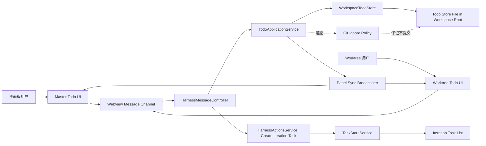

# 设计文档

## 1. 概述

本设计定义 funHarness 的工作区级待办能力，目标是在不改变既有迭代任务主流程的前提下，新增一套独立于迭代任务的 Todo 记录机制，并支持从 Todo 快速转化为迭代任务。

设计范围覆盖以下需求：Req-1、Req-2、Req-3、Req-4、Req-5、Req-6、Req-7。

设计原则如下。
1. 单一数据归属：Todo 仅归属于工作区，不归属任何单个迭代任务。
2. 单一持久化来源：主目录本地文件为唯一权威数据源。
3. 多面板一致视图：主面板与 worktree 子面板共享同一 Todo 数据。
4. 非侵入集成：复用既有消息通道与任务创建流程，不引入并行任务模型。

## 2. 架构设计

### 2.1 架构图（Mermaid）



### 2.2 项目目录结构

```text
workspace-root/
  .harness/
    workspace-todos.json          # 工作区待办持久化文件（非 git）
  apps/src/
    harnessMessages.ts            # 新增/扩展 Todo 消息契约
    harnessMessageController.ts   # Todo 消息路由与权限校验
    services/
      workspaceTodoStoreService.ts # Todo 存储抽象（新增）
      harnessActionsService.ts    # Todo -> Iteration Task 转化入口
    webviewTemplates.ts           # 主面板/子面板 Todo 展示与交互入口
  docs/
    requirements.md
    design.md
```

目录约束如下。
1. Todo 存储文件位于工作区主目录，不位于任何 worktree 子目录，绑定 Req-3。
2. Todo 能力在消息层、服务层、视图层分层实现，绑定 Req-1、Req-2、Req-4、Req-5、Req-7。
3. Todo 转任务复用既有任务创建服务，不新增第二套任务写入路径，绑定 Req-6。

### 2.3 路由设计

本功能采用 Webview 消息路由，不引入 HTTP 路由。

| Route ID | 通道 | 动作 | 说明 | 绑定需求 |
|---|---|---|---|---|
| R-1 | Webview -> Extension | todo.create | 新增工作区待办 | Req-1, Req-2 |
| R-2 | Webview -> Extension | todo.update | 修改待办标题/描述/状态 | Req-4 |
| R-3 | Webview -> Extension | todo.delete | 删除待办 | Req-5 |
| R-4 | Webview -> Extension | todo.list | 拉取工作区待办清单 | Req-7, Req-3 |
| R-5 | Webview -> Extension | todo.promoteToTask | 由待办快速创建迭代任务 | Req-6 |
| R-6 | Extension -> Webview | todo.changed | 广播待办清单变更 | Req-2, Req-7 |

路由约束如下。
1. 主面板与 worktree 子面板均可发起 R-1 到 R-5。
2. R-1 到 R-5 的落盘目标均为工作区级 Todo Store。
3. R-6 必须向全部相关面板广播，确保视图一致。

## 3. 组件与接口设计

### 3.1 API 契约

说明：以下 API 为内部消息契约，采用请求-响应模型；每个契约均绑定 Req-*。

#### API-1 新增待办（绑定 Req-1, Req-2）

- method: POST
- path: /messages/todo.create
- request

```json
{
  "sourcePanel": "master | worktree",
  "title": "string",
  "description": "string | null"
}
```

- response

```json
{
  "ok": true,
  "todo": {
    "id": "todo_xxx",
    "title": "string",
    "description": "string | null",
    "status": "open",
    "createdAt": "ISO-8601",
    "updatedAt": "ISO-8601"
  }
}
```

#### API-2 修改待办（绑定 Req-4）

- method: POST
- path: /messages/todo.update
- request

```json
{
  "id": "todo_xxx",
  "title": "string",
  "description": "string | null",
  "status": "open | done | promoted"
}
```

- response

```json
{
  "ok": true,
  "todo": {
    "id": "todo_xxx",
    "title": "string",
    "description": "string | null",
    "status": "open | done | promoted",
    "createdAt": "ISO-8601",
    "updatedAt": "ISO-8601"
  }
}
```

#### API-3 删除待办（绑定 Req-5）

- method: POST
- path: /messages/todo.delete
- request

```json
{
  "id": "todo_xxx"
}
```

- response

```json
{
  "ok": true,
  "deletedId": "todo_xxx"
}
```

#### API-4 查询待办列表（绑定 Req-7, Req-3）

- method: GET
- path: /messages/todo.list
- request

```json
{}
```

- response

```json
{
  "ok": true,
  "todos": [
    {
      "id": "todo_xxx",
      "title": "string",
      "description": "string | null",
      "status": "open | done | promoted",
      "createdAt": "ISO-8601",
      "updatedAt": "ISO-8601"
    }
  ]
}
```

#### API-5 待办转迭代任务（绑定 Req-6）

- method: POST
- path: /messages/todo.promoteToTask
- request

```json
{
  "todoId": "todo_xxx",
  "promotionPolicy": "keep | mark-promoted"
}
```

- response

```json
{
  "ok": true,
  "task": {
    "id": "task_xxx",
    "name": "from todo.title",
    "desc": "from todo.description"
  },
  "todo": {
    "id": "todo_xxx",
    "status": "open | promoted"
  }
}
```

#### API-6 待办变更广播（绑定 Req-2, Req-7）

- method: PUSH
- path: /events/todo.changed
- request

```json
{
  "reason": "created | updated | deleted | promoted | reloaded",
  "todos": [
    {
      "id": "todo_xxx",
      "title": "string",
      "description": "string | null",
      "status": "open | done | promoted",
      "createdAt": "ISO-8601",
      "updatedAt": "ISO-8601"
    }
  ]
}
```

- response

```json
{
  "ack": true
}
```

### 3.2 数据模型

#### M-1 WorkspaceTodoItem（绑定 Req-1, Req-2, Req-4, Req-5, Req-6）

| 字段 | 类型 | 约束 | 说明 |
|---|---|---|---|
| id | string | 非空，工作区唯一，不可变 | 待办主键 |
| title | string | `trim(title).length >= 1` | 待办标题 |
| description | string \| null | 可空 | 待办描述 |
| status | enum | `open | done | promoted` | 待办状态 |
| createdAt | string | ISO-8601，不可变 | 创建时间 |
| updatedAt | string | ISO-8601，单调递增 | 更新时间 |
| sourcePanel | enum | `master | worktree` | 首次创建来源 |
| linkedTaskId | string \| null | 可空 | 转化后关联迭代任务 ID |

#### M-2 WorkspaceTodoDocument（绑定 Req-3, Req-7）

| 字段 | 类型 | 约束 | 说明 |
|---|---|---|---|
| schemaVersion | integer | 当前版本固定值 | 文档版本 |
| workspaceId | string | 非空 | 工作区标识 |
| todos | WorkspaceTodoItem[] | 可空数组 | 待办集合 |
| lastSyncedAt | string | ISO-8601 | 最近加载/保存时间 |

#### M-3 TodoPromotionPolicy（绑定 Req-6）

| 字段 | 类型 | 约束 | 说明 |
|---|---|---|---|
| strategy | enum | `keep | mark-promoted` | 转任务后的待办存续策略 |
| appliedAt | string | ISO-8601 | 策略应用时间 |
| appliedBy | string | 非空 | 触发来源用户上下文 |

### 3.3 组件 Props / Events

#### C-1 MasterTodoPanel（绑定 Req-1, Req-4, Req-5, Req-6, Req-7）

- Props

| 名称 | 类型 | 说明 |
|---|---|---|
| todos | WorkspaceTodoItem[] | 当前待办列表 |
| loading | boolean | 列表加载状态 |

- Events

| 事件 | 载荷 | 说明 |
|---|---|---|
| onCreateTodo | `{title, description}` | 添加待办 |
| onUpdateTodo | `{id, title, description, status}` | 修改待办 |
| onDeleteTodo | `{id}` | 删除待办 |
| onPromoteTodo | `{todoId, promotionPolicy}` | 待办转任务 |

#### C-2 WorktreeTodoPanel（绑定 Req-2, Req-4, Req-5, Req-6, Req-7）

- Props

| 名称 | 类型 | 说明 |
|---|---|---|
| todos | WorkspaceTodoItem[] | 共享待办列表 |
| worktreeContext | object | 当前 worktree 上下文信息 |

- Events

| 事件 | 载荷 | 说明 |
|---|---|---|
| onCreateTodo | `{title, description}` | 在子面板添加待办 |
| onUpdateTodo | `{id, title, description, status}` | 修改待办 |
| onDeleteTodo | `{id}` | 删除待办 |
| onPromoteTodo | `{todoId, promotionPolicy}` | 待办转任务 |

#### C-3 TodoEditorDialog（绑定 Req-1, Req-4）

- Props

| 名称 | 类型 | 说明 |
|---|---|---|
| mode | `create | edit` | 对话框模式 |
| initialValue | `{title, description, status}` | 初始值 |

- Events

| 事件 | 载荷 | 说明 |
|---|---|---|
| onSubmit | `{title, description, status}` | 提交编辑 |
| onCancel | `{}` | 取消编辑 |

#### C-4 TodoEmptyState（绑定 Req-7）

- Props

| 名称 | 类型 | 说明 |
|---|---|---|
| visible | boolean | 空状态是否展示 |
| message | string | 空状态文案 |

- Events

| 事件 | 载荷 | 说明 |
|---|---|---|
| onCreateFromEmpty | `{}` | 从空状态入口添加待办 |

### 3.4 Store 设计

#### S-1 WorkspaceTodoStore（Extension Host，绑定 Req-3, Req-7）

职责如下。
1. 管理 Todo 权威状态。
2. 处理加载、保存、并发写入序列化。
3. 提供对所有面板一致的读取快照。

接口如下。
1. `load(): WorkspaceTodoDocument`
2. `list(): WorkspaceTodoItem[]`
3. `create(input): WorkspaceTodoItem`
4. `update(input): WorkspaceTodoItem`
5. `remove(id): void`
6. `promoteToTask(input): {taskId, todo}`
7. `subscribe(listener): unsubscribe`

#### S-2 TodoViewStore（Webview，绑定 Req-1, Req-2, Req-4, Req-5, Req-7）

职责如下。
1. 缓存当前视图 Todo 列表与 UI 状态。
2. 通过消息 API 与 Host Store 同步。
3. 接收 `todo.changed` 广播并刷新。

状态如下。
1. `todos: WorkspaceTodoItem[]`
2. `loading: boolean`
3. `error: {code, message} | null`

## 4. 正确性属性（需求不变量）

以下不变量均为系统级硬约束。

1. INV-1（绑定 Req-2）
规则：任意待办 $t$ 不属于任何迭代任务。
形式化：$\forall t \in Todos,\ t.ownerType = Workspace \land t.taskId = null$。

2. INV-2（绑定 Req-1）
规则：待办标题必须非空。
形式化：$\forall t \in Todos,\ |trim(t.title)| \ge 1$。

3. INV-3（绑定 Req-3）
规则：待办持久化路径必须在主目录且被 git 忽略。
形式化：$storePath \subset workspaceRoot \land storePath \notin GitTrackedSet$。

4. INV-4（绑定 Req-4）
规则：待办更新不改变待办 ID。
形式化：$update(t_{old}) = t_{new} \Rightarrow t_{old}.id = t_{new}.id$。

5. INV-5（绑定 Req-5）
规则：删除某待办不应修改其他待办身份。
形式化：$delete(id_x)$ 后，$\forall y \ne x,\ id_y$ 与关键字段不被重写。

6. INV-6（绑定 Req-7）
规则：多面板读取同一版本时展示一致。
形式化：同一 `documentVersion` 下，$View_{master}.todos = View_{worktree}.todos$。

7. INV-7（绑定 Req-6）
规则：待办转任务必须使用确定性的存续策略。
形式化：$promote(t, strategy)$ 中 $strategy \in \{keep, mark\mbox{-}promoted\}$ 且全局一致。

## 5. 错误处理

| 错误码 | 场景 | 绑定需求 | 处理策略 |
|---|---|---|---|
| TODO-VAL-001 | 标题为空或全空白 | Req-1, Req-4 | 拒绝写入并返回校验错误 |
| TODO-VAL-002 | 待办不存在 | Req-4, Req-5, Req-6 | 返回 not-found，前端刷新列表 |
| TODO-IO-001 | 存储文件读取失败 | Req-3, Req-7 | 进入降级模式，提示重试并记录日志 |
| TODO-IO-002 | 存储文件写入失败 | Req-1, Req-2, Req-4, Req-5 | 回滚内存变更并返回失败 |
| TODO-SYNC-001 | 面板同步广播失败 | Req-2, Req-7 | 保证写盘成功，允许视图下次拉取修复 |
| TODO-PROMOTE-001 | 创建迭代任务失败 | Req-6 | 不改变待办状态，返回可重试错误 |
| TODO-POLICY-001 | 不支持的转化策略 | Req-6 | 拒绝请求并返回允许策略集合 |

## 6. 测试策略

1. 合同测试（API Contract Tests）
目标：验证 API-1 到 API-6 的请求校验、响应结构与错误码。
覆盖需求：Req-1、Req-2、Req-4、Req-5、Req-6、Req-7。

2. 持久化测试（Store Persistence Tests）
目标：验证 WorkspaceTodoStore 的加载、保存、重启恢复、ID 稳定性、非 git 追踪策略。
覆盖需求：Req-3、Req-4、Req-5、Req-7。

3. 多面板一致性测试（Cross-Panel Consistency Tests）
目标：模拟主面板和 worktree 子面板并发操作，验证 `todo.changed` 广播与最终一致性。
覆盖需求：Req-2、Req-7。

4. 转任务集成测试（Promotion Integration Tests）
目标：验证待办到迭代任务创建链路、预填字段、失败回滚与策略一致性。
覆盖需求：Req-6。

5. 负向测试（Negative Tests）
目标：覆盖空标题、不存在 ID、损坏存储文件、策略非法值。
覆盖需求：Req-1、Req-3、Req-4、Req-5、Req-6。

## 7. 机器可读区

```yaml
artifactType: design
taskName: todo
apiContracts:
  - id: API-1
    requirementIds: [Req-1, Req-2]
    method: POST
    path: /messages/todo.create
    request:
      sourcePanel: master|worktree
      title: string
      description: string|null
    response:
      ok: true
      todo:
        id: string
        title: string
        description: string|null
        status: open
        createdAt: ISO-8601
        updatedAt: ISO-8601
  - id: API-2
    requirementIds: [Req-4]
    method: POST
    path: /messages/todo.update
    request:
      id: string
      title: string
      description: string|null
      status: open|done|promoted
    response:
      ok: true
      todo:
        id: string
        title: string
        description: string|null
        status: open|done|promoted
        createdAt: ISO-8601
        updatedAt: ISO-8601
  - id: API-3
    requirementIds: [Req-5]
    method: POST
    path: /messages/todo.delete
    request:
      id: string
    response:
      ok: true
      deletedId: string
  - id: API-4
    requirementIds: [Req-3, Req-7]
    method: GET
    path: /messages/todo.list
    request: {}
    response:
      ok: true
      todos: WorkspaceTodoItem[]
  - id: API-5
    requirementIds: [Req-6]
    method: POST
    path: /messages/todo.promoteToTask
    request:
      todoId: string
      promotionPolicy: keep|mark-promoted
    response:
      ok: true
      task:
        id: string
        name: string
        desc: string
      todo:
        id: string
        status: open|promoted
  - id: API-6
    requirementIds: [Req-2, Req-7]
    method: PUSH
    path: /events/todo.changed
    request:
      reason: created|updated|deleted|promoted|reloaded
      todos: WorkspaceTodoItem[]
    response:
      ack: true
models:
  - id: M-1
    name: WorkspaceTodoItem
    requirementIds: [Req-1, Req-2, Req-4, Req-5, Req-6]
    fields:
      id: string
      title: string
      description: string|null
      status: open|done|promoted
      createdAt: ISO-8601
      updatedAt: ISO-8601
      sourcePanel: master|worktree
      linkedTaskId: string|null
  - id: M-2
    name: WorkspaceTodoDocument
    requirementIds: [Req-3, Req-7]
    fields:
      schemaVersion: integer
      workspaceId: string
      todos: WorkspaceTodoItem[]
      lastSyncedAt: ISO-8601
  - id: M-3
    name: TodoPromotionPolicy
    requirementIds: [Req-6]
    fields:
      strategy: keep|mark-promoted
      appliedAt: ISO-8601
      appliedBy: string
components:
  - id: C-1
    name: MasterTodoPanel
    requirementIds: [Req-1, Req-4, Req-5, Req-6, Req-7]
    props: [todos, loading]
    events: [onCreateTodo, onUpdateTodo, onDeleteTodo, onPromoteTodo]
  - id: C-2
    name: WorktreeTodoPanel
    requirementIds: [Req-2, Req-4, Req-5, Req-6, Req-7]
    props: [todos, worktreeContext]
    events: [onCreateTodo, onUpdateTodo, onDeleteTodo, onPromoteTodo]
  - id: C-3
    name: TodoEditorDialog
    requirementIds: [Req-1, Req-4]
    props: [mode, initialValue]
    events: [onSubmit, onCancel]
  - id: C-4
    name: TodoEmptyState
    requirementIds: [Req-7]
    props: [visible, message]
    events: [onCreateFromEmpty]
stores:
  - id: S-1
    name: WorkspaceTodoStore
    requirementIds: [Req-3, Req-7]
    responsibilities: [authority-state, persistence, sync-source]
  - id: S-2
    name: TodoViewStore
    requirementIds: [Req-1, Req-2, Req-4, Req-5, Req-7]
    responsibilities: [ui-state, message-sync, event-refresh]
invariants:
  - id: INV-1
    requirementId: Req-2
    rule: 所有 Todo 的 ownerType 必须为 Workspace，且不得绑定迭代任务所有权
  - id: INV-2
    requirementId: Req-1
    rule: 所有 Todo 的 title 经过 trim 后长度必须大于等于 1
  - id: INV-3
    requirementId: Req-3
    rule: Todo 存储文件必须位于工作区主目录且不进入 Git 跟踪集合
  - id: INV-4
    requirementId: Req-4
    rule: 更新 Todo 时 id 不得变化
  - id: INV-5
    requirementId: Req-5
    rule: 删除指定 Todo 不得改写其他 Todo 的身份字段
  - id: INV-6
    requirementId: Req-7
    rule: 同一 documentVersion 下主面板与 worktree 子面板看到的 Todo 集合必须一致
  - id: INV-7
    requirementId: Req-6
    rule: Todo 转任务必须使用全局唯一确定的策略集合 keep 或 mark-promoted
```
