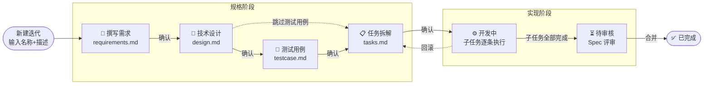

# Fun Harness 功能全景与环节介绍

> 本文面向实际使用本插件的项目工程师，介绍 Fun Harness 把 AI 编程组织成「可控研发流水线」的整体思路，以及每个环节如何推进、需要人工输入什么、最终沉淀出什么产物。

---

## 一、一句话定位

**Fun Harness** 是一个 VS Code 扩展，把 AI 辅助研发从「随手对话」升级为**阶段固定、产物固定、可评审、可回滚**的流水线：

> **需求 → 设计 →（测试用例）→ 任务拆解 → 开发 → 待审 → 完成**

每个阶段都产出一份固定的 Markdown 产物，并通过 **Git Worktree** 为每个迭代（Feature）隔离出独立的分支与工作目录，互不干扰。

---

## 二、全景流程图



每个规格阶段旁都挂着两类可选的「旁路能力」：

- **⚖️ AI 评审**：对当前产物做一次独立评审（非阻塞，评审失败不影响推进）。虽然流程上可选（刻意设计为不卡点），但**实际项目中建议在每个环节常规启用**，统一形成三步闭环：**AI 生成产物 → AI 评审产物 → 工程师人工复核并确认**。
- **⚙️ 自定义 Prompt**：打开该阶段的项目级自定义 Prompt 文件进行编辑。

---

## 三、阶段总览表

插件内部定义了 8 个阶段（见 [apps/src/models.ts](apps/src/models.ts#L44)）：

| 序号 | 阶段常量 | 界面标签 | 阶段 ID | 说明 |
|------|----------|----------|---------|------|
| 0 | `INITIALIZING` | ⌛ 初始化中 | `initializing` | 创建迭代、拉起 worktree 的过渡态 |
| 1 | `WRITING_REQUIREMENT` | 📝 撰写需求 | `writing_requirement` | 把业务诉求结构化为可验收需求 |
| 2 | `WRITING_DESIGN` | 📘 技术设计 | `writing_design` | 产出架构 / 接口 / 数据模型设计 |
| 3 | `WRITING_TESTCASE` | 🧪 测试用例 | `writing_testcase` | 产出测试用例矩阵（**可跳过**） |
| 4 | `WRITING_TASKS` | 📋 任务拆解 | `writing_tasks` | 拆分为可执行的开发子任务 |
| 5 | `DEVELOPING` | ⚙️ 开发中 | `developing` | 逐条驱动子任务写代码 |
| 6 | `READY_FOR_REVIEW` | ⏳ 待审核 | `ready_for_review` | 代码就绪，做 Spec 一致性评审 |
| 7 | `DONE` | ✅ 已完成 | `done` | 三段式合并回基线，清理 worktree |

> **快速模式（quickMode）**：新建迭代时可勾选，跳过需求/设计/测试用例/任务拆解，直接进入「开发中」，适合小改动或探索性任务。

---

## 四、各环节核心步骤

下面对每个环节说明四件事：**如何触发 → 人工需要输入什么 → 环节如何推进 → 最终产物**。

### 环节 1：📝 撰写需求（WRITING_REQUIREMENT）

- **如何触发**：在面板点击「新建迭代」，或从 TODO 提升为迭代。
- **人工输入**：
  - 迭代名称（英文/可从中文语义转写）
  - 迭代描述（中文业务故事、诉求背景）
  - 是否快速模式（可选）
- **如何推进**：点击「🤖 运行需求 Agent」，插件把描述 + 需求 System Prompt 合成后派发给 AI；AI 产出结构化需求（`Req-*` 编号、GIVEN/WHEN/THEN 验收标准、领域归类）。确认后点击「✅ 确认需求并进入设计」。
- **最终产物**：`specs/<迭代>/requirements.md`（含机读 YAML 区块：`requirements[]`，每条带 `id / domain / title / userStory / acceptanceCriteria`）。
- **旁路能力**：⚖️ AI 评审、📄 查看需求产物、⚙️ 需求评审 Prompt。
- **✅ 最佳使用建议**：AI 评审在流程上虽为可选（刻意设计为非阻塞，避免成为流程卡点），但实际项目中建议常规启用。推荐三步闭环：**AI 生成需求初稿 → AI 评审需求产物 → 工程师人工复核并确认**：先由需求 Agent 生成结构化初稿，再由 AI 评审检出需求的遗漏、歧义与不可测项，最后由工程师人工拊正并确认后进入设计。

### 环节 2：📘 技术设计（WRITING_DESIGN）

- **如何触发**：从需求阶段点击「✅ 确认需求并进入设计」。
- **人工输入**：无需再次输入（沿用需求上下文）。
- **如何推进**：点击「🤖 运行设计 Agent」，AI 基于需求产出架构设计、Mermaid 图、接口契约、数据模型、不变量；所有接口 / 模型需绑定到 `Req-*`。确认时可选择：
  - 「✅ 确认设计并进入 Testcase」→ 进入测试用例
  - 「✅ 确认设计并进入任务（跳过 Testcase）」→ 直接进入任务拆解
- **最终产物**：`specs/<迭代>/design.md`（机读 YAML：`apiContracts[] / invariants[]`）。
- **旁路能力**：< 返回需求、⚖️ AI 评审、📄 查看设计产物、⚙️ 设计评审 Prompt。
- **✅ 最佳使用建议**：推荐三步闭环：**AI 生成设计方案 → AI 评审设计产物 → 工程师人工复核并确认**。评审应重点校验接口契约是否完整回港至 `Req-*`、数据模型与不变量是否自洽；工程师确认后再决定进入测试用例或跳过。

### 环节 3：🧪 测试用例（WRITING_TESTCASE，可跳过）

- **如何触发**：从设计阶段点击「✅ 确认设计并进入 Testcase」。
- **人工输入**：无。
- **如何推进**：点击「🤖 运行测试用例 Agent」，AI 基于需求 + 设计产出 given-when-then 用例矩阵、测试数据与预期结果，并可选生成测试脚本。确认后进入任务拆解。
- **最终产物**：`specs/<迭代>/testcase.md`（机读 YAML：`testCases[]`），可选测试脚本文件。
- **旁路能力**：< 返回设计、⚖️ AI 评审、📄 查看测试用例、🧪 查看测试脚本、⚙️ 测试用例评审 Prompt。
- **✅ 最佳使用建议**：推荐三步闭环：**AI 生成测试用例 → AI 评审用例产物 → 工程师人工复核并确认**。评审应重点校验用例是否覆盖全部验收标准及边界、异常场景；工程师确认后进入任务拆解。

### 环节 4：📋 任务拆解（WRITING_TASKS）

- **如何触发**：从设计或测试用例阶段确认进入。
- **人工输入**：无（可事后微调子任务清单）。
- **如何推进**：点击「🤖 运行任务 Agent」，AI 把全部规格拆成可执行子任务（每条含 `id / name / status / description / dependencies / inputs / outputs / acceptanceCriteria`）。此时会生成**开发回滚快照**（记录 tasks 内容 + 各仓库 HEAD 提交），供后续回滚。确认后进入开发。
- **最终产物**：`specs/<迭代>/tasks.md`（子任务清单，`- [ ]` / `- [x]` 复选框驱动进度）+ 状态文件 `.harness/iteration-state.json`。
- **旁路能力**：< 返回测试用例、⚖️ AI 评审、📋 查看任务产物、⚙️ 任务拆解评审 Prompt。
- **✅ 最佳使用建议**：推荐三步闭环：**AI 生成任务拆解 → AI 评审拆解产物 → 工程师人工复核并确认**。评审应重点校验子任务粒度是否适中、依赖顺序是否正确、每项是否可独立验收；工程师确认后再进入开发（进入开发时才会锁定回滚快照）。

### 环节 5：⚙️ 开发中（DEVELOPING）

- **如何触发**：从任务拆解点击「✅ 确认任务拆解」；快速模式直接进入。
- **人工输入**：可在**自动**与**手动**两种模式间切换；手动模式下逐条触发子任务；随时可推送 / 回滚。
- **如何推进**：调度器（[FeatureScheduler](apps/src/featureScheduler.ts)）监听 `tasks.md`，对每个待办子任务派发开发 Prompt（携带需求/设计/用例/任务上下文），代码写入 worktree 对应目录（`frontend-iter` / `backend-iter` 或 monorepo 根）。子任务在 `tasks.md` 被标记完成后自动推进到下一条，全部完成后进入「待审核」。若开启自动修复，漂移门控失败时会自动派发修复 Prompt 更新规格。
- **最终产物**：worktree 目录内的源码；子任务进度；可选的 **Spec Delta** 漂移账本 / 摘要。
- **旁路能力**：▶ 自动执行 / ⏸ 暂停、⏭ 下一个、🚀 推送、回滚（回到任务拆解快照）、🧭 Spec 评审、📋 查看任务、🧪 查看测试脚本。
- **✅ 最佳使用建议**：首次使用或面对关键子任务时，建议采用**手动模式**逐条推进、逐步确认产出；建立信任后再切换至**自动模式**提效。开发阶段的 AI 评审以「🧭 Spec 评审」形式提供：建议**每完成若干子任务即执行一次**，及时发现规格与实现之间的漂移并修正，避免积累至「待审核」阶段才集中暴露。

### 环节 6：⏳ 待审核（READY_FOR_REVIEW）

- **如何触发**：开发阶段所有子任务完成后自动进入。
- **人工输入**：人工审阅代码与规格一致性；决定是否合并。
- **如何推进**：查看 **Spec 评审报告**（[SpecDeltaService](apps/src/services/specDeltaService.ts) 按领域给出风险等级）。当门控级别为 `strict` 且存在高风险漂移时会阻断合并。确认无误后点击「🏁 完成任务并合并」。
- **最终产物**：`specs/<迭代>/delta/domain-digest.latest.md`（领域漂移摘要）。
- **旁路能力**：🧭 Spec 评审报告、🔄 拉取代码、📤 提交代码、📋 查看任务。
- **✅ 最佳使用建议**：合并前应先查阅 **Spec 评审报告**并逐项消除高风险漂移——这是“AI 评审 → 人工确认”在整条流水线末端的收口。待确认各领域风险均处于可接受范围后，再执行「🏁 完成任务并合并」，以免将未对齐的规格带回基线。

### 环节 7：✅ 已完成（DONE）

- **如何触发**：待审核阶段点击「🏁 完成任务并合并」。
- **如何推进**：执行**三段式安全合并**：
  1. **备份**：提交并推送迭代分支到远端，校验 SHA 一致。
  2. **合并**：拉取基线 → 合并迭代分支 → 推送基线 → 校验基线已前进。
  3. **清理**：移除 worktree 目录（非强制，脏工作区会失败以保护未提交内容）。
- **最终产物**：规格与代码合并回基线分支；worktree 被清理；迭代进入终态。

---

## 五、贯穿全程的三大机制

### 1. Git Worktree 迭代隔离

- 每个迭代拥有**独立分支**（如 `task/<名称>-<短uuid>`）和**独立 worktree 目录**。
- **多仓模式**：分别克隆前端（`frontend-iter/`）与后端（`backend-iter/`）。
- **Monorepo 模式**：单一 worktree 根，按 `monorepoDirs` 识别子目录。
- 迭代生命周期内主仓库不受影响，直到「已完成」阶段才合并回基线。

### 2. Prompt 两层结构（每个阶段通用）

| 层 | 位置 | 作用 |
|----|------|------|
| **System Prompt（内置默认）** | `apps/system-prompts/<阶段>_system_prompt.md` | 随插件分发的不可变系统指令与输出契约 |
| **自定义 Prompt（项目覆盖）** | `specs/<迭代>/<阶段>_custom_prompt.md` | 项目级补充；Agent 类**追加**合并，评审类**完整替换** |

运行时的合成顺序：**宪法（Constitution）> System Prompt > 自定义 Prompt > 仓库约定**，再渲染 `{{taskName}}`、`{{taskDesc}}` 等模板变量。

各阶段对应文件：

| 阶段 | System Prompt | 自定义 Prompt |
|------|---------------|---------------|
| 需求 | `requirement_system_prompt.md` | `requirements_custom_prompt.md` |
| 设计 | `design_system_prompt.md` | `design_custom_prompt.md` |
| 测试用例 | `testcase_system_prompt.md` | `testcase_custom_prompt.md` |
| 任务拆解 | `task_system_prompt.md` | `tasks_custom_prompt.md` |
| 开发 | `dev_system_prompt.md` | `dev_custom_prompt.md` |
| 需求评审 | `review_requirements_system_prompt.md` | `review_requirements_custom_prompt.md` |
| 设计评审 | `review_design_system_prompt.md` | `review_design_custom_prompt.md` |
| 测试用例评审 | `review_testcase_system_prompt.md` | `review_testcase_custom_prompt.md` |
| 任务拆解评审 | `review_tasks_system_prompt.md` | `review_tasks_custom_prompt.md` |

> 评审 Prompt 的加载优先级：`review_*_custom_prompt.md`（项目自定义）> JSON 旧版配置 > 内置 `review_*_system_prompt.md` > 代码兜底字符串。

### 3. 领域知识 / SpecDelta / 宪法治理

- **领域知识（Domain Knowledge）**：`docs/domains/registry.yaml` 维护权威领域名映射，需求阶段每条 `Req-*` 必须归入合规领域；支持在 worktree 子面板中人工编辑、冲突检测与原子提交。
- **SpecDelta 漂移门控**：每个规格阶段记录快照，比对「规格 ↔ 实现」漂移，按领域评估风险（低/中/高），产出账本与摘要；`strict` 级别下高风险可阻断合并，产物落在 `specs/<迭代>/delta/`。
- **宪法（Constitution）**：全局治理规则，来源为内置 `constitution_default.md` 或项目自定义 `docs/constitution.md`，优先级最高，追加进每个阶段的 Prompt。

---

## 六、迭代目录结构速查

```
<迭代 worktree>/
├── .harness/
│   ├── iteration-state.json     # 迭代状态（阶段、配置、进度）
│   └── spec-delta/              # 漂移账本与摘要
├── specs/
│   ├── requirements.md          # 需求产物
│   ├── design.md                # 设计产物
│   ├── testcase.md              # 测试用例产物
│   ├── tasks.md                 # 任务拆解 / 子任务清单
│   └── delta/                   # 领域漂移摘要
├── docs/                        # 项目结构、宪法等人读文档
├── frontend-iter/               # 多仓模式：前端代码
└── backend-iter/                # 多仓模式：后端代码
```

---

## 七、快速上手清单

1. 在面板**新建迭代**，填写名称与描述（或勾选快速模式）。
2. 依次在各阶段点击「🤖 运行 …… Agent」生成产物，用「📄 查看」核对，必要时「⚖️ AI 评审」。
3. 每阶段满意后点「✅ 确认」推进；测试用例可按需跳过。
4. 进入「开发中」后选择**自动**或**手动**驱动子任务，随时可**回滚**到任务快照。
5. 子任务全部完成后在「待审核」查看 **Spec 评审报告**，确认后「🏁 完成任务并合并」。
```
