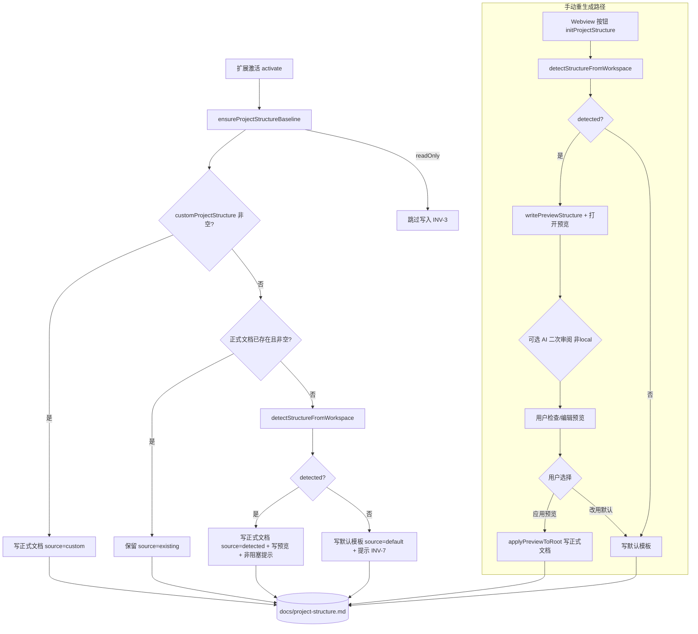

# 设计文档

## 1. 概述

本设计覆盖需求文档 [docs/project-structure/requirements.md](docs/project-structure/requirements.md) 中的 Req-1 ~ Req-7，目标是让 `docs/project-structure.md` 在**初始化时机**优先根据仓库真实代码目录结构生成，并明确「探测 → 预览 → 确认 → 应用 → 回退」的交互、流程与时机。

本设计不引入 HTTP/前端 Web 服务，而是面向 VS Code 扩展内部契约。因此下文的「API 契约」指 `ProjectStructureService` 的服务方法契约与扩展宿主的编排契约；「路由设计」指 Webview ↔ 扩展宿主的消息路由；「组件 Props/Events」指设置页 Webview 的交互按钮；「Store 设计」指扩展宿主内存态。

核心设计决策（回答需求中的「交互、流程、时机该如何」）：

- **两条时机路径分离**：
  - **自动基线时机**（`ensureProjectStructureBaseline` → `ensureBaseline`）：静默、非阻塞。在既有优先级链 `custom > existing > default` 中**插入 `detected` 分支**，形成 `custom > existing > detected > default`。检测成功即以真实结构写入正式文档并给出非阻塞提示；同时写一份预览供可选精修。
  - **手动重生成时机**（`handleInitProjectStructure`）：交互式，执行完整「探测 → 预览 → 用户检查/编辑 → 应用/改用默认」流程。
- **来源唯一性**：每次生成的正式文档来源必须唯一可判定为 `custom | existing | detected | default` 之一。
- **只读保护 / 幂等 / 非阻塞**：只读窗口不写；同仓库状态重复执行结果一致；AI 二次审阅仅增强预览，失败不回滚。

## 2. 架构设计

### 2.1 架构图（Mermaid）



### 2.2 项目目录结构

本次改动仅触及既有扩展代码，参考 [docs/project-structure.md](docs/project-structure.md)。涉及文件：

```text
apps/src/
├── extension.ts                         # 编排：ensureProjectStructureBaseline / handleInitProjectStructure / handleApplyProjectStructurePreview
├── harnessMessageController.ts          # 消息路由：initProjectStructure / applyProjectStructurePreview
├── harnessMessages.ts                   # 消息类型定义
├── models.ts                            # Config: customProjectStructure / projectStructureRefineMode / monorepoGit
└── services/
    ├── projectStructureService.ts       # 探测/预览/落盘/幂等核心（本次主要改动）
    └── aiDispatchService.ts             # 可选 AI 二次审阅
docs/
├── project-structure.md                 # 正式文档（monorepo 下位于 repos/mono-main/docs/）
└── project-structure.preview.md         # 预览文档
```

### 2.3 路由设计

Webview → 扩展宿主消息路由（`HarnessMessageController.handle`）：

| 消息 type | 触发来源 | 处理器 | 绑定需求 |
| --- | --- | --- | --- |
| `initProjectStructure` | 设置页「初始化项目结构」按钮 | `initProjectStructure()` → `handleInitProjectStructure()` | Req-4, Req-7 |
| `applyProjectStructurePreview` | 设置页「应用预览结构」按钮 | `applyProjectStructurePreview()` → `handleApplyProjectStructurePreview()` | Req-4, Req-6 |

自动路由（无 Webview 交互）：扩展 `activate()` → `ensureProjectStructureBaseline()`（Req-1, Req-2, Req-7）。

## 3. 组件与接口设计

### 3.1 API 契约

> 说明：为 VS Code 扩展内部服务/编排契约，`path` 表示服务方法路径，`method` 表示调用语义（`SERVICE` / `ORCHESTRATION` / `MESSAGE`）。

- **API-1 `ProjectStructureService.ensureBaseline`**（绑定 Req-1, Req-2, Req-6, Req-7）
  - 入参：`customProjectStructure: string`
  - 出参：`{ source: 'custom' | 'existing' | 'detected' | 'default'; filePath: string }`
  - 行为：按 `custom > existing > detected > default` 决策唯一来源；`detected` 分支调用 API-2，检测成功写正式文档并写预览，失败落默认。只读由调用方（API-6）拦截。

- **API-2 `ProjectStructureService.detectStructureFromWorkspace`**（绑定 Req-1, Req-3, Req-5）
  - 入参：无
  - 出参：`{ content: string; detected: boolean; summary: string }`
  - 行为：探测前端（Vue3/React）、后端（Java-DDD/分层/混合/多模块、Node.js）真实目录，输出真实目录树；无可识别项目时 `detected=false`，`content` 回退默认模板，`summary` 含回退说明；单点读取失败不得抛出以中断整体（尽力返回）。

- **API-3 `ProjectStructureService.writePreviewStructure`**（绑定 Req-4）
  - 入参：`content: string`
  - 出参：`filePath: string`（`docs/project-structure.preview.md`）

- **API-4 `ProjectStructureService.applyPreviewToRoot`**（绑定 Req-4, Req-6）
  - 入参：无
  - 出参：`boolean`（成功 `true`；预览不存在或为空 `false`，且不得修改正式文档）

- **API-5 `ProjectStructureService.writeRootStructure` / `readRootStructure`**（绑定 Req-6）
  - 行为：正式文档幂等落盘/读取；相同内容重复写入结果一致，不产生重复目录块。

- **API-6 `Extension.ensureProjectStructureBaseline`**（绑定 Req-1, Req-2, Req-7）
  - 行为：`configMeta.readOnly` 为真时直接返回不写；monorepo 模式设置 `setMonorepoMainDir(repos/mono-main)`；随后调用 API-1；`detected`/`default` 分支给出非阻塞提示。

- **API-7 `Extension.handleInitProjectStructure`**（绑定 Req-4, Req-5, Req-7）
  - 行为：手动交互路径。custom → 直接写正式文档；否则 API-2 → API-3 写预览并打开 → 非 `local` 模式可选触发 AI 二次审阅（失败仅告警，不回滚）→ 提供「立即应用预览 / 改用默认结构」选项。

- **API-8 `Extension.handleApplyProjectStructurePreview`**（绑定 Req-4, Req-6）
  - 行为：只读拦截；调用 API-4；`false` 时告警且不损坏正式文档；`true` 时打开正式文档并提示成功。

### 3.2 数据模型

```ts
// 结构探测结果（API-2）
type DetectionResult = {
  content: string;      // 目录树 Markdown（detected=true 时来源于真实目录 INV-5）
  detected: boolean;    // 是否成功提炼
  summary: string;      // 展示摘要 / 回退说明
};

// 基线决策结果（API-1）
type BaselineResult = {
  source: StructureSource;
  filePath: string;
};

// 来源唯一枚举（INV-1）
type StructureSource = 'custom' | 'existing' | 'detected' | 'default';

// 相关配置（models.ts Config 子集）
type ProjectStructureConfig = {
  customProjectStructure: string;                 // Req-2
  projectStructureRefineMode: 'local' | 'local+ai'; // Req-7.4
  monorepoGit: string;                            // Req-1.3
};
```

绑定：`DetectionResult` → Req-1/Req-3/Req-5；`BaselineResult`/`StructureSource` → Req-2；`ProjectStructureConfig` → Req-2/Req-7。

### 3.3 组件 Props / Events

设置页 Webview 结构初始化区（绑定 Req-4, Req-7）：

| 组件 | Props（输入） | Events（输出消息） | 绑定需求 |
| --- | --- | --- | --- |
| 「初始化项目结构」按钮 | `readOnly: boolean`（只读禁用） | `postMessage({ type: 'initProjectStructure' })` | Req-4, Req-7 |
| 「应用预览结构」按钮 | `readOnly: boolean` | `postMessage({ type: 'applyProjectStructurePreview' })` | Req-4, Req-6 |
| 结构来源提示 | `source: StructureSource`, `summary: string` | 无 | Req-2, Req-5 |

非阻塞通知（`vscode.window.showInformationMessage`）承载 detected/default 的可操作选项（「立即应用预览 / 改用默认结构」），绑定 Req-4/Req-5。

### 3.4 Store 设计

扩展宿主内存态（非持久化）：

| 状态 | 类型 | 说明 | 绑定需求 |
| --- | --- | --- | --- |
| `config` | `Config` | 含 `customProjectStructure` / `projectStructureRefineMode` / `monorepoGit` | Req-2, Req-7 |
| `configMeta.readOnly` | `boolean` | 只读快照窗口标志，写操作前置判断 | Req-7.2 |
| `projectStructureService.monorepoMainDir` | `string \| undefined` | monorepo 落盘根目录（`repos/mono-main`） | Req-1.3 |

持久化事实以文件为准：正式文档 `docs/project-structure.md`、预览 `docs/project-structure.preview.md`（Req-4, Req-6）。

## 4. 正确性属性（需求不变量）

- **INV-1（来源唯一）**：任一次 `ensureBaseline` 结束，`source` 恰为 `custom|existing|detected|default` 之一，不同时应用多个来源。 → Req-2.4
- **INV-2（检测优先于默认）**：当无 custom、正式文档不存在且 `detected=true` 时，正式文档内容必来源于探测结果，不得写静态默认模板。 → Req-1.1
- **INV-3（只读不写）**：`configMeta.readOnly` 为真时，任何生成/探测/应用路径都不得写正式或预览文档。 → Req-7.2
- **INV-4（幂等落盘）**：同一仓库状态重复执行基线/生成，正式文档内容与落盘路径一致，无重复目录块。 → Req-6.1, Req-6.2
- **INV-5（真实目录来源）**：`detected=true` 的目录树节点必对应真实扫描到的目录/包路径，无硬编码示例目录。 → Req-1.2
- **INV-6（应用预览不清空）**：预览不存在或为空时 `applyPreviewToRoot` 返回 `false` 且正式文档保持不变。 → Req-4.4
- **INV-7（失败非空回退）**：`detected=false` 时正式文档必为非空默认模板并给出提示。 → Req-2.3, Req-5.1
- **INV-8（AI 审阅非阻塞）**：非 `local` 模式 AI 二次审阅仅增强预览，其失败不得阻塞或回滚已生成的预览/正式文档。 → Req-7.4
- **INV-9（monorepo 落位）**：monorepo 模式下探测根与落盘位置遵循 `repos/mono-main` 约定。 → Req-1.3

## 5. 错误处理

| 场景 | 处理策略 | 绑定 |
| --- | --- | --- |
| 单个目录/文件读取失败（探测中） | try/catch 局部吞掉，继续探测其余；不中断整体，尽力返回已探测部分 | Req-5.2 |
| 无可识别前后端（`detected=false`） | 写默认模板并 `showInformationMessage` 提示已回退 | Req-2.3, Req-5.1 |
| 预览为空/不存在时应用 | 返回 `false` + `showWarningMessage`，不改正式文档 | Req-4.4 |
| 只读窗口触发写操作 | 前置 `readOnly` 判断，`showWarningMessage` 拒绝 | Req-7.2 |
| AI 二次审阅调用失败 | 捕获异常仅 `showWarningMessage`，保留已生成预览/正式文档 | Req-7.4 |
| 正式文档已存在（existing） | 保留原内容，不覆盖 | Req-2.2, Req-6.2 |

## 6. 测试策略

- **单元测试（`ProjectStructureService`）**
  - `ensureBaseline` 四分支来源判定（custom/existing/detected/default），断言 `source` 唯一（INV-1）。 → Req-2
  - `detectStructureFromWorkspace`：构造 Vue3/React/Java 单模块/Java 多模块/Node.js/空仓 夹具，断言 `detected` 与目录树来源真实（INV-2, INV-5）。 → Req-1, Req-3, Req-5
  - `applyPreviewToRoot`：预览为空/不存在返回 `false` 且正式文档不变（INV-6）。 → Req-4
  - 幂等：同状态两次 `ensureBaseline` 内容与路径一致（INV-4）。 → Req-6
  - monorepo：`setMonorepoMainDir` 后落盘路径位于 `repos/mono-main/docs`（INV-9）。 → Req-1.3
- **编排测试（`extension`）**
  - `ensureProjectStructureBaseline` 在 `readOnly=true` 时不写文件（INV-3）。 → Req-7.2
  - `handleInitProjectStructure` 交互路径生成预览、非 `local` 触发 AI、AI 失败不回滚（INV-8）。 → Req-4, Req-7.4
- **回归**：确保既有 `existing` 分支与 monorepo 复制流程（`copyRootStructureToIteration`）不被破坏。 → Req-6

## 7. 机器可读区

```yaml
artifactType: design
taskName: project-structure
apiContracts:
  - id: API-1
    requirementIds: [Req-1, Req-2, Req-6, Req-7]
    method: SERVICE
    path: ProjectStructureService.ensureBaseline
    request: { customProjectStructure: string }
    response: { source: "custom|existing|detected|default", filePath: string }
  - id: API-2
    requirementIds: [Req-1, Req-3, Req-5]
    method: SERVICE
    path: ProjectStructureService.detectStructureFromWorkspace
    request: {}
    response: { content: string, detected: boolean, summary: string }
  - id: API-3
    requirementIds: [Req-4]
    method: SERVICE
    path: ProjectStructureService.writePreviewStructure
    request: { content: string }
    response: { filePath: string }
  - id: API-4
    requirementIds: [Req-4, Req-6]
    method: SERVICE
    path: ProjectStructureService.applyPreviewToRoot
    request: {}
    response: { applied: boolean }
  - id: API-5
    requirementIds: [Req-6]
    method: SERVICE
    path: ProjectStructureService.writeRootStructure
    request: { content: string }
    response: {}
  - id: API-6
    requirementIds: [Req-1, Req-2, Req-7]
    method: ORCHESTRATION
    path: Extension.ensureProjectStructureBaseline
    request: {}
    response: {}
  - id: API-7
    requirementIds: [Req-4, Req-5, Req-7]
    method: ORCHESTRATION
    path: Extension.handleInitProjectStructure
    request: {}
    response: {}
  - id: API-8
    requirementIds: [Req-4, Req-6]
    method: MESSAGE
    path: Extension.handleApplyProjectStructurePreview
    request: { type: "applyProjectStructurePreview" }
    response: {}
models:
  - id: MODEL-DetectionResult
    requirementIds: [Req-1, Req-3, Req-5]
    fields: { content: string, detected: boolean, summary: string }
  - id: MODEL-BaselineResult
    requirementIds: [Req-2]
    fields: { source: "custom|existing|detected|default", filePath: string }
  - id: MODEL-ProjectStructureConfig
    requirementIds: [Req-2, Req-7]
    fields: { customProjectStructure: string, projectStructureRefineMode: "local|local+ai", monorepoGit: string }
components:
  - id: CMP-InitButton
    requirementIds: [Req-4, Req-7]
    props: { readOnly: boolean }
    events: [initProjectStructure]
  - id: CMP-ApplyPreviewButton
    requirementIds: [Req-4, Req-6]
    props: { readOnly: boolean }
    events: [applyProjectStructurePreview]
invariants:
  - id: INV-1
    requirementId: Req-2
    rule: ensureBaseline 结束时 source 唯一属于 custom|existing|detected|default
  - id: INV-2
    requirementId: Req-1
    rule: 无 custom 且正式文档不存在且 detected=true 时，正式文档来源于探测结果而非默认模板
  - id: INV-3
    requirementId: Req-7
    rule: readOnly 窗口不得写正式或预览文档
  - id: INV-4
    requirementId: Req-6
    rule: 同仓库状态重复执行，正式文档内容与路径一致且无重复目录块
  - id: INV-5
    requirementId: Req-1
    rule: detected=true 的目录树节点均对应真实扫描目录/包路径
  - id: INV-6
    requirementId: Req-4
    rule: 预览为空或不存在时 applyPreviewToRoot 返回 false 且正式文档不变
  - id: INV-7
    requirementId: Req-5
    rule: detected=false 时正式文档为非空默认模板并给出提示
  - id: INV-8
    requirementId: Req-7
    rule: 非 local 模式 AI 二次审阅失败不得阻塞或回滚已生成文档
  - id: INV-9
    requirementId: Req-1
    rule: monorepo 模式探测根与落盘位置遵循 repos/mono-main 约定
```
