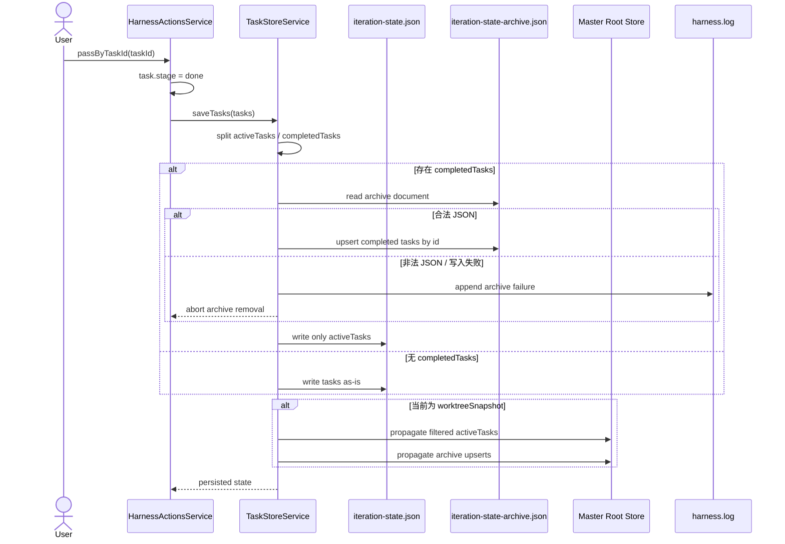

# 设计文档

## 1. 概述

本设计为 Fun Harness 引入“完成后归档”能力：当迭代任务进入 `STAGE.DONE` 后，状态存储层必须将该任务从活跃状态文件 `.harness/iteration-state.json` 中移除，并以追加且幂等的方式写入 `.harness/iteration-state-archive.json`。该能力覆盖 Req-1 至 Req-7，目标是在不改变现有 `Task` 契约和无关模块行为的前提下，分离“活跃任务视图”与“历史审计记录”。

本设计的职责边界限定为迭代状态存储与完成动作触发链路：`harnessActionsService.passByTaskId` 负责产生“任务已完成”的状态变化，`taskStoreService` 负责完成归档、活跃状态落盘以及主/子工作区传播一致性。归档文档结构复用工作区待办归档范式，保持 `schemaVersion`、归档元数据和追加式持久化的一致治理模型。

## 2. 架构设计

### 2.1 架构图（Mermaid）



### 2.2 项目目录结构

本设计不新增运行时入口，不调整无关模块；仅在下列现有边界内扩展归档语义：

```text
apps/src/
├── models.ts
│   └── 新增迭代归档常量与归档文档类型；保持 Task 原结构不变
├── services/
│   ├── taskStoreService.ts
│   │   └── 归档主流程、活跃文件过滤、主/子工作区传播一致化
│   ├── harnessActionsService.ts
│   │   └── 完成动作触发点，继续通过 saveTasks 进入持久化链路
│   └── workspaceTodoStoreService.ts
│       └── 作为归档文档结构与失败回滚策略的参考实现
└── .harness/
    ├── iteration-state.json
    └── iteration-state-archive.json
```

### 2.3 路由设计

本需求不引入 HTTP 路由，也不增加新的 Webview 消息协议；“路由”仅体现为内部状态流转路径：

| 路由 ID | 入口 | 目标 | 绑定需求 |
| --- | --- | --- | --- |
| ROUTE-1 | `HarnessActionsService.passByTaskId` | 将目标任务置为 `STAGE.DONE` 后调用 `saveTasks` | Req-1, Req-2 |
| ROUTE-2 | `TaskStoreService.saveTasks` | 识别 `done` 任务并执行归档优先、活跃后写入 | Req-1, Req-3, Req-5 |
| ROUTE-3 | `TaskStoreService.propagateTasksToMaster` | 子工作区保存后向主工作区传播活跃状态和归档状态 | Req-6 |

## 3. 组件与接口设计

### 3.1 API 契约

#### API-1：完成态持久化入口

- 绑定需求：Req-1, Req-2
- 调用方：`HarnessActionsService.passByTaskId`
- 被调方：`TaskStoreService.saveTasks(tasks: Task[]): void`
- 契约：

| 字段 | 约束 |
| --- | --- |
| 输入 | 包含最新 `stage` 的完整任务数组；其中目标任务已被置为 `done` |
| 前置条件 | `task.id` 唯一，`Task` 字段名称与语义不变 |
| 后置条件 | 所有 `done` 任务不得再出现在写回后的活跃状态文件中 |
| 失败语义 | 若归档写入未成功，则不得移除对应活跃任务 |

#### API-2：归档计划与活跃过滤

- 绑定需求：Req-2, Req-3, Req-5, Req-7
- 所属组件：`TaskStoreService`
- 建议新增内部接口：`archiveCompletedTasks(root: string, tasks: Task[]): Task[]`
- 契约：

| 字段 | 约束 |
| --- | --- |
| 输入 | 某一权威根目录下待保存的任务数组 |
| 处理 | 按 `task.stage === STAGE.DONE` 分离 `completedTasks` 与 `activeTasks` |
| 输出 | 返回允许写回 `iteration-state.json` 的 `activeTasks` |
| 幂等 | 对已存在于归档文件中的相同 `task.id` 不重复追加 |
| 原子性 | 只有在归档文件持久化成功后，`activeTasks` 才允许覆盖活跃文件 |

#### API-3：归档文档 Upsert

- 绑定需求：Req-3, Req-4, Req-5
- 所属组件：`TaskStoreService`
- 建议新增内部接口：`writeArchiveDocument(root: string, completedTasks: Task[]): void`
- 契约：

| 字段 | 约束 |
| --- | --- |
| 目标路径 | `<root>/.harness/iteration-state-archive.json` |
| 写入策略 | 读取现有归档文档后按 `task.id` 去重 Upsert；新条目追加到数组末尾 |
| 归档元数据 | 每个新归档条目必须包含 `archivedAt` 和 `archiveReason: completed` |
| 非法文件处理 | 解析失败时阻断本次归档移除，记录日志，不抛出未捕获异常 |
| 兼容性 | 顶层 `schemaVersion` 与条目字段名稳定，后续版本不得单方面改名 |

#### API-4：主工作区传播

- 绑定需求：Req-5, Req-6
- 所属组件：`TaskStoreService.propagateTasksToMaster(masterRoot, tasks)`
- 契约：

| 字段 | 约束 |
| --- | --- |
| 调用时机 | `origin === 'worktreeSnapshot'` 的保存流程 |
| 活跃状态传播 | 主工作区收到的活跃文件必须是完成任务已剔除后的结果 |
| 归档传播 | 主工作区归档文件必须接收相同 `task.id` 归档 Upsert 结果 |
| 自愈 | 当主工作区已存在该归档项但活跃文件仍残留时，重跑后仅移除残留，不新增重复归档 |

### 3.2 数据模型

#### 模型 M-1：归档条目

- 绑定需求：Req-3, Req-4, Req-5

`IterationArchiveItem` 为 `Task` 的归档快照扩展类型，定义如下：

| 字段 | 类型 | 说明 |
| --- | --- | --- |
| `id` | `string` | 直接复用 `Task.id`，作为幂等主键 |
| `name` | `string` | 直接复用 `Task.name` |
| `stage` | `Stage` | 必须为 `done` |
| `...taskFields` | `Task` 其余字段 | 保留归档时刻的任务原始业务字段 |
| `archivedAt` | `string` | ISO-8601 时间戳 |
| `archiveReason` | `'completed'` | 当前版本固定值 |

#### 模型 M-2：归档文档

- 绑定需求：Req-3, Req-4

| 字段 | 类型 | 说明 |
| --- | --- | --- |
| `schemaVersion` | `number` | 当前版本固定为 `1` |
| `tasks` | `IterationArchiveItem[]` | 已归档迭代集合 |
| `lastSyncedAt` | `string` | 最近一次成功写入归档文件的时间戳 |

#### 模型 M-3：常量与兼容性

- 绑定需求：Req-4, Req-7

需要在 `models.ts` 中新增但不破坏既有 `Task` 契约的常量/类型：

| 名称 | 说明 |
| --- | --- |
| `HARNESS_STATE_ARCHIVE_FILE` | 值为 `iteration-state-archive.json` |
| `ITERATION_ARCHIVE_SCHEMA_VERSION` | 当前值为 `1` |
| `IterationArchiveItem` / `IterationArchiveDocument` | 独立于 `Task` 的归档模型 |

### 3.3 组件 Props / Events

本需求无新增前端组件、Props 或 Webview 事件；为满足追溯要求，仅定义服务层事件语义。

| 事件 ID | 触发源 | 载荷 | 结果 | 绑定需求 |
| --- | --- | --- | --- | --- |
| EVT-1 | `passByTaskId` | `taskId` + 已更新任务数组 | 进入 `saveTasks` 持久化链路 | Req-1 |
| EVT-2 | `saveTasks` | `completedTasks[]` | 触发归档文档 Upsert | Req-3, Req-5 |
| EVT-3 | `saveTasks` in worktree snapshot | `masterRoot` + 过滤后的活跃任务 + 已完成任务 | 传播到主工作区活跃文件与归档文件 | Req-6 |

### 3.4 Store 设计

状态存储采用“双文档职责分离”模型：

| 存储 | 权威内容 | 写入原则 | 绑定需求 |
| --- | --- | --- | --- |
| `iteration-state.json` | 仅未完成任务 | 写入前先剔除全部 `done` 任务 | Req-1, Req-2 |
| `iteration-state-archive.json` | 全量已完成任务历史 | 追加式、按 `task.id` 幂等去重 | Req-3, Req-5 |

主工作区是全局权威根；子工作区快照在只读语义下仍可通过既有 `propagateTasksToMaster` 通道请求主工作区完成持久化一致化。设计上不要求子工作区单独维护一份独立归档真相，而是要求其保存动作可确定地把归档结果收敛到主工作区归档文件，避免主/子两侧历史分叉。

## 4. 正确性属性（需求不变量）

| ID | 绑定需求 | 不变量 |
| --- | --- | --- |
| INV-1 | Req-1 | 任意一次 `saveTasks` 完成后，写回 `iteration-state.json` 的任务集合满足 `forall t in active: t.stage != done`。 |
| INV-2 | Req-2 | 对任意任务 `t`，若其 `id` 出现在归档文件中且本次保存成功，则随后 `loadTasks` 返回结果中不得再包含同 `id` 的活跃条目。 |
| INV-3 | Req-3 | 任意新归档条目都必须保留归档时刻的 `Task` 原始字段，并新增 `archivedAt` 与 `archiveReason=completed`。 |
| INV-4 | Req-4 | 归档文件顶层结构恒为 `{ schemaVersion, tasks, lastSyncedAt }`；字段名与语义在当前需求范围内不可漂移。 |
| INV-5 | Req-5 | 对任意任务 `t`，归档文件中满足 `count(items where id=t.id) <= 1`。 |
| INV-6 | Req-5 | 若归档文档写入失败，则活跃状态文件不得丢失该 `done` 任务；下次重跑仍可再次尝试归档。 |
| INV-7 | Req-6 | 在 `origin === worktreeSnapshot` 的保存场景中，主工作区活跃文件与归档文件最终状态必须与同一批任务在主工作区直接保存的结果等价。 |
| INV-8 | Req-7 | 归档能力不得修改 `Task` 已有字段的名称、类型语义或非存储层调用方契约。 |

## 5. 错误处理

| 场景 | 处理方式 | 用户/系统影响 | 日志要求 |
| --- | --- | --- | --- |
| 归档文件不存在 | 创建 `.harness` 目录及新归档文档 | 正常完成保存 | 可选记录初始化日志 |
| 归档文件 JSON 非法 | 阻断本次归档移除；保留活跃任务 | 不发生数据丢失；保存链路以“未归档成功”结束 | 必须记录失败原因到 harness 日志 |
| 归档文件写入失败 | 不覆盖活跃状态文件 | 保证原子性，不丢失已完成任务 | 必须记录错误详情 |
| 活跃状态写入失败且归档已成功 | 允许归档保留；下一次保存按 `id` 去重后继续移除活跃残留 | 系统通过重跑自愈 | 必须记录“需重试移除”日志 |
| 主工作区传播失败 | 不阻断子工作区本地保存；等待后续重跑收敛 | 主/子短暂不一致，但不丢档 | 必须记录传播失败原因 |
| 非 `done` 任务参与保存 | 严禁进入归档数组 | 活跃列表保持原样 | 无需错误日志 |

## 6. 测试策略

| 测试类型 | 覆盖场景 | 绑定需求 |
| --- | --- | --- |
| 单元测试 | `saveTasks` 将 `done` 任务从活跃数组剔除，未完成任务保持原字段不变 | Req-1, Req-2 |
| 单元测试 | 首次归档时自动创建 `iteration-state-archive.json`，并写入合法 `schemaVersion` 与 `tasks` 数组 | Req-3, Req-4 |
| 单元测试 | 相同 `task.id` 重复归档仅保留一条记录 | Req-5 |
| 单元测试 | 归档文件损坏时，`saveTasks` 不抛未捕获异常、不删除活跃任务，并写日志 | Req-4, Req-5 |
| 单元测试 | 归档写入成功但活跃写入失败后，下一次重跑能够移除活跃残留且不重复归档 | Req-5 |
| 集成测试 | `passByTaskId` 置 `done` 后触发保存，随后 `loadTasks` 不再返回该任务 | Req-1, Req-2 |
| 集成测试 | worktree snapshot 保存后，主工作区活跃状态与归档文件与预期一致 | Req-6 |
| 回归测试 | 非 `done` 阶段保存、旧 `Task` 字段消费方、现有待办归档功能不受影响 | Req-7 |

## 7. 机器可读区

```yaml
artifactType: design
taskName: after-iteration
apiContracts:
  - id: API-1
    requirementIds: [Req-1, Req-2]
    method: INTERNAL_SAVE
    path: TaskStoreService.saveTasks
    request:
      tasks: Task[]
      precondition: target task stage already set to done by completion flow
    response:
      writes:
        - .harness/iteration-state.json
      guarantee: done tasks are absent from active state after successful save
  - id: API-2
    requirementIds: [Req-2, Req-3, Req-5, Req-7]
    method: INTERNAL_ARCHIVE
    path: TaskStoreService.archiveCompletedTasks
    request:
      root: workspace root
      tasks: Task[]
    response:
      activeTasks: Task[]
      guarantee: archive persists before active-state removal
  - id: API-3
    requirementIds: [Req-3, Req-4, Req-5]
    method: INTERNAL_UPSERT
    path: TaskStoreService.writeArchiveDocument
    request:
      root: workspace root
      completedTasks: Task[]
    response:
      writes:
        - .harness/iteration-state-archive.json
      guarantee: archive items are deduplicated by id and annotated with archivedAt/archiveReason
  - id: API-4
    requirementIds: [Req-5, Req-6]
    method: INTERNAL_PROPAGATE
    path: TaskStoreService.propagateTasksToMaster
    request:
      masterRoot: string
      tasks: Task[]
    response:
      writes:
        - master .harness/iteration-state.json
        - master .harness/iteration-state-archive.json
      guarantee: master state converges with worktree-origin save result
models:
  - id: M-1
    requirementIds: [Req-3, Req-4, Req-5]
    name: IterationArchiveItem
    fields: [id, name, stage, archivedAt, archiveReason]
  - id: M-2
    requirementIds: [Req-3, Req-4]
    name: IterationArchiveDocument
    fields: [schemaVersion, tasks, lastSyncedAt]
  - id: M-3
    requirementIds: [Req-4, Req-7]
    name: HARNESS_STATE_ARCHIVE_FILE
    fields: [iteration-state-archive.json]
components:
  - id: CMP-1
    requirementIds: [Req-1, Req-2]
    name: HarnessActionsService.passByTaskId
    responsibility: marks task done and delegates persistence
  - id: CMP-2
    requirementIds: [Req-2, Req-3, Req-5, Req-6]
    name: TaskStoreService
    responsibility: filters active tasks, writes archive, propagates to master
invariants:
  - id: INV-1
    requirementId: Req-1
    rule: active iteration-state.json never contains tasks whose stage is done after a successful save
  - id: INV-2
    requirementId: Req-2
    rule: archived task ids are absent from subsequent loadTasks results
  - id: INV-3
    requirementId: Req-3
    rule: every new archive item preserves task fields and adds archivedAt plus archiveReason=completed
  - id: INV-4
    requirementId: Req-4
    rule: archive document shape remains schemaVersion plus tasks plus lastSyncedAt
  - id: INV-5
    requirementId: Req-5
    rule: archive contains at most one item per task id and active removal happens only after archive persistence succeeds
  - id: INV-6
    requirementId: Req-6
    rule: worktree-origin saves converge master active state and master archive state to the same logical result
  - id: INV-7
    requirementId: Req-7
    rule: Task field names and semantics remain unchanged while adding archive-only models
```