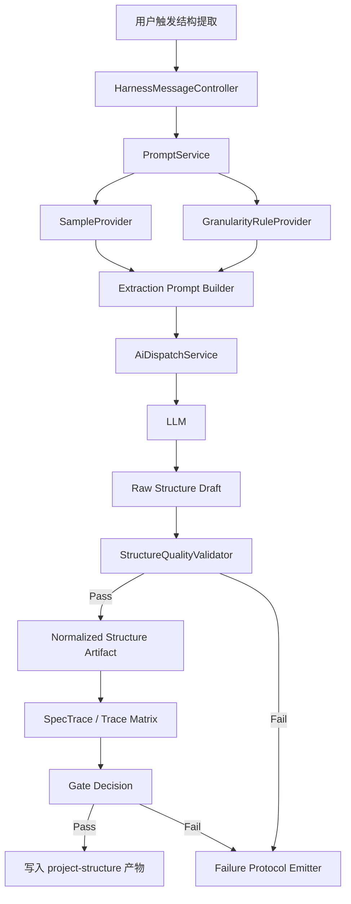

# 设计文档
## 1. 概述
本设计面向 better-project-structure 能力升级，目标是在现有 VS Code 扩展流水线中引入“样例驱动 + 规则约束”的项目结构提取机制，替代单一强约束提示词方案，从而提升 product-structure 产物的稳定性、可读性与信息完整性。

设计范围聚焦于结构提取链路：输入装配（样例与规则）→ AI 请求组装 → 结果结构化校验 → 追溯与门禁。所有设计实体必须绑定需求：Req-1 至 Req-5。

## 2. 架构设计
### 2.1 架构图（Mermaid）


### 2.2 项目目录结构
```text
apps/src/
  extension.ts                        # 项目结构预览应用、AI 二次审阅与门禁触发入口
  harnessMessageController.ts         # 结构提取触发入口与路由
  harnessMessages.ts                  # 提取请求/响应契约定义
  services/
    promptService.ts                  # 组装样例+规则+输出契约提示词
    aiDispatchService.ts              # 发送 LLM 请求与响应接收
    projectStructureService.ts        # 提取流程编排与产物标准化
    specDeltaService.ts               # 门禁校验与差异规则
    harnessLog.ts                     # 结构门禁失败日志与统一日志写入
    taskStoreService.ts               # 任务上下文与阶段状态
  specTrace.ts                        # Req-* 到设计/任务/测试映射与断裂检测
spec-delta/
  domain-classification-rules.yaml    # 规则基础配置输入
specs/better-project-structure/
  requirements.md                     # 需求基线（已存在）
  design.md                           # 本设计文档
```

### 2.3 路由设计
1. Route-1（Req-1, Req-2, Req-3）
- 入口事件：webview.message.extractProjectStructure
- 处理器：HarnessMessageController.handleExtractProjectStructure
- 语义：触发样例驱动结构提取并返回结构草案与质量摘要。

2. Route-2（Req-4）
- 入口事件：webview.message.validateProjectStructure
- 处理器：HarnessMessageController.handleValidateProjectStructure
- 语义：对提取结果执行结构合法性与门禁规则校验。

3. Route-3（Req-5）
- 入口事件：webview.message.traceRequirements
- 处理器：HarnessMessageController.handleTraceRequirements
- 语义：输出 Req-* 到设计/任务/测试的追溯关系快照。

## 3. 组件与接口设计
### 3.1 API 契约
1. API-1（Req-1, Req-2, Req-3）
- method: POST
- path: /internal/project-structure/extract
- request:
  - workspaceRoot: string
  - sampleProfileId: string
  - granularityProfileId: string
  - extractionMode: enum(sampleDriven|legacy)
- response:
  - structureDraft: object
  - qualitySignals: array
  - contractVersion: string

2. API-2（Req-4）
- method: POST
- path: /internal/project-structure/validate
- request:
  - structureDraft: object
  - requiredSections: array
  - requiredFields: array
- response:
  - passed: boolean
  - gateStatus: enum(passed|failed)
  - violations: array
  - gateId: string
  - checkedAt: string

3. API-3（Req-5）
- method: GET
- path: /internal/project-structure/trace
- request:
  - requirementIds: array
- response:
  - traceMatrix: array
  - orphanChanges: array
  - checkedAt: string

### 3.2 数据模型
1. Model-1 SampleProfile（Req-1, Req-3）
- id: string
- name: string
- schemaVersion: string
- exemplarMarkdown: string
- includePatterns: string[]
- excludePatterns: string[]

2. Model-2 GranularityRuleSet（Req-2）
- id: string
- maxDepth: number
- mustExpandDomains: string[]
- collapsePatterns: string[]
- dedupeStrategy: enum(byPath|bySemantic)

3. Model-3 StructureArtifact（Req-2, Req-4）
- title: string
- sections: object[]
- domainNodes: object[]
- completenessScore: number
- validationState: enum(pending|passed|failed)

4. Model-4 TraceLink（Req-5）
- requirementId: string
- designRefs: string[]
- taskRefs: string[]
- testRefs: string[]
- status: enum(complete|incomplete)

5. Model-5 StructureGateResult（Req-4）
- passed: boolean
- gateStatus: enum(passed|failed)
- gateId: string
- checkedAt: string
- violations: StructureGateViolation[]
- requiredSections: string[]
- requiredFields: string[]

6. Model-6 StructureGateViolation（Req-4）
- ruleId: string
- location: string
- message: string
- suggestion: string

7. Model-7 TraceMatrixSnapshot（Req-5）
- traceMatrix: TraceLink[]
- orphanChanges: string[]
- checkedAt: string

### 3.3 组件 Props / Events
1. Component-1 StructureControlPanel（Req-1, Req-2, Req-3）
- Props:
  - sampleProfiles: SampleProfile[]
  - granularityProfiles: GranularityRuleSet[]
  - defaultMode: string
- Events:
  - onExtractRequested(sampleProfileId, granularityProfileId, extractionMode)
  - onModeChanged(extractionMode)

2. Component-2 StructureValidationPanel（Req-4）
- Props:
  - artifact: StructureArtifact
  - violations: object[]
- Events:
  - onValidateRequested(artifact)
  - onGateDecisionViewed(gateId)

3. Component-3 RequirementTracePanel（Req-5）
- Props:
  - traceLinks: TraceLink[]
- Events:
  - onTraceRefresh(requirementIds)
  - onOrphanChangeDetected(changeRef)

### 3.4 Store 设计
1. Store-1 structureExtractionStore（Req-1, Req-2, Req-3）
- state:
  - selectedSampleProfileId
  - selectedGranularityProfileId
  - extractionMode
  - latestDraft
- actions:
  - setProfiles
  - runExtraction
  - applyNormalization

2. Store-2 structureGateStore（Req-4）
- state:
  - lastValidationResult
  - activeViolations
  - gateStatus
- actions:
  - validateDraft
  - acknowledgeViolations

3. Store-3 requirementTraceStore（Req-5）
- state:
  - traceMatrix
  - orphanChangeList
  - lastCheckedAt
- actions:
  - refreshTrace
  - flagOrphanChange
  - publishTraceSnapshot

## 4. 正确性属性（需求不变量）
1. INV-1（Req-1）
- 规则：每次提取请求必须绑定且仅绑定一个可解析 SampleProfile.id。

2. INV-2（Req-2）
- 规则：输出节点深度不得超过 GranularityRuleSet.maxDepth，且 mustExpandDomains 必须完整展开。

3. INV-3（Req-3）
- 规则：样例驱动模式下，提示词输入必须同时包含样例块、规则块、输出契约块，三者缺一不可。

4. INV-4（Req-4）
- 规则：任一 requiredSections 或 requiredFields 缺失时，gateStatus 必须为 failed，且不得写入最终产物。

5. INV-5（Req-5）
- 规则：每个 Req-* 在 traceMatrix 中至少存在 designRefs、taskRefs、testRefs 三类之一；若任一 Req-* 无映射则流程阻断。

## 5. 错误处理
1. E-1 样例加载失败（Req-1）
- 条件：样例文件不存在、不可读或格式不合法。
- 处理：返回 SAMPLE_PROFILE_UNAVAILABLE，包含路径与修复建议。

2. E-2 规则冲突（Req-2）
- 条件：maxDepth 与 mustExpandDomains 导致不可满足约束。
- 处理：返回 GRANULARITY_RULE_CONFLICT，阻断提取并要求修订规则集。

3. E-3 契约片段缺失（Req-3）
- 条件：提示词组装缺少样例/规则/输出契约任一块。
- 处理：返回 PROMPT_CONTRACT_INCOMPLETE，禁止发送 AI 请求。

4. E-4 门禁失败（Req-4）
- 条件：结构校验存在 violations。
- 处理：返回 STRUCTURE_GATE_FAILED，记录 gateId、violations、定位信息与修复建议，并写入统一 harness 日志。

5. E-5 追溯断裂（Req-5）
- 条件：检测到 orphanChanges 或 Req-* 无映射。
- 处理：返回 TRACE_CLOSURE_BROKEN，阻断进入后续阶段，并标记 dangling reference / 缺失 designRefs / 缺失 taskRefs / 缺失 testRefs 的具体断裂类型。

## 6. 测试策略
1. TS-1（Req-1）样例注入测试
- GIVEN 有效 SampleProfile WHEN 执行提取 THEN AI 请求中可观测到样例块注入。

2. TS-2（Req-2）颗粒度边界测试
- GIVEN maxDepth 与 mustExpandDomains 配置 WHEN 提取完成 THEN 深度约束与关键域展开同时满足。

3. TS-3（Req-3）提示词契约完整性测试
- GIVEN 样例驱动模式 WHEN 组装请求 THEN 样例/规则/输出契约三块均存在且字段名稳定。

4. TS-4（Req-4）门禁阻断测试
- GIVEN 缺失必填结构字段的草案 WHEN 触发校验 THEN gateStatus=failed 且产物不落盘，并输出包含 gateId、ruleId、location、suggestion 的失败日志。

5. TS-5（Req-5）追溯闭环测试
- GIVEN 任意 Req-* WHEN 查询追溯矩阵 THEN 返回设计/任务/测试映射与 checkedAt 快照时间，出现 orphanChanges 时流程失败。

## 7. 机器可读区
```yaml
artifactType: design
taskName: better-project-structure
apiContracts:
  - id: API-1
    requirementIds: [Req-1, Req-2, Req-3]
    method: POST
    path: /internal/project-structure/extract
    request:
      workspaceRoot: string
      sampleProfileId: string
      granularityProfileId: string
      extractionMode: sampleDriven|legacy
    response:
      structureDraft: object
      qualitySignals: array
      contractVersion: string
  - id: API-2
    requirementIds: [Req-4]
    method: POST
    path: /internal/project-structure/validate
    request:
      structureDraft: object
      requiredSections: array
      requiredFields: array
    response:
      passed: boolean
      violations: array
      gateId: string
  - id: API-3
    requirementIds: [Req-5]
    method: GET
    path: /internal/project-structure/trace
    request:
      requirementIds: array
    response:
      traceMatrix: array
      orphanChanges: array
      checkedAt: string
models:
  - id: Model-1
    name: SampleProfile
    requirementIds: [Req-1, Req-3]
  - id: Model-2
    name: GranularityRuleSet
    requirementIds: [Req-2]
  - id: Model-3
    name: StructureArtifact
    requirementIds: [Req-2, Req-4]
  - id: Model-4
    name: TraceLink
    requirementIds: [Req-5]
  - id: Model-5
    name: StructureGateResult
    requirementIds: [Req-4]
  - id: Model-6
    name: StructureGateViolation
    requirementIds: [Req-4]
  - id: Model-7
    name: TraceMatrixSnapshot
    requirementIds: [Req-5]
components:
  - id: Component-1
    name: StructureControlPanel
    requirementIds: [Req-1, Req-2, Req-3]
  - id: Component-2
    name: StructureValidationPanel
    requirementIds: [Req-4]
  - id: Component-3
    name: RequirementTracePanel
    requirementIds: [Req-5]
invariants:
  - id: INV-1
    requirementId: Req-1
    rule: 每次提取请求必须绑定且仅绑定一个可解析 SampleProfile.id。
  - id: INV-2
    requirementId: Req-2
    rule: 输出节点深度不得超过 GranularityRuleSet.maxDepth，且 mustExpandDomains 必须完整展开。
  - id: INV-3
    requirementId: Req-3
    rule: 样例驱动模式下提示词输入必须包含样例块、规则块、输出契约块。
  - id: INV-4
    requirementId: Req-4
    rule: requiredSections 或 requiredFields 缺失时 gateStatus 必须为 failed 且不得写入最终产物。
  - id: INV-5
    requirementId: Req-5
    rule: 任一 Req-* 无追溯映射时流程必须阻断。
```