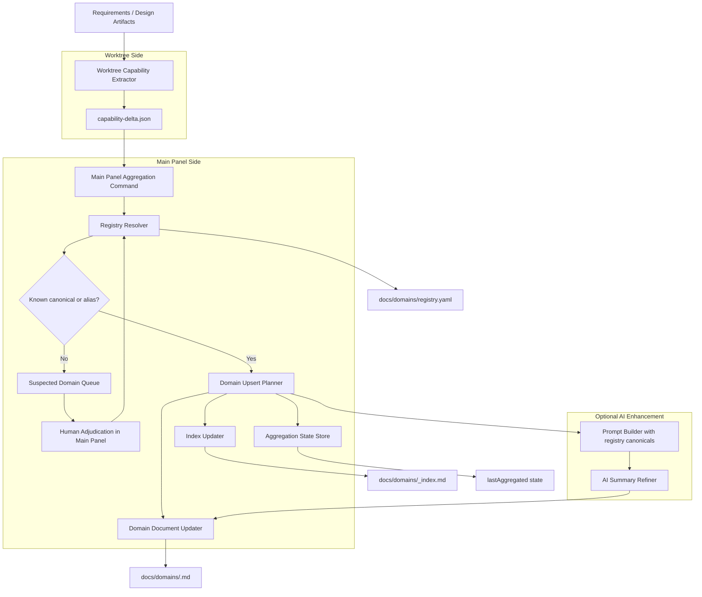

# 设计文档

## 1. 概述

本设计覆盖 [specs/domain-knowledge/requirements.md](specs/domain-knowledge/requirements.md) 中的 Req-dk-1 至 Req-dk-12，目标是在 Fun Harness 现有 Spec Delta 体系之上，补齐一套可长期维护的领域知识库构建链路：

- worktree 侧只做确定性抽取，产出 `specs/<iteration>/delta/capability-delta.json`。
- 主面板侧作为唯一写入者，读取 delta 并 upsert 到 `docs/domains/registry.yaml`、`docs/domains/<domain>.md` 与 `docs/domains/_index.md`。
- AI 仅作为主面板可选润色增强，不参与能力事实生成。

本设计不引入新的外部 HTTP 服务。下文中的 API 契约均指 VS Code 扩展内部服务契约、主面板命令契约和消息路由契约。为满足可追溯性，所有 API、模型、组件与不变量均绑定明确的 Req-dk-*。

核心设计决策：

1. 采用“两段式”架构，彻底分离“事实抽取”和“知识基线写入”，从根上满足单写者约束。
2. 以 `registry.yaml` 为领域规范名唯一来源，显式 `domain` 字段优先，关键词/路径/Req 前缀仅兜底。
3. 领域文档采用 `AUTO:*` / `HUMAN:*` 标记块，机器只改托管区，人工只改保留区。
4. 所有聚合操作按当前仓库根目录解析路径，兼容 monoRepo 与 multiRepo。
5. 幂等由 `iteration + contentHash` 驱动，避免重复聚合和重复变更历史。

## 2. 架构设计

### 2.1 架构图（Mermaid）



### 2.2 项目目录结构

```text
apps/src/
├── extension.ts                          # 主面板命令注册与编排入口
├── harnessMessageController.ts           # worktree / main panel 消息路由
├── harnessMessages.ts                    # 消息类型定义
├── models.ts                             # 能力 delta、注册表、聚合状态模型
├── services/
│   ├── promptService.ts                  # AI 提示词注入 registry canonical 列表
│   ├── specDeltaService.ts               # 读取需求/设计产物与 delta 工具函数
│   ├── workspaceRoot.ts                  # 当前仓库根目录解析
│   ├── fileOps.ts                        # 标记块读写与原子落盘
│   ├── domainRegistryService.ts          # 新增：registry.yaml 读写、冲突校验、归一化
│   ├── capabilityDeltaService.ts         # 新增：worktree 确定性抽取 capability-delta.json
│   ├── domainKnowledgeAggregateService.ts# 新增：主面板聚合、upsert、幂等状态
│   └── harnessActionsService.ts          # 新增/扩展：主面板聚合与人工裁决动作封装
docs/
└── domains/
    ├── registry.yaml                     # 领域注册表
    ├── _index.md                         # 领域总览
    └── <domain>.md                       # 领域能力基线文档
specs/
└── <iteration>/
    └── delta/
        └── capability-delta.json         # worktree 产出的稳定中间产物
```

目录设计约束：

- `capability-delta.json` 仅在 worktree 侧写入。绑定 Req-dk-5。
- `docs/domains/` 仅在主面板聚合中写入。绑定 Req-dk-6。
- 所有路径均通过当前仓库根目录解析，不允许硬编码 workspace 根路径。绑定 Req-dk-1、Req-dk-6。

### 2.3 路由设计

本能力没有浏览器 URL 路由，采用“消息路由 + 命令路由”两层设计。

消息路由：

| 路由 ID | 消息/命令 | 来源 | 目标处理器 | 绑定需求 |
| --- | --- | --- | --- | --- |
| ROUTE-1 | `generateCapabilityDelta` | worktree 子视图 | `CapabilityDeltaService.generateForIteration` | Req-dk-5 |
| ROUTE-2 | `runDomainBaselineAggregation` | 主面板 | `DomainKnowledgeAggregateService.aggregatePendingDeltas` | Req-dk-6, Req-dk-8 |
| ROUTE-3 | `reviewSuspectedDomains` | 主面板 | `HarnessActionsService.reviewSuspectedDomains` | Req-dk-7 |
| ROUTE-4 | `applyDomainAdjudication` | 主面板 | `DomainRegistryService.applyAdjudication` | Req-dk-7 |
| ROUTE-5 | `previewDomainBaselineSummary` | 主面板 | `DomainKnowledgeAggregateService.previewIndexChanges` | Req-dk-10 |
| ROUTE-6 | `commitDomainBaseline` | 主面板 | `HarnessActionsService.commitDomainBaselineByTaskId` | Req-dk-6 |

路由约束：

- `runDomainBaselineAggregation` 只能在主面板注册，worktree 子视图不注册该入口。绑定 Req-dk-5、Req-dk-6。
- `generateCapabilityDelta` 只能依赖 requirements/design/delta，不得回读业务代码之外的主干聚合状态。绑定 Req-dk-5。
- `reviewSuspectedDomains` 只处理查无此名的归类项，不直接写领域文档。绑定 Req-dk-7。
- `testcase.md` 为可选产物，主面板健康状态评估不得因 testcase 缺失单独降级或阻断。绑定 Req-dk-6。
- `commitDomainBaseline` 只能在主面板注册，worktree 子视图必须拦截该消息。绑定 Req-dk-6。

## 3. 组件与接口设计

### 3.1 API 契约

> 说明：`method` 字段表示契约类型，取值为 `SERVICE`、`COMMAND` 或 `MESSAGE`。

| API ID | 契约 | method | path | 绑定需求 |
| --- | --- | --- | --- | --- |
| API-DK-1 | 读取并校验领域注册表 | SERVICE | `DomainRegistryService.loadRegistry` | Req-dk-1 |
| API-DK-2 | 归一化领域名 | SERVICE | `DomainRegistryService.normalizeDomain` | Req-dk-1, Req-dk-2, Req-dk-7 |
| API-DK-3 | 应用人工裁决结果到注册表 | SERVICE | `DomainRegistryService.applyAdjudication` | Req-dk-7 |
| API-DK-4 | 从当前迭代 requirements/design 抽取 capability delta | SERVICE | `CapabilityDeltaService.generateForIteration` | Req-dk-5, Req-dk-12 |
| API-DK-5 | 校验 capability-delta.json schema 与 content hash | SERVICE | `CapabilityDeltaService.validateDelta` | Req-dk-5, Req-dk-8 |
| API-DK-6 | 聚合待处理 delta 并更新领域文档 | SERVICE | `DomainKnowledgeAggregateService.aggregatePendingDeltas` | Req-dk-4, Req-dk-6, Req-dk-8, Req-dk-9, Req-dk-10, Req-dk-11 |
| API-DK-7 | 对单个领域文档执行标记块 upsert | SERVICE | `DomainKnowledgeAggregateService.upsertDomainDocument` | Req-dk-3, Req-dk-4, Req-dk-9 |
| API-DK-8 | 更新领域总览索引 | SERVICE | `DomainKnowledgeAggregateService.upsertDomainIndex` | Req-dk-10 |
| API-DK-9 | 生成主面板疑似新领域待确认清单 | SERVICE | `DomainKnowledgeAggregateService.collectSuspectedDomains` | Req-dk-7 |
| API-DK-10 | 生成可选 AI 润色提示词 | SERVICE | `PromptService.buildDomainSummaryPrompt` | Req-dk-2, Req-dk-11 |
| API-DK-11 | worktree 触发 delta 生成 | MESSAGE | `HarnessMessageController.generateCapabilityDelta` | Req-dk-5 |
| API-DK-12 | 主面板触发领域基线聚合 | COMMAND | `Extension.runDomainBaselineAggregation` | Req-dk-6, Req-dk-8 |
| API-DK-13 | 主面板触发疑似领域审阅 | MESSAGE | `HarnessMessageController.reviewSuspectedDomains` | Req-dk-7 |
| API-DK-14 | 主面板预览领域总览摘要 | MESSAGE | `HarnessMessageController.previewDomainBaselineSummary` | Req-dk-10 |
| API-DK-15 | 主面板执行领域裁决写回 | COMMAND | `Extension.applyDomainAdjudication` | Req-dk-7 |
| API-DK-16 | 提交领域基线变更到 Git | SERVICE | `GitService.commitDomainBaseline` | Req-dk-6 |
| API-DK-17 | 主面板触发领域基线 Git 提交 | COMMAND | `Extension.commitDomainBaseline` | Req-dk-6 |

详细契约：

- API-DK-1 `DomainRegistryService.loadRegistry`
  - request:
    - `repoRoot: string`
  - response:
    - `registry: DomainRegistry`
    - `validationErrors: RegistryConflict[]`
  - 约束：若存在重复 `canonical` 或别名多重映射，必须返回冲突并阻断后续聚合。绑定 Req-dk-1。

- API-DK-2 `DomainRegistryService.normalizeDomain`
  - request:
    - `rawDomain: string | null`
    - `requirementId: string`
    - `fallbackSignals: DomainFallbackSignals`
  - response:
    - `canonical: string | null`
    - `matchedBy: 'explicit' | 'canonical' | 'alias' | 'reqIdPrefix' | 'artifactPathPattern' | 'contractPattern' | 'keywordMap' | 'none'`
    - `isSuspectedNew: boolean`
  - 约束：显式 `domain` 字段优先；只有未命中注册表且无法确认归属时才标记 `isSuspectedNew=true`。绑定 Req-dk-1、Req-dk-2、Req-dk-7。

- API-DK-4 `CapabilityDeltaService.generateForIteration`
  - request:
    - `repoRoot: string`
    - `iterationPath: string`
  - response:
    - `delta: CapabilityDelta`
  - 约束：仅从当前迭代 requirements/design 读取 Req、API、invariants 等结构化信息；禁止 AI 参与；输出稳定排序和稳定 hash。绑定 Req-dk-5、Req-dk-12。

- API-DK-5 `CapabilityDeltaService.validateDelta`
  - request:
    - `delta: CapabilityDelta`
  - response:
    - `valid: boolean`
    - `errors: string[]`
    - `contentHash: string`
  - 约束：缺少 `iteration`、`domains[]`、`capabilities[]` 等必填字段时必须阻断。绑定 Req-dk-5、Req-dk-8。

- API-DK-6 `DomainKnowledgeAggregateService.aggregatePendingDeltas`
  - request:
    - `repoRoot: string`
    - `enableAiRefinement: boolean`
  - response:
    - `processed: AggregationRecord[]`
    - `skipped: AggregationRecord[]`
    - `suspectedDomains: SuspectedDomainRecord[]`
  - 约束：只能读取 `capability-delta.json`；按 `iteration + contentHash` 跳过已聚合项；写入 `docs/domains/` 与 `_index.md`；不得回读迭代源代码。绑定 Req-dk-4、Req-dk-6、Req-dk-8、Req-dk-10、Req-dk-11。

- API-DK-7 `DomainKnowledgeAggregateService.upsertDomainDocument`
  - request:
    - `canonical: string`
    - `domainDelta: AggregatedDomainDelta`
    - `registryEntry: DomainRegistryEntry`
  - response:
    - `filePath: string`
    - `changeSummary: DomainDocumentChangeSummary`
  - 约束：仅更新 `AUTO:*` 标记块；`HUMAN:*` 原样保留；能力以 `Req-ID` 为主键、契约以 `method+path` 为主键、不变量以文本指纹去重；`changelog` 为唯一 append-only 区。绑定 Req-dk-3、Req-dk-4、Req-dk-9。

- API-DK-10 `PromptService.buildDomainSummaryPrompt`
  - request:
    - `canonical: string`
    - `displayName: string`
    - `capabilities: CapabilityRow[]`
    - `registryCanonicals: string[]`
  - response:
    - `prompt: string`
  - 约束：提示词必须显式注入合法 canonical 列表，并声明不得创建新领域名或新能力。绑定 Req-dk-2、Req-dk-11。

- API-DK-13 `HarnessMessageController.reviewSuspectedDomains`
  - request:
    - `type: 'reviewSuspectedDomains'`
    - `id: string`
  - response:
    - `void`
  - 约束：该消息仅允许主面板触发，worktree 子视图必须拦截。绑定 Req-dk-7。

- API-DK-14 `HarnessMessageController.previewDomainBaselineSummary`
  - request:
    - `type: 'previewDomainBaselineSummary'`
    - `id: string`
  - response:
    - `void`
  - 约束：只读预览，不得产生写入副作用。绑定 Req-dk-10。

- API-DK-15 `Extension.applyDomainAdjudication`
  - request:
    - `command arguments: none`
  - response:
    - `void`
  - 约束：裁决写回必须落在 `docs/domains/registry.yaml`，且不得直接写入能力基线文档。绑定 Req-dk-7。

- API-DK-16 `GitService.commitDomainBaseline`
  - request:
    - `repoRoot: string`
  - response:
    - `success: boolean`
    - `message: string`
  - 约束：仅对 `docs/domains` 执行 git add + git commit；若目录下无待提交变更则返回 `success=true` 且不产生空 commit；提交信息格式固定为 `chore(domain-baseline): update docs/domains YYYY-MM-DD`；repoRoot 必须是 git 工作树，否则返回 `success=false`。绑定 Req-dk-6。

- API-DK-17 `Extension.commitDomainBaseline`
  - request:
    - `command arguments: none`
  - response:
    - `void`
  - 约束：该命令仅在主面板注册；worktree 子视图拦截同名消息并提示「领域基线提交仅支持主面板执行」；内部委托 `GitService.commitDomainBaseline` 完成落盘。绑定 Req-dk-6。

### 3.2 数据模型

```ts
// Req-dk-1, Req-dk-7
interface DomainRegistry {
  domains: DomainRegistryEntry[];
  lastAggregated?: AggregationRecord[];
}

interface DomainRegistryEntry {
  canonical: string;
  displayName: string;
  aliases: string[];
  status: 'active' | 'deprecated';
}

interface AggregationRecord {
  iteration: string;
  contentHash: string;
  aggregatedAt: string;
}

// Req-dk-5
interface CapabilityDelta {
  iteration: string;
  generatedAt: string;
  contentHash: string;
  domains: DomainDelta[];
}

interface DomainDelta {
  canonical: string | null;
  rawDomain: string | null;
  isSuspectedNew: boolean;
  capabilities: CapabilityDeltaItem[];
  contracts: ContractDeltaItem[];
  invariants: InvariantDeltaItem[];
}

interface CapabilityDeltaItem {
  reqId: string;
  title: string;
  userStory: string;
  status: 'active' | 'deprecated' | 'removed';
}

interface ContractDeltaItem {
  id: string;
  reqId: string;
  method: string;
  path: string;
  requestShape: Record<string, unknown>;
  responseShape: Record<string, unknown>;
}

interface InvariantDeltaItem {
  id: string;
  reqId: string;
  text: string;
}

// Req-dk-3, Req-dk-4, Req-dk-10
interface DomainDocumentSections {
  frontMatter: DomainFrontMatter;
  humanOverview: string;
  capabilityTable: CapabilityRow[];
  contractTable: ContractRow[];
  invariantList: InvariantRow[];
  humanNotes: string;
  changelog: ChangelogEntry[];
}

interface DomainFrontMatter {
  domain: string;
  displayName: string;
  lastUpdatedAt: string;
  contributingIterations: string[];
}

interface CapabilityRow {
  reqId: string;
  title: string;
  status: 'active' | 'deprecated' | 'removed';
  firstIntroduced: string;
  lastChanged: string;
}

// Req-dk-7
interface SuspectedDomainRecord {
  iteration: string;
  rawDomain: string;
  relatedReqIds: string[];
  suggestedCanonical: string | null;
}
```

模型约束：

- `DomainRegistry.domains[].canonical` 在一个 repo 内必须唯一。绑定 Req-dk-1。
- `CapabilityDelta.domains[]` 必须按 `canonical ?? rawDomain` 稳定排序，以保证 hash 稳定。绑定 Req-dk-5、Req-dk-8。
- `CapabilityRow.reqId` 是能力主键，不引入独立 CAP-*。绑定 Req-dk-3、Req-dk-4。
- `AggregationRecord` 作为幂等状态持久化在 registry 或独立 state 中，但对聚合器暴露统一模型。绑定 Req-dk-8。

### 3.3 组件 Props / Events

本能力涉及两个界面组件面：worktree 子视图按钮区与主面板治理区。

| 组件 ID | 组件 | Props | Events | 绑定需求 |
| --- | --- | --- | --- | --- |
| UI-DK-1 | Worktree「Generate capability delta」按钮 | `variant='secondary'`, `disabled`, `loading`, `readOnly` | `generateCapabilityDelta` | Req-dk-5 |
| UI-DK-2 | 主面板「领域基线聚合」按钮 | `variant='primary'`, `disabled`, `loading`, `hasPendingDeltas` | `runDomainBaselineAggregation` | Req-dk-6, Req-dk-8 |
| UI-DK-3 | 主面板「疑似领域裁决」按钮 | `variant='danger'`, `disabled`, `pendingCount` | `reviewSuspectedDomains` | Req-dk-7 |
| UI-DK-4 | 主面板「领域总览预览」按钮 | `variant='ghost'`, `disabled` | `previewDomainBaselineSummary` | Req-dk-10 |
| UI-DK-5 | 主面板「提交」按钮 | `variant='success'`, `disabled` | `commitDomainBaseline` | Req-dk-6 |

按钮样式基线：

- 高度 `28px`、`line-height: 28px`、`padding: 0 12px`、`border-radius: 2px`。绑定宪法按钮基线。
- 字体使用 `var(--vscode-font-family)` 与 `var(--vscode-font-size)`，主按钮可用 `font-weight: 600`。绑定宪法按钮基线。
- 仅允许 `primary` / `secondary` / `ghost` / `danger` 四类，颜色使用 VS Code theme token，disabled 使用 `opacity: 0.4`，loading 使用 `codicon-loading`，保留 `var(--vscode-focusBorder)` focus ring。绑定宪法按钮基线。
- 按钮文案使用 sentence case。绑定宪法按钮基线。

事件约束：

- `generateCapabilityDelta` 在 readOnly 或非当前迭代上下文中必须禁用。绑定 Req-dk-5。
- `runDomainBaselineAggregation` 在存在未裁决疑似领域时可运行，但只能写已归一化领域，疑似领域进入待确认清单。绑定 Req-dk-7、Req-dk-8。
- `runDomainBaselineAggregation` 完成后，若 `suspectedDomains` 为空且 `processed.length>0`，前端提示必须返回已处理迭代数量；若 `processed.length===0`，返回聚合预检查完成提示。绑定 Req-dk-6、Req-dk-8。
- `commitDomainBaseline` 在 worktree 子视图中必须被拦截，不得触达 git 操作层。绑定 Req-dk-6。

### 3.4 Store 设计

| Store | 类型 | 作用 | 绑定需求 |
| --- | --- | --- | --- |
| `domainRegistryStore` | `DomainRegistry` | 缓存 registry.yaml 与 lastAggregated 状态 | Req-dk-1, Req-dk-8 |
| `pendingDeltaStore` | `CapabilityDelta[]` | 主面板展示待聚合 delta 清单 | Req-dk-6, Req-dk-8 |
| `suspectedDomainStore` | `SuspectedDomainRecord[]` | 主面板展示待人工裁决领域 | Req-dk-7 |
| `aggregationPreviewStore` | `DomainIndexPreview` | `_index.md` 预览及变更摘要 | Req-dk-10 |
| `uiActionStateStore` | `{ loadingAction?: string }` | 管理按钮 loading/disabled 状态 | Req-dk-5, Req-dk-6, Req-dk-7 |

Store 约束：

- 文件系统是最终事实源，store 只缓存运行态快照。绑定 Req-dk-6、Req-dk-8。
- 聚合完成后必须刷新 `domainRegistryStore` 与 `pendingDeltaStore`，确保同一会话内二次触发幂等。绑定 Req-dk-8。

## 4. 正确性属性（需求不变量）

- INV-DK-1：`registry.yaml` 中任一 `canonical` 唯一，任一 alias 最多映射到一个 canonical；冲突即阻断。绑定 Req-dk-1。
- INV-DK-2：当需求机器块存在显式 `domain` 字段时，领域解析优先使用该字段，兜底策略不得覆盖显式值。绑定 Req-dk-2。
- INV-DK-3：任何正式领域文档中的能力、契约、不变量都必须至少绑定一个 Req-dk-* 或源 requirements 中的 Req-*；不存在无来源条目。绑定 Req-dk-3、Req-dk-12。
- INV-DK-4：领域文档写入时，机器只能修改 `AUTO:*` 标记块，`HUMAN:*` 内容逐字节保留。绑定 Req-dk-3。
- INV-DK-5：能力主键为 `Req-ID`，相同 `Req-ID` 在同一领域文档的能力表中最多出现一次。绑定 Req-dk-4。
- INV-DK-6：`method + path` 相同的契约在同一领域文档中最多出现一次；文本指纹相同的不变量最多出现一次。绑定 Req-dk-4。
- INV-DK-7：worktree 侧只能生成 `capability-delta.json`，不得直接写 `docs/domains/`。绑定 Req-dk-5、Req-dk-6。
- INV-DK-8：主面板聚合只能消费 `capability-delta.json`，不得回读迭代源代码。绑定 Req-dk-6。
- INV-DK-9：未裁决的疑似新领域不得落入正式 `docs/domains/<domain>.md`，仅能暂存为 `uncategorized` 或待确认记录。绑定 Req-dk-7。
- INV-DK-10：同一 `iteration + contentHash` 的 delta 重复聚合时，不得产生新的 changelog 条目或重复能力行。绑定 Req-dk-8。
- INV-DK-11：被标记为 `deprecated` 或 `removed` 的能力保留历史行，不物理删除。绑定 Req-dk-9。
- INV-DK-12：`_index.md` 中每个 canonical 仅一行摘要，按 canonical upsert，不重复。绑定 Req-dk-10。
- INV-DK-13：worktree 抽取与结构化 upsert 全程零 AI；AI 只可在主面板对已有结构化结果做可选润色。绑定 Req-dk-11。
- INV-DK-14：机器账本、单迭代摘要与领域基线三类产物职责边界固定，互不回写。绑定 Req-dk-12。
- INV-DK-15：所有 spec 与领域基线路径均按当前仓库根目录解析，在 multiRepo 下不得跨 repo 越界写入。绑定 Req-dk-1、Req-dk-6。

## 5. 错误处理

| 场景 | 处理策略 | 绑定需求 |
| --- | --- | --- |
| `registry.yaml` 缺失 | 允许按空注册表初始化，但必须写出合法模板后再继续；若初始化失败则阻断 | Req-dk-1 |
| `registry.yaml` 冲突（重复 canonical / alias） | 返回冲突详情并阻断聚合，不生成成功信号 | Req-dk-1 |
| requirements 中 `domain` 非法 | 标记为 `uncategorized` 或加入 suspected queue，并在门禁/聚合报告中显式指出 | Req-dk-2, Req-dk-7 |
| `capability-delta.json` 缺字段或 hash 不匹配 | 校验失败并阻断该迭代入库，其余合法迭代可继续 | Req-dk-5, Req-dk-8 |
| worktree 侧请求聚合 | 返回受限操作错误，提示该动作仅在主面板提供 | Req-dk-5, Req-dk-6 |
| `AUTO:*` 标记块缺失或损坏 | 视为文档结构非法；保留原文件，输出修复建议并阻断该领域写入 | Req-dk-3 |
| `_index.md` 不存在 | 自动按模板创建，再执行 canonical upsert | Req-dk-10 |
| 疑似新领域未裁决 | 聚合继续处理已知领域，未知领域只进入待确认清单，不写正式域文档 | Req-dk-7 |
| AI 润色失败 | 记录告警并回退到纯结构化摘要，不影响基线更新 | Req-dk-11 |
| testcase.md 缺失 | 允许继续 requirements/design -> tasks -> developing 流程，不产生仅由 testcase 缺失导致的告警/阻断 | Req-dk-6 |
| multiRepo 根目录解析失败 | 阻断并返回所需 repoRoot 缺失信息 | Req-dk-1, Req-dk-6 |

## 6. 测试策略

- 单元测试
  - 校验 `DomainRegistryService.loadRegistry` 能检测重复 `canonical`、重复 alias、空注册表初始化。绑定 Req-dk-1。
  - 校验 `normalizeDomain` 按 `explicit > canonical > alias > fallback` 顺序解析，且未知值进入 suspected queue。绑定 Req-dk-2、Req-dk-7。
  - 校验 `CapabilityDeltaService.generateForIteration` 从 requirements/design 生成稳定排序、稳定 `contentHash`、零 AI 依赖的 delta。绑定 Req-dk-5、Req-dk-11。
  - 校验 `upsertDomainDocument` 对能力/契约/不变量执行正确的 upsert 与去重，且 `HUMAN:*` 内容不变。绑定 Req-dk-3、Req-dk-4。
  - 校验 `aggregatePendingDeltas` 对重复 `iteration + contentHash` 跳过，对 changed hash 重新处理。绑定 Req-dk-8。
  - 校验 `removed/deprecated` 状态写入 changelog 且保留能力行。绑定 Req-dk-9。

- 集成测试
  - 模拟 worktree 侧生成 `capability-delta.json`，再由主面板聚合更新 `registry.yaml`、`_index.md` 与多个领域文档。绑定 Req-dk-5、Req-dk-6、Req-dk-10。
  - 模拟 mixed repo 场景，验证当前仓库根目录解析正确且不会越界写入邻近 repo。绑定 Req-dk-1、Req-dk-6。
  - 模拟存在疑似新领域的 delta，验证已知领域正常入库、未知领域进入待裁决队列。绑定 Req-dk-7。
  - 模拟重复点击聚合，验证 changelog 与 `_index.md` 不重复。绑定 Req-dk-8。

- 门禁测试
  - requirements 机器块缺少 `domain`、出现无效 canonical、或设计契约未绑定 Req-ID 时，门禁必须失败。绑定 Req-dk-2、Req-dk-12。
  - 领域文档缺失 `AUTO:*` / `HUMAN:*` 标记块时，聚合门禁必须失败。绑定 Req-dk-3。
  - worktree 侧若暴露主面板聚合入口，UI/命令注册测试必须失败。绑定 Req-dk-5、Req-dk-6。

## 7. 机器可读区

```yaml
artifactType: design
taskName: domain-knowledge
apiContracts:
  - id: API-DK-1
    requirementIds: [Req-dk-1]
    method: SERVICE
    path: DomainRegistryService.loadRegistry
    request:
      repoRoot: string
    response:
      registry: DomainRegistry
      validationErrors: RegistryConflict[]
  - id: API-DK-2
    requirementIds: [Req-dk-1, Req-dk-2, Req-dk-7]
    method: SERVICE
    path: DomainRegistryService.normalizeDomain
    request:
      rawDomain: string|null
      requirementId: string
      fallbackSignals: DomainFallbackSignals
    response:
      canonical: string|null
      matchedBy: explicit|canonical|alias|reqIdPrefix|artifactPathPattern|contractPattern|keywordMap|none
      isSuspectedNew: boolean
  - id: API-DK-3
    requirementIds: [Req-dk-7]
    method: SERVICE
    path: DomainRegistryService.applyAdjudication
    request:
      repoRoot: string
      decision: mergeExisting|createCanonical|appendAlias
      rawDomain: string
      targetCanonical: string|null
      displayName: string|null
    response:
      updatedRegistry: DomainRegistry
  - id: API-DK-4
    requirementIds: [Req-dk-5, Req-dk-12]
    method: SERVICE
    path: CapabilityDeltaService.generateForIteration
    request:
      repoRoot: string
      iterationPath: string
    response:
      delta: CapabilityDelta
  - id: API-DK-5
    requirementIds: [Req-dk-5, Req-dk-8]
    method: SERVICE
    path: CapabilityDeltaService.validateDelta
    request:
      delta: CapabilityDelta
    response:
      valid: boolean
      errors: string[]
      contentHash: string
  - id: API-DK-6
    requirementIds: [Req-dk-4, Req-dk-6, Req-dk-8, Req-dk-9, Req-dk-10, Req-dk-11]
    method: SERVICE
    path: DomainKnowledgeAggregateService.aggregatePendingDeltas
    request:
      repoRoot: string
      enableAiRefinement: boolean
    response:
      processed: AggregationRecord[]
      skipped: AggregationRecord[]
      suspectedDomains: SuspectedDomainRecord[]
  - id: API-DK-7
    requirementIds: [Req-dk-3, Req-dk-4, Req-dk-9]
    method: SERVICE
    path: DomainKnowledgeAggregateService.upsertDomainDocument
    request:
      canonical: string
      domainDelta: AggregatedDomainDelta
      registryEntry: DomainRegistryEntry
    response:
      filePath: string
      changeSummary: DomainDocumentChangeSummary
  - id: API-DK-8
    requirementIds: [Req-dk-10]
    method: SERVICE
    path: DomainKnowledgeAggregateService.upsertDomainIndex
    request:
      repoRoot: string
      domains: DomainIndexRow[]
    response:
      filePath: string
  - id: API-DK-9
    requirementIds: [Req-dk-7]
    method: SERVICE
    path: DomainKnowledgeAggregateService.collectSuspectedDomains
    request:
      deltas: CapabilityDelta[]
    response:
      suspectedDomains: SuspectedDomainRecord[]
  - id: API-DK-10
    requirementIds: [Req-dk-2, Req-dk-11]
    method: SERVICE
    path: PromptService.buildDomainSummaryPrompt
    request:
      canonical: string
      displayName: string
      capabilities: CapabilityRow[]
      registryCanonicals: string[]
    response:
      prompt: string
  - id: API-DK-11
    requirementIds: [Req-dk-5]
    method: MESSAGE
    path: HarnessMessageController.generateCapabilityDelta
    request:
      type: generateCapabilityDelta
      id: string
    response:
      void: true
  - id: API-DK-12
    requirementIds: [Req-dk-6, Req-dk-8]
    method: COMMAND
    path: Extension.runDomainBaselineAggregation
    request:
      commandArgs: none
    response:
      void: true
  - id: API-DK-13
    requirementIds: [Req-dk-7]
    method: MESSAGE
    path: HarnessMessageController.reviewSuspectedDomains
    request:
      type: reviewSuspectedDomains
      id: string
    response:
      void: true
  - id: API-DK-14
    requirementIds: [Req-dk-10]
    method: MESSAGE
    path: HarnessMessageController.previewDomainBaselineSummary
    request:
      type: previewDomainBaselineSummary
      id: string
    response:
      void: true
  - id: API-DK-15
    requirementIds: [Req-dk-7]
    method: COMMAND
    path: Extension.applyDomainAdjudication
    request:
      commandArgs: none
    response:
      void: true
  - id: API-DK-16
    requirementIds: [Req-dk-6]
    method: SERVICE
    path: GitService.commitDomainBaseline
    request:
      repoRoot: string
    response:
      success: boolean
      message: string
  - id: API-DK-17
    requirementIds: [Req-dk-6]
    method: COMMAND
    path: Extension.commitDomainBaseline
    request:
      commandArgs: none
    response:
      void: true
dataModels:
  - id: MODEL-DK-1
    requirementIds: [Req-dk-1, Req-dk-8]
    name: DomainRegistry
    fields: [domains, lastAggregated]
  - id: MODEL-DK-2
    requirementIds: [Req-dk-5]
    name: CapabilityDelta
    fields: [iteration, generatedAt, contentHash, domains]
  - id: MODEL-DK-3
    requirementIds: [Req-dk-5, Req-dk-7]
    name: DomainDelta
    fields: [canonical, rawDomain, isSuspectedNew, capabilities, contracts, invariants]
  - id: MODEL-DK-4
    requirementIds: [Req-dk-3, Req-dk-4, Req-dk-9]
    name: DomainDocumentSections
    fields: [frontMatter, humanOverview, capabilityTable, contractTable, invariantList, humanNotes, changelog]
  - id: MODEL-DK-5
    requirementIds: [Req-dk-7]
    name: SuspectedDomainRecord
    fields: [iteration, rawDomain, relatedReqIds, suggestedCanonical]
components:
  - id: UI-DK-1
    requirementIds: [Req-dk-5]
    name: Generate capability delta button
    variant: secondary
    events: [generateCapabilityDelta]
  - id: UI-DK-2
    requirementIds: [Req-dk-6, Req-dk-8]
    name: 领域基线聚合按钮
    variant: primary
    events: [runDomainBaselineAggregation]
  - id: UI-DK-3
    requirementIds: [Req-dk-7]
    name: 疑似领域裁决按钮
    variant: danger
    events: [reviewSuspectedDomains, applyDomainAdjudication]
  - id: UI-DK-4
    requirementIds: [Req-dk-10]
    name: 领域总览预览按钮
    variant: ghost
    events: [previewDomainBaselineSummary]
  - id: UI-DK-5
    requirementIds: [Req-dk-6]
    name: 提交按钮
    variant: success
    events: [commitDomainBaseline]
invariants:
  - id: INV-DK-1
    requirementId: Req-dk-1
    rule: registry.yaml 中 canonical 唯一且 alias 只能映射到一个 canonical，冲突即阻断
  - id: INV-DK-16
    requirementId: Req-dk-6
    rule: testcase.md 属于可选输入，缺失时不得单独触发健康告警或阻断
  - id: INV-DK-2
    requirementId: Req-dk-2
    rule: 显式 domain 字段优先于所有兜底归类策略
  - id: INV-DK-3
    requirementId: Req-dk-3
    rule: 正式领域文档中任一能力、契约、不变量必须绑定可追溯 Req-ID
  - id: INV-DK-4
    requirementId: Req-dk-3
    rule: 机器只能修改 AUTO:* 标记块，HUMAN:* 内容逐字节保留
  - id: INV-DK-5
    requirementId: Req-dk-4
    rule: 同一领域文档中相同 Req-ID 的能力行最多一条
  - id: INV-DK-6
    requirementId: Req-dk-4
    rule: 同一领域文档中相同 method+path 的契约最多一条且不变量按文本指纹去重
  - id: INV-DK-7
    requirementId: Req-dk-5
    rule: worktree 侧只能写 capability-delta.json 不得直接写 docs/domains
  - id: INV-DK-8
    requirementId: Req-dk-6
    rule: 主面板聚合只能消费 capability-delta.json 不得回读迭代源代码
  - id: INV-DK-9
    requirementId: Req-dk-7
    rule: 未裁决的疑似新领域不得写入正式 docs/domains/<domain>.md
  - id: INV-DK-10
    requirementId: Req-dk-8
    rule: 同一 iteration+contentHash 重复聚合不得新增 changelog 或重复能力行
  - id: INV-DK-11
    requirementId: Req-dk-9
    rule: deprecated 或 removed 能力保留行记录不物理删除
  - id: INV-DK-12
    requirementId: Req-dk-10
    rule: _index.md 以 canonical 为主键每个领域最多一行摘要
  - id: INV-DK-13
    requirementId: Req-dk-11
    rule: worktree 抽取与结构化 upsert 全程零 AI，AI 仅用于主面板可选润色
  - id: INV-DK-14
    requirementId: Req-dk-12
    rule: 机器账本、单迭代摘要与领域基线三类产物互不回写
  - id: INV-DK-15
    requirementId: Req-dk-6
    rule: 所有读写路径必须按当前仓库根目录解析且 multiRepo 下不得跨 repo 越界
```