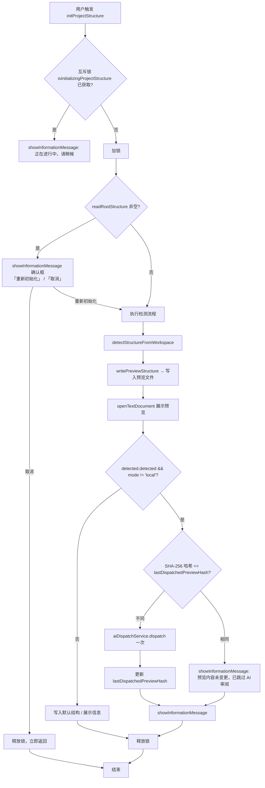

# 设计文档

## 1. 概述

本设计文档描述 **init-enhance** 功能的技术方案，解决 `handleInitProjectStructure` 在文档已存在时的冗余 AI 任务触发问题，以及并发场景下重复对话发起问题。

涉及变更范围：仅 `apps/src/extension.ts`（`handleInitProjectStructure` 与相关字段）。

---

## 2. 架构设计

### 2.1 架构图（Mermaid）



### 2.2 项目目录结构

受本需求影响的文件（仅 `extension.ts`）：

```
apps/src/
└── extension.ts          # 修改目标：添加互斥锁字段、确认逻辑、哈希去重逻辑
```

其余文件不变。

### 2.3 路由设计

Webview 消息路由不变，`initProjectStructure` 动作继续映射至 `handleInitProjectStructure()`（无新消息类型引入）。

---

## 3. 组件与接口设计

### 3.1 API 契约

#### API-1：`handleInitProjectStructure` 方法签名（不变）

- **绑定需求**：Req-1、Req-2、Req-3
- **签名**：`private async handleInitProjectStructure(): Promise<void>`
- **调用入口**：`HarnessMessageController` 绑定的 `initProjectStructure` 动作（行 224）
- **副作用范围**：仅 `extension.ts` 内实例状态字段（互斥锁、哈希缓存）

#### API-2：`ensureProjectStructureBaseline` 方法签名（不变）

- **绑定需求**：Req-4
- **签名**：`private ensureProjectStructureBaseline(): void`
- **约束**：不得调用 `aiDispatchService.dispatch()`，不得触发任何 VS Code 信息/警告对话框，不得打开编辑器标签

#### API-3：`ProjectStructureService.readRootStructure`（只读引用，不变）

- **绑定需求**：Req-1
- **用途**：在 `handleInitProjectStructure` 入口检测 `project-structure.md` 是否存在且非空
- **签名**：`readRootStructure(): string`（返回空字符串表示不存在或为空）

### 3.2 数据模型

#### Model-1：互斥锁字段

- **绑定需求**：Req-2
- **位置**：`Harness` 类私有字段
- **字段名**：`isInitializingProjectStructure: boolean`
- **初始值**：`false`
- **生命周期**：`handleInitProjectStructure` 执行期间为 `true`；方法退出时（正常/取消/异常）通过 `finally` 块置回 `false`

#### Model-2：预览内容哈希缓存字段

- **绑定需求**：Req-3
- **位置**：`Harness` 类私有字段
- **字段名**：`lastDispatchedPreviewHash: string | undefined`
- **算法**：`crypto.createHash('sha256').update(previewContent).digest('hex')`（Node.js 内置，无需新增依赖）
- **生命周期**：成功派发后更新；扩展重启清空（内存字段）

### 3.3 组件 Props / Events

不适用（无新 Webview 组件引入）。

### 3.4 Store 设计

不适用（无持久化存储变更；哈希缓存为纯内存字段）。

---

## 4. 正确性属性（需求不变量）

| ID | 绑定需求 | domain | 规则 |
|----|---------|--------|------|
| INV-1 | Req-2 | project-structure-init | `isInitializingProjectStructure` 在 `handleInitProjectStructure` 返回时（含异常路径）必须恢复为 `false`；由 `try/finally` 保证。 |
| INV-2 | Req-1 | project-structure-init | 当 `readRootStructure()` 返回非空字符串时，`vscode.window.showInformationMessage` 确认框必须在执行任何文件写入或 AI 派发之前被弹出。 |
| INV-3 | Req-3 | project-structure-init | `aiDispatchService.dispatch()` 在同一 `handleInitProjectStructure` 调用中最多执行一次；若预览内容哈希与 `lastDispatchedPreviewHash` 相等，则不调用。 |
| INV-4 | Req-4 | project-structure-init | `ensureProjectStructureBaseline` 调用链中不存在对 `aiDispatchService.dispatch()` 的直接或间接调用，不触发 VS Code 信息/警告对话框，不调用 `vscode.workspace.openTextDocument`。 |
| INV-5 | Req-1, Req-3 | project-structure-init | 用户通过确认对话框选择「取消」时，`aiDispatchService.dispatch()` 不被调用，预览文件不被写入，`lastDispatchedPreviewHash` 不被更新。 |

---

## 5. 错误处理

| 场景 | 处理策略 | 绑定需求 |
|------|---------|---------|
| `handleInitProjectStructure` 内部抛出异常 | `try/finally` 保证 `isInitializingProjectStructure = false`，由调用方现有异常处理机制处理 | Req-2 |
| `aiDispatchService.dispatch()` 抛出异常 | 维持现有 `catch` 逻辑（`showWarningMessage`），哈希不更新 | Req-3 |
| `readRootStructure()` 读取失败（返回空串） | 视为文件不存在，跳过确认对话框，直接执行完整初始化流程 | Req-1 |
| 确认对话框在未选择任何项时关闭（`undefined`） | 等同于「取消」，立即返回 | Req-1 |

---

## 6. 测试策略

| 测试场景 | 绑定需求 | 验证方式 |
|---------|---------|---------|
| `project-structure.md` 存在且非空，触发初始化 → 弹出确认框 | Req-1 | 单测：mock `readRootStructure` 返回非空，断言 `showInformationMessage` 被调用含「重新初始化」「取消」选项 |
| 确认框用户选择「取消」→ 不写文件、不打开编辑器、不派发 AI | Req-1 | 单测：断言 `writePreviewStructure`、`openTextDocument`、`dispatch` 均未被调用 |
| `project-structure.md` 不存在 → 不弹确认框，直接执行 | Req-1 | 单测：mock `readRootStructure` 返回空串，断言 `showInformationMessage` 确认框未调用 |
| 并发两次触发 → 第二次立即返回并提示 | Req-2 | 单测：手动设 `isInitializingProjectStructure = true`，断言第二次调用仅触发信息提示，其余步骤未执行 |
| 流程结束后锁已释放 → 再次触发正常执行 | Req-2 | 单测：流程走完后断言 `isInitializingProjectStructure === false` |
| 新预览内容 → `dispatch` 被调用，哈希已更新 | Req-3 | 单测：mock `dispatch` 成功，断言调用一次，`lastDispatchedPreviewHash` 已更新 |
| 预览内容哈希相同 → 跳过派发，显示提示 | Req-3 | 单测：预设 `lastDispatchedPreviewHash` 等于当前内容哈希，断言 `dispatch` 未被调用，`showInformationMessage` 含「已跳过 AI 审阅」 |
| `ensureProjectStructureBaseline` 调用 → 无 AI 派发、无对话框、无编辑器 | Req-4 | 单测：断言 `dispatch`、`showInformationMessage`（信息级）、`openTextDocument` 均未被调用 |

---

## 7. 机器可读区

```yaml
artifactType: design
taskName: init-enhance
apiContracts:
  - id: API-1
    domain: project-structure-init
    requirementIds: [Req-1, Req-2, Req-3]
    method: internal
    path: Harness#handleInitProjectStructure
    request: {}
    response: { type: Promise<void> }
    notes: >
      入口增加互斥锁检测（Req-2）、文档存在性确认框（Req-1）、预览内容哈希去重（Req-3）。
      方法签名不变，调用入口不变。

  - id: API-2
    domain: project-structure-init
    requirementIds: [Req-4]
    method: internal
    path: Harness#ensureProjectStructureBaseline
    request: {}
    response: { type: void }
    notes: >
      方法签名与实现不变，设计层确认其调用链无 AI 派发、无 UI 对话框、无 openTextDocument。

  - id: API-3
    domain: project-structure-init
    requirementIds: [Req-1]
    method: internal
    path: ProjectStructureService#readRootStructure
    request: {}
    response: { type: string, notes: "空串表示文件不存在或为空" }

models:
  - id: Model-1
    domain: project-structure-init
    requirementIds: [Req-2]
    name: isInitializingProjectStructure
    type: boolean
    location: Harness class (private field)
    initialValue: false
    lifecycle: true during handleInitProjectStructure execution; false on exit via finally

  - id: Model-2
    domain: project-structure-init
    requirementIds: [Req-3]
    name: lastDispatchedPreviewHash
    type: string | undefined
    location: Harness class (private field)
    initialValue: undefined
    lifecycle: updated on successful dispatch; cleared on extension restart

invariants:
  - id: INV-1
    domain: project-structure-init
    requirementId: Req-2
    rule: isInitializingProjectStructure must be false when handleInitProjectStructure exits (any path), guaranteed by try/finally

  - id: INV-2
    domain: project-structure-init
    requirementId: Req-1
    rule: Confirmation dialog must be shown before any file write or AI dispatch when readRootStructure() returns non-empty string

  - id: INV-3
    domain: project-structure-init
    requirementId: Req-3
    rule: aiDispatchService.dispatch() called at most once per handleInitProjectStructure invocation; skipped when preview hash equals lastDispatchedPreviewHash

  - id: INV-4
    domain: project-structure-init
    requirementId: Req-4
    rule: ensureProjectStructureBaseline call chain must not invoke dispatch(), showInformationMessage, showWarningMessage, or openTextDocument

  - id: INV-5
    domain: project-structure-init
    requirementIds: [Req-1, Req-3]
    rule: On user cancellation via confirmation dialog, dispatch() is not called and lastDispatchedPreviewHash is not updated
```
