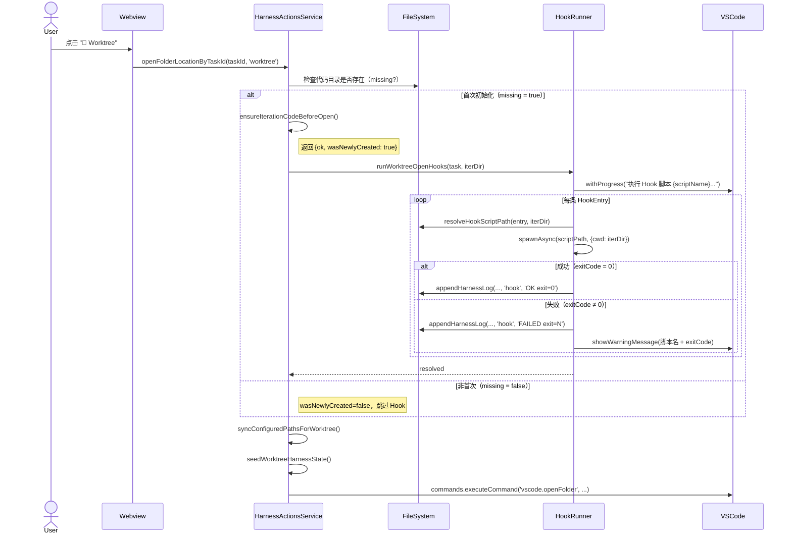

# 设计文档

## 1. 概述

为 Fun Harness VS Code 扩展在 Worktree 初始化节点引入 Hook 执行机制（`worktree-open`）。用户可在全局配置中声明一组 `HookEntry`，当"📁 Worktree"按钮触发**首次**代码初始化（`createIterationBranches`）成功后，扩展在打开新窗口前依次阻塞式执行这些脚本，并将结果写入 harness.log。

本设计绑定需求：Req-1、Req-2、Req-3、Req-4。

**无新文件**：所有改动限于现有文件（`models.ts`、`harnessActionsService.ts`、`webviewTemplates.ts`、`taskStoreService.ts`）。

---

## 2. 架构设计

### 2.1 架构图（Mermaid）



### 2.2 项目目录结构

无新文件。变更仅涉及下列已有文件：

```
apps/src/
├── models.ts                          ← 新增 HookEntry、LifecycleHooks 类型；Config 扩展
├── services/
│   └── harnessActionsService.ts       ← 新增 runWorktreeOpenHooks、spawnHookAsync；
│                                         修改 ensureIterationCodeBeforeOpen 返回值；
│                                         修改 openFolderLocationByTaskId 调用链
└── webviewTemplates.ts                ← 设置页面新增 Lifecycle Hooks 配置区块
```

`taskStoreService.ts` 负责 `Config` 的持久化与默认值合并，需在 `DEFAULT_CONFIG` 中补充 `lifecycleHooks` 默认值（`{ worktreeOpen: [] }`）。

### 2.3 路由设计

本功能为扩展内部流程，无 HTTP 路由变更。Webview 消息协议无新消息类型（配置通过已有 `saveConfig` / `loadConfig` 消息传递）。

---

## 3. 组件与接口设计

### 3.1 API 契约

#### 契约 IFACE-1：`HarnessActionsService.ensureIterationCodeBeforeOpen`（签名变更）

绑定：Req-2

| 项目 | 旧 | 新 |
|------|----|----|
| 返回类型 | `Promise<boolean>` | `Promise<{ ok: boolean; wasNewlyCreated: boolean }>` |
| `ok = true, wasNewlyCreated = true` | — | 目录缺失且本次补偿成功（首次初始化） |
| `ok = true, wasNewlyCreated = false` | — | 目录已存在，无需初始化 |
| `ok = false` | — | 补偿失败，调用方应中止 |

两处调用方均需更新：
- `openFolderLocationByTaskId`：读取 `wasNewlyCreated` 决定是否触发 Hook。
- `runCustomButtonByTaskId`：只需判断 `ok`，`wasNewlyCreated` 忽略。

---

#### 契约 IFACE-2：`HarnessActionsService.runWorktreeOpenHooks`（新增私有方法）

绑定：Req-2、Req-3、Req-4

```
private async runWorktreeOpenHooks(task: Task, iterDir: string): Promise<void>
```

- 从 `this.deps.getConfig().lifecycleHooks.worktreeOpen` 读取 `HookEntry[]`。
- 若列表为空，静默返回（Req-1 验收标准 3）。
- 包裹于 `vscode.window.withProgress({ location: ProgressLocation.Notification, title: '...' })` 内执行（Req-3）。
- 对每条 entry 调用内部 `spawnHookAsync`，顺序执行，互相独立（单条失败不中止后续）。

---

#### 契约 IFACE-3：`HarnessActionsService.spawnHookAsync`（新增私有方法）

绑定：Req-2、Req-4

```
private spawnHookAsync(
  entry: HookEntry,
  iterDir: string,
  taskName: string,
  logDir: string
): Promise<void>
```

- 调用 `resolveHookScriptPath(entry, iterDir)` 获取脚本绝对路径。
- 若脚本文件不存在：`appendHarnessLog` 记录告警，`showWarningMessage`，resolve（不 reject）。
- 若 `isOsScriptFile(entry.script)` 返回 false：记录日志"跳过非当前 OS 脚本"，resolve（Req-4 验收标准 3）。
- 使用 `child_process.spawn` 执行脚本，`cwd = iterDir`，stdio 捕获 stdout/stderr。
- 返回 `Promise<void>`：
  - 进程 `exit` 事件 exitCode === 0 → resolve，log "OK"。
  - exitCode ≠ 0 → log "FAILED"，`showWarningMessage`，resolve（非阻塞，Req-2 验收标准 2）。
  - `error` 事件（spawn 失败）→ log 错误信息，`showWarningMessage`，resolve。

---

#### 契约 IFACE-4：`resolveHookScriptPath`（新增私有辅助）

绑定：Req-4

```
private resolveHookScriptPath(entry: HookEntry, iterDir: string): string
```

- 复用 `resolveScriptDir` 的路径逻辑，将 `HookEntry` 适配为 `CustomButton` 形状（`scriptSource` 字段语义相同）传入。
- `master` 来源 → `<masterRoot>/script/<entry.script>`（Req-4 验收标准 1）。
- `worktree` 来源 → 与 iteration-context 的 `resolveScriptDir` 返回路径一致（Req-4 验收标准 2）。

---

### 3.2 数据模型

绑定：Req-1、Req-4

#### `HookEntry`（新增，models.ts）

```typescript
/** 单条生命周期 Hook 配置，格式与 CustomButton 脚本字段对齐。 */
export interface HookEntry {
  /** 脚本文件名（相对于 scriptSource 决定的目录）。 */
  script: string;
  /** 脚本来源目录。'master'（默认）= <masterRoot>/script/；'worktree' = 迭代目录下 scripts 子目录。 */
  scriptSource?: CustomButtonScriptSource;
  /** 传递给脚本的额外 CLI 参数（可选）。 */
  args?: string;
}
```

#### `LifecycleHooks`（新增，models.ts）

```typescript
/** 各生命周期节点的 Hook 配置容器。 */
export interface LifecycleHooks {
  /** Worktree 首次初始化完成后执行的脚本列表（顺序执行）。 */
  worktreeOpen: HookEntry[];
}
```

#### `Config` 扩展（models.ts）

在现有 `Config` 接口末尾追加字段：

```typescript
/** 各生命周期节点的 Hook 配置。未配置时默认为空列表，静默跳过。 */
lifecycleHooks: LifecycleHooks;
```

#### `DEFAULT_CONFIG` 扩展（taskStoreService.ts）

```typescript
lifecycleHooks: { worktreeOpen: [] },
```

---

### 3.3 组件 Props / Events（设置页面）

绑定：Req-1

`webviewTemplates.ts` 的 `buildSettingsPageHtml` 中新增"Lifecycle Hooks"配置区块，位于"自定义按钮"区块之后，渲染以下 UI：

| 元素 | 说明 |
|------|------|
| 区块标题 | `⚡ 生命周期 Hook` |
| 子标题 | `Worktree 初始化后（worktree-open）` |
| Hook 列表 | 每条 `HookEntry` 一行：`script` 文本输入 + `scriptSource` 下拉（master/worktree）+ `args` 文本输入 + 删除按钮 |
| 添加按钮 | `＋ 添加 Hook` |
| 说明文字 | "脚本在 Worktree 首次初始化完成后自动执行（仅首次，不重复触发）" |

数据通过现有 `saveConfig` / `loadConfig` Webview 消息传递，无新消息类型。设置保存路径与 `customButtons` 等字段相同（写入 `.harness/config.json`）。

---

### 3.4 Store 设计

无独立 Store 新增。`lifecycleHooks` 随现有 `Config` 一同由 `TaskStoreService` 持久化与加载，与 `customButtons` 处理路径完全对齐。

---

## 4. 正确性属性（需求不变量）

| ID | 绑定 Req | 不变量描述 |
|----|---------|------------|
| INV-1 | Req-2 | `wasNewlyCreated = true` 当且仅当 `ensureIterationCodeBeforeOpen` 内 `missing` 为 `true` 且 `createIterationBranches` 成功返回。 |
| INV-2 | Req-2 | `runWorktreeOpenHooks` 仅在 `wasNewlyCreated = true` 时被调用；`wasNewlyCreated = false` 时绝不调用（幂等）。 |
| INV-3 | Req-2 | 单条 Hook 失败（非零退出码或 spawn error）不中止其余 Hook 的顺序执行，也不阻止 `vscode.openFolder`。 |
| INV-4 | Req-3 | `vscode.window.withProgress` 的 `task` Promise 仅在所有 Hook `spawnHookAsync` settle 后 resolve。 |
| INV-5 | Req-4 | `HookEntry.scriptSource` 的路径解析结果与相同 `scriptSource` 值的 `CustomButton` 解析结果字节一致。 |
| INV-6 | Req-1 | `lifecycleHooks.worktreeOpen` 为空列表时，`runWorktreeOpenHooks` 不发起任何进程、不产生任何 VS Code 通知。 |
| INV-7 | Req-4 | `isOsScriptFile(entry.script)` 返回 false 的 Hook 条目被跳过；跳过仅写日志，不展示用户弹窗。 |

---

## 5. 错误处理

| 场景 | 处理方式 | 用户可见反馈 | 日志 |
|------|---------|------------|------|
| Hook 列表为空 | 静默跳过，无任何操作 | 无 | 无 |
| 脚本文件不存在 | resolve（非阻塞），记录日志 | `showWarningMessage` 含路径 | harness.log: `[hook] MISSING: <path>` |
| `isOsScriptFile` 为 false | 跳过该条目 | 无（仅日志） | harness.log: `[hook] SKIP_OS: <script>` |
| 进程 spawn 失败（ENOENT 等） | resolve（非阻塞），记录错误 | `showWarningMessage` 含脚本名 + 错误消息 | harness.log: `[hook] SPAWN_ERROR: <msg>` |
| 进程退出码非零 | resolve（非阻塞），记录日志 | `showWarningMessage` 含脚本名 + exitCode | harness.log: `[hook] FAILED: <script> exit=N stderr=<摘要>` |
| 进程成功（exitCode = 0） | resolve，继续流程 | 进度通知消失（正常关闭） | harness.log: `[hook] OK: <script> exit=0` |
| `ensureIterationCodeBeforeOpen` 失败 | 已有逻辑：早退，不进入 Hook 阶段 | 已有 `showErrorMessage` | 已有 git 日志 |

所有 Hook 错误均为**非阻塞**：Hook 执行失败后，`vscode.openFolder` 流程正常继续。

---

## 6. 测试策略

| 测试类型 | 覆盖场景 | 绑定 Req |
|---------|---------|---------|
| 单元测试：`spawnHookAsync` | 成功退出、非零退出码、spawn error、文件不存在、OS 不匹配脚本 | Req-2, Req-4 |
| 单元测试：`resolveHookScriptPath` | master 来源、worktree 来源（mono/multi-repo）路径正确性 | Req-4 |
| 单元测试：`runWorktreeOpenHooks` | 空列表静默、多条顺序执行、单条失败不中止后续 | Req-1, Req-2 |
| 单元测试：`ensureIterationCodeBeforeOpen` | 返回 `wasNewlyCreated=true/false` 的条件正确 | Req-2 |
| 集成测试：`openFolderLocationByTaskId` | 首次打开触发 Hook、二次打开不触发（幂等）、Hook 失败后仍打开窗口 | Req-2, Req-3 |
| 快照测试：设置页面 HTML | 确认 `lifecycleHooks` 配置区块正确渲染 | Req-1 |
| 持久化测试：`TaskStoreService` | `lifecycleHooks` 默认值注入、保存后正确回读 | Req-1 |

---

## 7. 机器可读区

```yaml
artifactType: design
taskName: initial-hook

models:
  - id: MODEL-1
    name: HookEntry
    file: apps/src/models.ts
    requirementIds: [Req-1, Req-4]
    fields:
      - name: script
        type: string
        required: true
        description: 脚本文件名
      - name: scriptSource
        type: "'master' | 'worktree'"
        required: false
        default: master
        description: 脚本来源目录，语义与 CustomButtonScriptSource 一致
      - name: args
        type: string
        required: false
        description: 额外 CLI 参数

  - id: MODEL-2
    name: LifecycleHooks
    file: apps/src/models.ts
    requirementIds: [Req-1, Req-2]
    fields:
      - name: worktreeOpen
        type: HookEntry[]
        required: true
        default: "[]"
        description: Worktree 首次初始化后执行的 Hook 列表

  - id: MODEL-3
    name: Config (extension)
    file: apps/src/models.ts
    requirementIds: [Req-1]
    fields:
      - name: lifecycleHooks
        type: LifecycleHooks
        required: true
        default: "{ worktreeOpen: [] }"

apiContracts:
  - id: IFACE-1
    name: ensureIterationCodeBeforeOpen (return type change)
    file: apps/src/services/harnessActionsService.ts
    requirementIds: [Req-2]
    returnType: "Promise<{ ok: boolean; wasNewlyCreated: boolean }>"
    note: ok=true,wasNewlyCreated=true 表示首次初始化成功；ok=false 表示补偿失败

  - id: IFACE-2
    name: runWorktreeOpenHooks
    file: apps/src/services/harnessActionsService.ts
    requirementIds: [Req-2, Req-3, Req-4]
    visibility: private
    signature: "runWorktreeOpenHooks(task: Task, iterDir: string): Promise<void>"

  - id: IFACE-3
    name: spawnHookAsync
    file: apps/src/services/harnessActionsService.ts
    requirementIds: [Req-2, Req-4]
    visibility: private
    signature: "spawnHookAsync(entry: HookEntry, iterDir: string, taskName: string, logDir: string): Promise<void>"
    errorBehavior: always-resolve（非阻塞），失败写日志 + showWarningMessage

  - id: IFACE-4
    name: resolveHookScriptPath
    file: apps/src/services/harnessActionsService.ts
    requirementIds: [Req-4]
    visibility: private
    signature: "resolveHookScriptPath(entry: HookEntry, iterDir: string): string"
    note: 复用 resolveScriptDir 路径逻辑，master/worktree 来源行为与 CustomButton 完全一致

invariants:
  - id: INV-1
    requirementId: Req-2
    rule: wasNewlyCreated=true 当且仅当 missing=true 且 createIterationBranches 成功

  - id: INV-2
    requirementId: Req-2
    rule: runWorktreeOpenHooks 仅在 wasNewlyCreated=true 时调用（幂等保证）

  - id: INV-3
    requirementId: Req-2
    rule: 单条 Hook 失败不中止其余 Hook 及后续 openFolder 流程

  - id: INV-4
    requirementId: Req-3
    rule: withProgress Promise 在所有 spawnHookAsync 全部 settle 后才 resolve

  - id: INV-5
    requirementId: Req-4
    rule: HookEntry scriptSource 的路径解析结果与同 scriptSource 的 CustomButton 解析结果字节一致

  - id: INV-6
    requirementId: Req-1
    rule: lifecycleHooks.worktreeOpen 为空时不发起任何进程、不产生任何通知

  - id: INV-7
    requirementId: Req-4
    rule: isOsScriptFile 为 false 的条目仅写日志跳过，不展示用户弹窗
```
