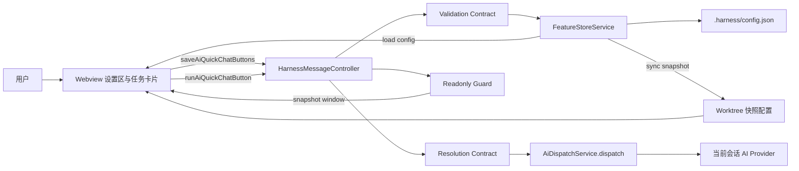

# 设计文档
## 1. 概述
本设计面向 AI 快捷对话能力，目标是在不改变既有自定义按钮与会话派发主流程的前提下，新增一组可配置、可持久化、可渲染、可一键发送的快捷对话按钮能力，并在快照窗口保持只读治理一致性。

范围绑定：
1. Req-1：配置区支持新增、编辑、删除、保存校验。
2. Req-2：配置字段持久化、加载、缺省兼容。
3. Req-3：任务卡片旁路操作区渲染有效按钮。
4. Req-4：点击后按当前会话上下文派发原文内容。
5. Req-5：快照窗口只读保护与主从同步一致。

域约束：所有设计实体统一使用 canonical domain `ai-quick-chat`。

## 2. 架构设计
### 2.1 架构图（Mermaid）


### 2.2 项目目录结构
本能力涉及的设计落点如下（仅列设计关注对象）：

1. `apps/src/models.ts`
2. `apps/src/harnessMessages.ts`
3. `apps/src/harnessMessageController.ts`
4. `apps/src/webviewTemplates.ts`
5. `apps/src/services/featureStoreService.ts`
6. `apps/src/services/harnessActionsService.ts`
7. `apps/src/services/aiDispatchService.ts`
8. `apps/src/extension.ts`

### 2.3 路由设计
本能力采用 Webview Message Route（非 HTTP）进行契约交互。

1. Route-MSG-1 `saveAiQuickChatButtons`
   - 方向：Webview -> Extension
   - 目的：提交 AI 快捷对话按钮配置集合。
   - 绑定需求：Req-1, Req-2, Req-5。
2. Route-MSG-2 `runAiQuickChatButton`
   - 方向：Webview -> Extension
   - 目的：在当前任务会话上下文触发按钮关联对话内容发送。
   - 绑定需求：Req-3, Req-4。
3. Route-MSG-3 `configBootstrap`（复用既有初始化注入）
  - 方向：Extension -> Webview（初始化数据注入）
  - 目的：通过既有 `config` 注入通道下发 `aiQuickChatButtons`，避免新增独立加载路由。
  - 绑定需求：Req-2, Req-3。

## 3. 组件与接口设计
### 3.1 API 契约
1. API-1
   - domain: ai-quick-chat
   - requirementIds: [Req-1, Req-2, Req-5]
   - interface: `saveAiQuickChatButtons`
   - request:
     - taskId: string
     - buttons: AiQuickChatButtonInput[]
   - response:
     - oneOf:
       - { ok: true }
       - { ok: false, readonlyRejected: true, message: string }
       - { ok: false, validationErrors: AiQuickChatValidationIssue[] }

2. API-2
   - domain: ai-quick-chat
   - requirementIds: [Req-2]
   - interface: `configBootstrap.aiQuickChatButtons`
   - request:
     - none
   - response:
     - buttons: AiQuickChatButton[]

3. API-3
   - domain: ai-quick-chat
   - requirementIds: [Req-3, Req-4]
   - interface: `runAiQuickChatButton`
   - request:
     - taskId: string
     - buttonId: string
   - response:
     - accepted: boolean
     - failureReason?: `not_found_or_invalid` | `dispatch_failed`

4. API-4
   - domain: ai-quick-chat
   - requirementIds: [Req-2]
   - interface: `persistConfig.aiQuickChatButtons`
   - request:
     - aiQuickChatButtons: PersistedAiQuickChatButton[]
   - response:
     - writeApplied: boolean

5. API-5
   - domain: ai-quick-chat
   - requirementIds: [Req-4]
   - interface: `aiDispatchService.dispatch`（既有服务调用）
   - request:
     - query: string
     - iterDir: string
     - source: `quick-chat-button`
     - providerOverride?: string
   - response:
     - Promise<void>

6. API-6
   - domain: ai-quick-chat
   - requirementIds: [Req-5]
   - interface: `syncAiQuickChatButtonsToWorktrees`
   - request:
     - sourceConfig: ConfigSnapshot
   - response:
     - syncedWorktreeCount: number

### 3.2 派发适配契约（Resolution Contract）
为避免与既有派发主流程冲突，`runAiQuickChatButton` 到 `aiDispatchService.dispatch` 的映射固定如下：

1. 输入解析
  - 依据 `taskId` 解析任务实体，得到 `iterDir`（迭代目录）与任务级 AI provider（若有）。
  - 依据 `buttonId` 在已保存配置中查找目标按钮，取原始 `content` 作为 `query`。

2. 调用映射
  - `query = persistedButton.content`（禁止 trim/模板替换/转义改写）。
  - `iterDir = resolvedTask.iterationDir`。
  - `source = 'quick-chat-button'`（新增受控来源枚举值，用于审计与会话范围决策）。
  - `providerOverride = resolvedTask.aiProvider || undefined`。

3. 错误映射
  - 按钮不存在或无效：返回 `accepted=false, failureReason=not_found_or_invalid`。
  - dispatch 抛错：返回 `accepted=false, failureReason=dispatch_failed`。
  - 任一失败分支均需给出可感知提示，且不得抛出未捕获异常。

### 3.3 数据模型
1. Model-1 `AiQuickChatButton`
   - domain: ai-quick-chat
   - requirementIds: [Req-1, Req-3, Req-4]
   - fields:
     - id: string
     - label: string
     - content: string
     - order: number
   - constraints:
     - `trim(label).length` in [1, 64]
     - `trim(content).length` in [1, 4000]

2. Model-2 `AiQuickChatButtonInput`
   - domain: ai-quick-chat
   - requirementIds: [Req-1]
   - fields:
     - label: string
     - content: string

3. Model-3 `PersistedAiQuickChatButton`
   - domain: ai-quick-chat
   - requirementIds: [Req-2, Req-5]
   - fields:
     - id: string
     - label: string
     - content: string
     - order: number
   - notes:
     - 序列化至 `.harness/config.json` 的 `aiQuickChatButtons` 字段。

4. Model-4 `AiQuickChatValidationIssue`
   - domain: ai-quick-chat
   - requirementIds: [Req-1]
   - fields:
     - index: number
     - field: `label` | `content`
     - code: `blank` | `too_long`
     - limit?: number

5. Model-5 `AiQuickChatDispatchContext`
   - domain: ai-quick-chat
   - requirementIds: [Req-4]
   - fields:
     - taskId: string
     - iterationDir: string
     - provider: string

### 3.4 组件 Props / Events
1. Component-1 `AiQuickChatSettingsSection`
   - domain: ai-quick-chat
   - requirementIds: [Req-1, Req-2, Req-5]
   - props:
     - buttons: AiQuickChatButton[]
     - readonly: boolean
   - events:
     - `onAddButton()`
     - `onEditButton(index, patch)`
     - `onDeleteButton(index)`
     - `onSave(buttons)`

2. Component-2 `TaskCardSideActions`
   - domain: ai-quick-chat
   - requirementIds: [Req-3, Req-4]
   - props:
     - aiQuickChatButtons: AiQuickChatButton[]
     - taskId: string
   - events:
     - `onRunAiQuickChatButton(taskId, buttonId)`

3. Component-3 `ReadonlyHintBanner`
   - domain: ai-quick-chat
   - requirementIds: [Req-5]
   - props:
     - readonly: boolean
     - message: string
   - events:
     - none

### 3.5 Store 设计
1. Store-1 `Config.aiQuickChatButtons`
   - domain: ai-quick-chat
   - requirementIds: [Req-2]
   - responsibility:
     - 持久化与加载 AI 快捷对话按钮集合。
     - 字段缺失时回退为空数组，不报错。

2. Store-2 `NormalizedAiQuickChatButtonsView`
   - domain: ai-quick-chat
   - requirementIds: [Req-1, Req-3]
   - responsibility:
     - 过滤无效按钮（空白名称/空白内容）。
     - 保持有效按钮顺序稳定，用于渲染。

3. Store-3 `SnapshotReadonlyState`
   - domain: ai-quick-chat
   - requirementIds: [Req-5]
   - responsibility:
     - 标识窗口是否为主配置快照只读态。
     - 拒绝写入并返回一致提示。

## 4. 正确性属性（需求不变量）
1. INV-1（Req-1）
   - domain: ai-quick-chat
   - 规则：任一待保存按钮必须满足 `1 <= trim(label).length <= 64` 且 `1 <= trim(content).length <= 4000`，否则保存整体失败并返回字段级提示。

2. INV-2（Req-1, Req-2）
   - domain: ai-quick-chat
   - 规则：保存后的按钮序列与用户编辑顺序一致，读取后顺序不变。

3. INV-3（Req-2）
   - domain: ai-quick-chat
   - 规则：`aiQuickChatButtons` 的持久化写入不得改变其他既有配置字段语义值。

4. INV-4（Req-3）
   - domain: ai-quick-chat
   - 规则：仅有效按钮可渲染在旁路操作区；无有效按钮时不渲染占位元素。

5. INV-5（Req-4）
   - domain: ai-quick-chat
   - 规则：点击触发时发送文本必须与已保存 `content` 逐字符一致（含换行和 Unicode），不允许截断、转义改写或模板替换。

6. INV-6（Req-4）
   - domain: ai-quick-chat
   - 规则：若目标按钮在执行时不存在或无效，系统必须拒绝派发并返回可感知失败提示，且不抛出未捕获异常。

7. INV-7（Req-5）
   - domain: ai-quick-chat
   - 规则：快照只读窗口中任何保存请求必须被拒绝，且不得写入配置文件。

8. INV-8（Req-5）
   - domain: ai-quick-chat
   - 规则：主窗口保存后，快照窗口读取到的 `aiQuickChatButtons` 与主窗口源配置最终一致。

9. INV-9（Req-3）
  - domain: ai-quick-chat
  - 规则：AI 快捷对话按钮必须与自定义按钮并列渲染在同一旁路容器，复用相同按钮样式类与布局容器类，不引入独立占位容器。

## 5. 错误处理
1. 校验错误（Req-1）
   - 触发条件：名称/内容为空白或超长。
   - 处理策略：拒绝保存，返回 `AiQuickChatValidationIssue[]`，前端按字段显示提示。

2. 只读拒绝（Req-5）
   - 触发条件：快照窗口发起保存。
   - 处理策略：统一返回只读拒绝标记与提示文案，不执行任何写入。

3. 派发失败（Req-4）
   - 触发条件：按钮缺失/失效，或 AI 派发通道失败。
   - 处理策略：不重试隐式发送；返回失败原因并给出可感知提示。

4. 加载兼容（Req-2）
   - 触发条件：历史配置缺失 `aiQuickChatButtons`。
   - 处理策略：按空列表处理，保持系统可用。

## 6. 安全基线
1. 输入边界校验（Req-1, Req-4）
  - 所有来自 Webview 的按钮数据在 Extension 侧二次校验（空白/长度/字段类型），不得仅依赖前端校验。

2. 输出编码与渲染约束（Req-3）
  - 按钮 `label` 渲染必须进行 HTML 转义；`content` 不参与 HTML 拼接，仅作为派发文本载荷。

3. 消息与执行边界（Req-4）
  - `runAiQuickChatButton` 只允许触发受控的 `aiDispatchService.dispatch`；禁止将 `content` 解释为脚本、命令或模板指令。

4. OWASP Top 10 对齐（最小相关集）
  - A03 Injection：通过严格数据/执行边界避免命令与脚本注入。
  - A03/A07 XSS：通过统一 HTML 转义避免按钮名称注入。
  - A04 Insecure Design：只读窗口写保护与失败显式化，避免静默不一致。

## 7. 测试策略
1. 契约测试
   - 覆盖 API-1 至 API-6 的请求/响应结构、错误分支与只读分支。
   - 需求映射：Req-1, Req-2, Req-4, Req-5。

2. 模型与校验测试
   - 覆盖 Model-1/2/3/4 的边界值：空白、64/65、4000/4001、Unicode 与换行。
   - 需求映射：Req-1, Req-2。

3. 渲染行为测试
  - 覆盖有效按钮渲染、无效过滤、空列表不占位、与自定义按钮并列布局。
  - 新增 DOM 断言：复用相同按钮样式类与旁路容器类（INV-9）。
   - 需求映射：Req-3。

4. 派发行为测试
   - 覆盖点击后上下文绑定、逐字符一致发送、失效按钮拒发。
   - 需求映射：Req-4。

5. 快照治理测试
   - 覆盖快照只读拒绝与主从同步一致性。
   - 需求映射：Req-5。

6. 安全回归测试
  - 覆盖按钮名称含 HTML 特殊字符时的转义渲染。
  - 覆盖 `content` 含多行/Unicode/模板样式字符时仍按纯文本逐字符派发。
  - 需求映射：Req-3, Req-4。

## 8. 机器可读区
```yaml
artifactType: design
taskName: AI快捷对话
apiContracts:
  - id: API-1
    domain: ai-quick-chat
    requirementIds: [Req-1, Req-2, Req-5]
    method: MESSAGE
    path: saveAiQuickChatButtons
    request:
      taskId: string
      buttons: AiQuickChatButtonInput[]
    response:
      oneOf:
        - ok: true
        - ok: false
          readonlyRejected: true
          message: string
        - ok: false
          validationErrors: AiQuickChatValidationIssue[]
  - id: API-2
    domain: ai-quick-chat
    requirementIds: [Req-2]
    method: MESSAGE
    path: configBootstrap.aiQuickChatButtons
    request: {}
    response:
      buttons: AiQuickChatButton[]
  - id: API-3
    domain: ai-quick-chat
    requirementIds: [Req-3, Req-4]
    method: MESSAGE
    path: runAiQuickChatButton
    request:
      taskId: string
      buttonId: string
    response:
      accepted: boolean
      failureReason: not_found_or_invalid|dispatch_failed
  - id: API-4
    domain: ai-quick-chat
    requirementIds: [Req-2]
    method: FILE_WRITE
    path: .harness/config.json.aiQuickChatButtons
    request:
      aiQuickChatButtons: PersistedAiQuickChatButton[]
    response:
      writeApplied: boolean
  - id: API-5
    domain: ai-quick-chat
    requirementIds: [Req-4]
    method: SERVICE_CALL
    path: aiDispatchService.dispatch
    request:
      query: string
      iterDir: string
      source: quick-chat-button
      providerOverride: string|undefined
    response:
      promise: Promise<void>
  - id: API-6
    domain: ai-quick-chat
    requirementIds: [Req-5]
    method: SYNC
    path: syncAiQuickChatButtonsToWorktrees
    request:
      sourceConfig: ConfigSnapshot
    response:
      syncedWorktreeCount: number
models:
  - id: Model-1
    domain: ai-quick-chat
    requirementIds: [Req-1, Req-3, Req-4]
    name: AiQuickChatButton
    fields:
      - name: id
        type: string
      - name: label
        type: string
      - name: content
        type: string
      - name: order
        type: number
  - id: Model-2
    domain: ai-quick-chat
    requirementIds: [Req-1]
    name: AiQuickChatButtonInput
    fields:
      - name: label
        type: string
      - name: content
        type: string
  - id: Model-3
    domain: ai-quick-chat
    requirementIds: [Req-2, Req-5]
    name: PersistedAiQuickChatButton
    fields:
      - name: id
        type: string
      - name: label
        type: string
      - name: content
        type: string
      - name: order
        type: number
  - id: Model-4
    domain: ai-quick-chat
    requirementIds: [Req-1]
    name: AiQuickChatValidationIssue
    fields:
      - name: index
        type: number
      - name: field
        type: label|content
      - name: code
        type: blank|too_long
      - name: limit
        type: number
  - id: Model-5
    domain: ai-quick-chat
    requirementIds: [Req-4]
    name: AiQuickChatDispatchContext
    fields:
      - name: taskId
        type: string
      - name: iterationDir
        type: string
      - name: provider
        type: string
components:
  - id: Component-1
    domain: ai-quick-chat
    requirementIds: [Req-1, Req-2, Req-5]
    name: AiQuickChatSettingsSection
    props:
      - name: buttons
        type: AiQuickChatButton[]
      - name: readonly
        type: boolean
    events: [onAddButton, onEditButton, onDeleteButton, onSave]
  - id: Component-2
    domain: ai-quick-chat
    requirementIds: [Req-3, Req-4]
    name: TaskCardSideActions
    props:
      - name: aiQuickChatButtons
        type: AiQuickChatButton[]
      - name: taskId
        type: string
    events: [onRunAiQuickChatButton]
  - id: Component-3
    domain: ai-quick-chat
    requirementIds: [Req-5]
    name: ReadonlyHintBanner
    props:
      - name: readonly
        type: boolean
      - name: message
        type: string
    events: []
stores:
  - id: Store-1
    domain: ai-quick-chat
    requirementIds: [Req-2]
    name: Config.aiQuickChatButtons
  - id: Store-2
    domain: ai-quick-chat
    requirementIds: [Req-1, Req-3]
    name: NormalizedAiQuickChatButtonsView
  - id: Store-3
    domain: ai-quick-chat
    requirementIds: [Req-5]
    name: SnapshotReadonlyState
invariants:
  - id: INV-1
    domain: ai-quick-chat
    requirementId: Req-1
    rule: trim(label) and trim(content) must be non-empty and within length bounds (label<=64, content<=4000)
  - id: INV-2
    domain: ai-quick-chat
    requirementId: Req-1
    rule: save and load must preserve user-defined button order
  - id: INV-3
    domain: ai-quick-chat
    requirementId: Req-2
    rule: persisting aiQuickChatButtons must not mutate semantic values of other config fields
  - id: INV-4
    domain: ai-quick-chat
    requirementId: Req-3
    rule: render only valid buttons; render none when list is empty or invalid
  - id: INV-5
    domain: ai-quick-chat
    requirementId: Req-4
    rule: dispatched content must be byte-equivalent to persisted content including Unicode and line breaks
  - id: INV-6
    domain: ai-quick-chat
    requirementId: Req-4
    rule: missing or invalid target button must fail gracefully without uncaught exception
  - id: INV-7
    domain: ai-quick-chat
    requirementId: Req-5
    rule: snapshot readonly window must reject all save requests and perform zero writes
  - id: INV-8
    domain: ai-quick-chat
    requirementId: Req-5
    rule: snapshot data must converge to main-window saved aiQuickChatButtons after sync
  - id: INV-9
    domain: ai-quick-chat
    requirementId: Req-3
    rule: aiQuickChatButtons must render in the same side-action container and reuse the same style classes as customButtons
```
