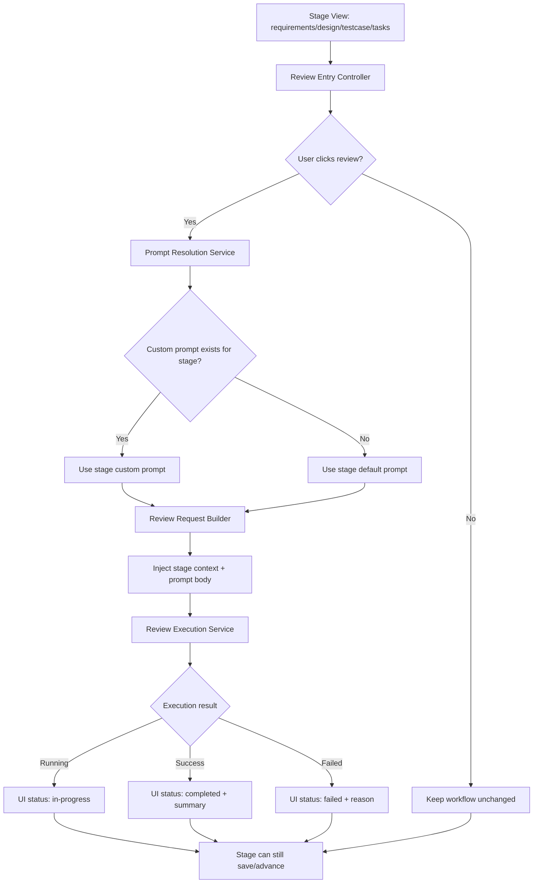

# 设计文档

## 1. 概述

本设计面向“评审植入”能力，覆盖需求文档中的 Req-1 至 Req-4，目标是在需求、设计、测试用例、任务拆解四个关键阶段提供可选评审入口，并支持按阶段选择通用模板或用户自定义模板发起评审。

设计原则：
- 非阻断：评审为可选动作，不改变主流程保存/推进语义（Req-1, Req-4）。
- 分阶段：需求、设计、测试用例、任务拆解必须使用各自阶段模板，不允许跨阶段误用（Req-2, Req-3）。
- 可追溯：接口、模型、不变量全部绑定 Req-*，无无来源能力扩展（Req-1 至 Req-4）。
- 可回退：未配置自定义模板时必须回退通用模板，且回退行为可验证（Req-2, Req-3）。

## 2. 架构设计

### 2.1 架构图（Mermaid）



### 2.2 项目目录结构

```text
apps/src/
├── harnessMessageController.ts        # 评审入口消息路由与阶段动作分发（Req-1, Req-4）
├── harnessMessages.ts                 # 评审相关消息契约定义（Req-1, Req-2, Req-4）
├── webviewTemplates.ts                # 四个关键阶段评审入口、状态展示与自定义模板编辑器（Req-1, Req-3, Req-4）
└── services/
    ├── promptService.ts               # 按阶段选择通用/自定义模板并回退（Req-2, Req-3）
    ├── reviewPromptConfigService.ts   # 按阶段保存与读取自定义模板（Req-3）
    └── reviewExecutionService.ts      # 执行评审并回传状态/摘要（Req-4）

apps/system-prompts/
├── review_requirements_system_prompt.md  # 需求阶段通用评审模板（Req-2）
├── review_design_system_prompt.md        # 设计阶段通用评审模板（Req-2）
├── review_testcase_system_prompt.md      # 测试用例阶段通用评审模板（Req-2）
└── review_tasks_system_prompt.md         # 任务拆解阶段通用评审模板（Req-2）

specs/评审植入/
└── design.md                          # 本设计产物
```

说明：
- 目录中的服务名称为设计契约层命名，表示职责边界；实现阶段可与现有服务合并，但不得改变对外契约语义。
- 所有路径按当前仓库根目录解析，不引入硬编码 workspace 根路径。

### 2.3 路由设计

本能力不引入浏览器 URL 路由，采用 Webview 消息路由。

| Route ID | Message | 来源 | 处理器契约 | 绑定需求 |
| --- | --- | --- | --- | --- |
| ROUTE-1 | `openStageReview` | 阶段页面评审按钮 | `HarnessMessageController` 校验阶段后委托扩展处理器，并回发 `stageReviewOpened` | Req-1 |
| ROUTE-2 | `saveStagePrompt` | 阶段配置面板 | `HarnessMessageController` 校验阶段后委托 `ReviewPromptConfigService#saveStagePrompt(stage, promptBody)` | Req-3 |
| ROUTE-3 | `runStageReview` | 阶段页面 | `HarnessMessageController` 校验阶段后委托 `ReviewExecutionService#runStageReview(stage, context)`，并通过 `stageReviewStatus` 回传首次状态快照 | Req-2, Req-3, Req-4 |
| ROUTE-4 | `getLatestReviewStatus` | 阶段页面初始化、刷新、轮询回显 | `HarnessMessageController` 校验阶段后委托 `ReviewExecutionService#getLatestReviewStatus(stage)`，并通过 `stageReviewStatus` 回传最新状态 | Req-4 |

路由约束：
- `openStageReview` 与 `runStageReview` 仅在 `requirements|design|testcase|tasks` 四个阶段生效（Req-1）。
- `saveStagePrompt` 与 `getLatestReviewStatus` 同样仅在 `requirements|design|testcase|tasks` 四个阶段生效（Req-1）。
- 非法阶段值由 `HarnessMessageController#ensureReviewStage` 拦截并提示 `REVIEW-VAL-001`，不抛出异常到主流程（Req-1, Req-4）。- `runStageReview` 内必须先做模板解析，再创建评审请求（Req-2, Req-3）。
- `runStageReview` 负责返回立即可见的 `running|failed` 首次快照；`completed|failed` 终态通过 `getLatestReviewStatus` 的刷新或轮询链路获取（Req-4）。
- 任一评审消息失败不得阻断阶段保存/推进消息链（Req-4）。

## 3. 组件与接口设计

### 3.1 API 契约

| API ID | 契约名 | method | path | requirementIds |
| --- | --- | --- | --- | --- |
| API-1 | 打开阶段评审入口 | MESSAGE | `openStageReview -> stageReviewOpened` | [Req-1] |
| API-2 | 解析评审模板（自定义优先，通用回退） | SERVICE | `PromptService#resolveReviewPromptByStage` | [Req-2, Req-3] |
| API-3 | 保存阶段自定义模板 | MESSAGE+SERVICE | `saveStagePrompt -> ReviewPromptConfigService#saveStagePrompt` | [Req-3] |
| API-4 | 执行阶段评审 | MESSAGE+SERVICE | `runStageReview -> ReviewExecutionService#runStageReview -> stageReviewStatus` | [Req-2, Req-3, Req-4] |
| API-5 | 查询阶段最新评审状态 | MESSAGE+SERVICE | `getLatestReviewStatus -> ReviewExecutionService#getLatestReviewStatus -> stageReviewStatus` | [Req-4] |

契约细化：
- API-1 `openStageReview -> stageReviewOpened`
  - request:
    - `stage: "requirements" | "design" | "testcase" | "tasks"`
  - async event response:
    - `type: "stageReviewOpened"`
    - `stage: "requirements" | "design" | "testcase" | "tasks"`
    - `reviewEnabled: true`
    - `defaultExecuted: false`
  - 约束：页面加载后可见入口，但默认不自动执行评审（Req-1）。

- API-2 `PromptService#resolveReviewPromptByStage`
  - request:
    - `stage: "requirements" | "design" | "testcase" | "tasks"`
    - `context: StageContext`
    - `configService?: ReviewPromptConfigService`
  - response:
    - `source: "custom" | "default"`
    - `promptBody: string`
    - `composedPrompt: string`
  - 约束：同阶段优先 custom；无 custom 或未提供 `configService` 时回退 default；不同阶段必须返回对应模板（Req-2, Req-3）。

- API-3 `ReviewPromptConfigService#saveStagePrompt`
  - request:
    - `stage: "requirements" | "design" | "testcase" | "tasks"`
    - `promptBody: string`
  - service response:
    - `savedVersion: number`
    - `updatedAt: string`
  - 存储：持久化到 `.fun-harness/review-prompt-config.json`
  - 消息语义：当前 Webview 入口以 `saveStagePrompt` fire-and-forget 方式调用该服务；版本号与时间戳仅为服务内部返回值，不额外回发确认事件。
  - 约束：同阶段新保存版本覆盖旧版本；仅影响该阶段（Req-3）。

- API-4 `runStageReview -> ReviewExecutionService#runStageReview -> stageReviewStatus`
  - request:
    - `stage: "requirements" | "design" | "testcase" | "tasks"`
    - `context: StageContext`
  - immediate response:
    - `reviewId: string`
    - `status: "running" | "failed"`
    - `summary?: string`
    - `errorReason?: string`
  - async event response:
    - `type: "stageReviewStatus"`
    - `stage: "requirements" | "design" | "testcase" | "tasks"`
    - `reviewId?: string`
    - `status: "running" | "failed"`
    - `errorReason?: string`
  - 约束：首次调用立即返回并回发 `running`，若模板解析失败则立即回发 `failed`；异步执行完成后的 `completed|failed` 终态不由本调用直接推送，而由 API-5 查询返回；请求内容必须包含阶段上下文与模板正文；失败时返回可理解原因；不改变主流程可完成语义（Req-2, Req-4）。

- API-5 `getLatestReviewStatus -> ReviewExecutionService#getLatestReviewStatus -> stageReviewStatus`
  - request:
    - `stage: "requirements" | "design" | "testcase" | "tasks"`
  - response:
    - `status: "idle" | "running" | "completed" | "failed"`
    - `summary?: string`
    - `errorReason?: string`
  - async event response:
    - `type: "stageReviewStatus"`
    - `stage: "requirements" | "design" | "testcase" | "tasks"`
  - 约束：用于页面初始化、刷新和轮询后的状态回显；无历史记录时返回 `idle`；不引入阻断状态机（Req-4）。

### 3.2 数据模型

| Model ID | 名称 | 字段摘要 | requirementIds |
| --- | --- | --- | --- |
| MODEL-1 | StageReviewPromptConfig | `stage`, `customPrompt`, `version`, `updatedAt` | [Req-3] |
| MODEL-2 | StageReviewTemplateSet | `stage`, `defaultPrompt`, `defaultTemplateId` | [Req-2] |
| MODEL-3 | StageReviewRequest | `reviewId`, `stage`, `promptSource`, `composedPrompt`, `contextSnapshot` | [Req-2, Req-3] |
| MODEL-4 | StageReviewStatus | `reviewId`, `stage`, `status`, `summary`, `errorReason`, `updatedAt` | [Req-4] |

模型约束：
- MODEL-1 的 `stage` 必须是四阶段枚举值之一，禁止跨阶段复用配置（Req-3）；持久化文件为 `.fun-harness/review-prompt-config.json`。
- MODEL-2 的 `defaultPrompt` 必须按阶段区分，不得四阶段共用同一未分阶段模板（Req-2）。
- MODEL-3 的 `promptSource` 只能是 `custom|default`，且来源与解析结果一致（Req-2, Req-3）。
- MODEL-4 的 `status` 不参与主流程推进门禁，仅用于可感知反馈（Req-4）。

### 3.3 组件 Props / Events

| Component ID | 组件 | Props | Events | requirementIds |
| --- | --- | --- | --- | --- |
| COMP-1 | StageReviewEntryButton | `stage`, `visible`, `latestStatus` | `onClickReview(stage)` | [Req-1, Req-4] |
| COMP-2 | StageReviewPromptEditor | `stage`, `customPrompt`, `defaultPromptPreview` | `onSaveCustomPrompt(stage,prompt)` | [Req-3] |
| COMP-3 | StageReviewStatusPanel | `stage`, `status`, `summary`, `errorReason` | `onRefreshStatus(stage)` | [Req-4] |

组件约束：
- `StageReviewEntryButton.visible=true` 仅在四关键阶段成立（Req-1）。
- `StageReviewPromptEditor` 保存事件必须只写入当前阶段配置（Req-3）。
- `StageReviewStatusPanel` 展示失败时必须包含可理解失败原因（Req-4）。
- `StageReviewStatusPanel` 在触发评审后可通过刷新或轮询 `getLatestReviewStatus` 获取终态（Req-4）。

### 3.4 Store 设计

| Store ID | 名称 | 键设计 | 值设计 | requirementIds |
| --- | --- | --- | --- | --- |
| STORE-1 | `reviewPromptConfigStore` | `stage` | `StageReviewPromptConfig`（磁盘文件 `.fun-harness/review-prompt-config.json`） | [Req-3] |
| STORE-2 | `reviewStatusStore` | `stage` | `StageReviewStatus` | [Req-4] |

Store 规则：
- `reviewPromptConfigStore` 采用按阶段覆盖写入（last-write-wins）并保留版本号（Req-3）。
- `reviewStatusStore` 可被评审执行异步更新，但任何状态不得写入“阻断主流程”的布尔门禁字段（Req-4）。

## 4. 正确性属性（需求不变量）

| Invariant ID | requirementId | domain | rule |
| --- | --- | --- | --- |
| INV-1 | Req-1 | project-structure-init | 在 `requirements|design|testcase|tasks` 阶段页面加载完成后，评审入口必须可见且默认不触发评审执行。 |
| INV-2 | Req-1 | project-structure-init | 用户未点击评审入口时，主流程推进链路的可达性与无评审场景等价。 |
| INV-3 | Req-2 | project-structure-init | 当某阶段无自定义模板时，`resolveReviewPromptByStage(stage)` 必须返回该阶段 `defaultPrompt`。 |
| INV-4 | Req-2 | project-structure-init | 评审请求创建时，`composedPrompt` 必须同时包含阶段上下文与模板正文。 |
| INV-5 | Req-2 | project-structure-init | 对任意两个不同阶段 `s1 != s2`，其 `defaultPrompt(s1)` 与 `defaultPrompt(s2)` 必须可区分。 |
| INV-6 | Req-3 | project-structure-init | 当阶段存在自定义模板时，`promptSource` 必须为 `custom`，且请求不得回退 `default`。 |
| INV-7 | Req-3 | project-structure-init | 自定义模板更新后，下一次同阶段评审请求必须使用最新保存版本。 |
| INV-8 | Req-3 | project-structure-init | 阶段 A 的自定义模板不得影响阶段 B 的模板解析结果（A != B）。 |
| INV-9 | Req-4 | project-structure-init | 评审执行开始后状态必须进入 `running`，成功后进入 `completed` 并附摘要，失败后进入 `failed` 并附原因。 |
| INV-10 | Req-4 | project-structure-init | 即使评审为 `failed` 或 `idle`，阶段保存/推进操作仍按既有规则判定，不新增“必须评审”门禁。 |

## 5. 错误处理

| 场景 | 处理策略 | 绑定需求 |
| --- | --- | --- |
| 阶段值非法（不在四关键阶段） | 在消息入口层拦截并提示 `REVIEW-VAL-001`，不下发评审调用；不影响主流程状态 | Req-1, Req-4 |
| 模板解析失败（自定义读取异常） | 记录错误并回退通用模板；若通用模板也不可用则返回失败原因 | Req-2, Req-3, Req-4 |
| 评审执行引擎调用失败 | 写入 `failed` 状态并返回可理解失败原因；页面允许重试 | Req-4 |
| 状态回显读取失败 | 返回 `idle` 与诊断提示，不阻断页面操作 | Req-4 |
| 保存自定义模板冲突 | 按版本号执行最后写入生效并持久化到磁盘；消息链路不额外回发确认事件 | Req-3 |

## 6. 测试策略

| 测试 ID | 测试目标 | 验证点（GIVEN/WHEN/THEN） | requirementIds |
| --- | --- | --- | --- |
| TEST-1 | 四阶段入口可见且默认未执行 | GIVEN 进入任一关键阶段 WHEN 页面加载 THEN 可见评审入口且状态为 `idle` | [Req-1] |
| TEST-2 | 不点击评审不阻断流程 | GIVEN 用户未触发评审 WHEN 保存/推进阶段 THEN 操作按既有规则成功 | [Req-1, Req-4] |
| TEST-3 | 通用模板回退 | GIVEN 未配置自定义或未提供 `configService` WHEN 点击评审或解析模板 THEN 使用当前阶段通用模板，且 `promptBody` 非空 | [Req-2] |
| TEST-4 | 模板含阶段上下文 | GIVEN 发起评审 WHEN 请求创建 THEN composedPrompt 含阶段上下文与模板正文 | [Req-2] |
| TEST-5 | 四阶段通用模板区分 | GIVEN 分别在四阶段发起评审 WHEN 构造请求 THEN 四阶段模板内容可区分 | [Req-2] |
| TEST-6 | 自定义覆盖生效 | GIVEN 阶段已配置自定义 WHEN 点击评审 THEN promptSource=custom 且使用该模板 | [Req-3] |
| TEST-7 | 自定义更新后生效 | GIVEN 已更新并保存模板 WHEN 再次发起评审 THEN 使用最新版本 | [Req-3] |
| TEST-8 | 阶段间隔离 | GIVEN 需求阶段有自定义、设计阶段无自定义 WHEN 分别评审 THEN 分别走 custom/default | [Req-3] |
| TEST-9 | 状态可感知 | GIVEN 发起评审 WHEN 先执行 `runStageReview` 再查询 `getLatestReviewStatus` THEN 分别观察到 running/completed/failed 与摘要或原因 | [Req-4] |
| TEST-10 | 失败不改变完成语义 | GIVEN 评审失败 WHEN 用户继续阶段保存/推进 THEN 不新增强制评审门禁 | [Req-4] |

## 7. 机器可读区
```yaml
artifactType: design
taskName: 评审植入
apiContracts:
  - id: API-1
    domain: project-structure-init
    requirementIds: [Req-1]
    method: MESSAGE
    path: openStageReview
    request:
      stage: enum(requirements|design|testcase|tasks)
    emits:
      type: stageReviewOpened
      stage: enum(requirements|design|testcase|tasks)
      reviewEnabled: true
      defaultExecuted: false
  - id: API-2
    domain: project-structure-init
    requirementIds: [Req-2, Req-3]
    method: SERVICE
    path: PromptService#resolveReviewPromptByStage
    request:
      stage: enum(requirements|design|testcase|tasks)
      context: StageContext
      configService: ReviewPromptConfigService?
    response:
      source: enum(custom|default)
      promptBody: string
      composedPrompt: string
  - id: API-3
    domain: project-structure-init
    requirementIds: [Req-3]
    method: MESSAGE+SERVICE
    path: saveStagePrompt -> ReviewPromptConfigService#saveStagePrompt
    transport: saveStagePrompt message (fire-and-forget)
    request:
      stage: enum(requirements|design|testcase|tasks)
      promptBody: string
    serviceResponse:
      savedVersion: number
      updatedAt: string
    storageFile: .fun-harness/review-prompt-config.json
    webviewResponse: none
  - id: API-4
    domain: project-structure-init
    requirementIds: [Req-2, Req-3, Req-4]
    method: MESSAGE+SERVICE
    path: ReviewExecutionService#runStageReview
    request:
      stage: enum(requirements|design|testcase|tasks)
      context: StageContext
    response:
      reviewId: string
      status: enum(running|failed)
      summary: string?
      errorReason: string?
    emits:
      type: stageReviewStatus
      stage: enum(requirements|design|testcase|tasks)
      reviewId: string?
      status: enum(running|failed)
      errorReason: string?
    delivery: immediate running or immediate failed; terminal completed|failed is retrieved through API-5 polling/query
  - id: API-5
    domain: project-structure-init
    requirementIds: [Req-4]
    method: MESSAGE+SERVICE
    path: ReviewExecutionService#getLatestReviewStatus
    request:
      stage: enum(requirements|design|testcase|tasks)
    response:
      status: enum(idle|running|completed|failed)
      summary: string?
      errorReason: string?
    emits:
      type: stageReviewStatus
      stage: enum(requirements|design|testcase|tasks)
    usage: initial page load, manual refresh, and post-run polling
models:
  - id: MODEL-1
    domain: project-structure-init
    requirementIds: [Req-3]
    name: StageReviewPromptConfig
    storageFile: .fun-harness/review-prompt-config.json
    fields:
      stage: enum(requirements|design|testcase|tasks)
      customPrompt: string
      version: number
      updatedAt: string
  - id: MODEL-2
    domain: project-structure-init
    requirementIds: [Req-2]
    name: StageReviewTemplateSet
    fields:
      stage: enum(requirements|design|testcase|tasks)
      defaultPrompt: string
      defaultTemplateId: string
  - id: MODEL-3
    domain: project-structure-init
    requirementIds: [Req-2, Req-3]
    name: StageReviewRequest
    fields:
      reviewId: string
      stage: enum(requirements|design|testcase|tasks)
      promptSource: enum(custom|default)
      composedPrompt: string
      contextSnapshot: object
  - id: MODEL-4
    domain: project-structure-init
    requirementIds: [Req-4]
    name: StageReviewStatus
    fields:
      reviewId: string
      stage: enum(requirements|design|testcase|tasks)
      status: enum(idle|running|completed|failed)
      summary: string?
      errorReason: string?
      updatedAt: string
components:
  - id: COMP-1
    domain: project-structure-init
    requirementIds: [Req-1, Req-4]
    name: StageReviewEntryButton
    props: [stage, visible, latestStatus]
    events: [onClickReview]
  - id: COMP-2
    domain: project-structure-init
    requirementIds: [Req-3]
    name: StageReviewPromptEditor
    props: [stage, customPrompt, defaultPromptPreview]
    events: [onSaveCustomPrompt]
  - id: COMP-3
    domain: project-structure-init
    requirementIds: [Req-4]
    name: StageReviewStatusPanel
    props: [stage, status, summary, errorReason]
    events: [onRefreshStatus]
stores:
  - id: STORE-1
    domain: project-structure-init
    requirementIds: [Req-3]
    name: reviewPromptConfigStore
    key: stage
    value: StageReviewPromptConfig
  - id: STORE-2
    domain: project-structure-init
    requirementIds: [Req-4]
    name: reviewStatusStore
    key: stage
    value: StageReviewStatus
invariants:
  - id: INV-1
    domain: project-structure-init
    requirementId: Req-1
    rule: stage page load must render review entry and not auto-run review
  - id: INV-2
    domain: project-structure-init
    requirementId: Req-1
    rule: not clicking review must not block stage progression
  - id: INV-3
    domain: project-structure-init
    requirementId: Req-2
    rule: missing custom prompt must fallback to stage default prompt
  - id: INV-4
    domain: project-structure-init
    requirementId: Req-2
    rule: review request must include stage context and prompt body
  - id: INV-5
    domain: project-structure-init
    requirementId: Req-2
    rule: default prompts for requirements, design, testcase must be distinguishable
  - id: INV-6
    domain: project-structure-init
    requirementId: Req-3
    rule: existing stage custom prompt must override default prompt
  - id: INV-7
    domain: project-structure-init
    requirementId: Req-3
    rule: latest saved custom prompt version must be used for subsequent reviews
  - id: INV-8
    domain: project-structure-init
    requirementId: Req-3
    rule: custom prompt configuration must be isolated per stage
  - id: INV-9
    domain: project-structure-init
    requirementId: Req-4
    rule: review execution status must transition to running and end in completed or failed with summary/reason
  - id: INV-10
    domain: project-structure-init
    requirementId: Req-4
    rule: failed or skipped review must not introduce mandatory-review gate for stage completion
```