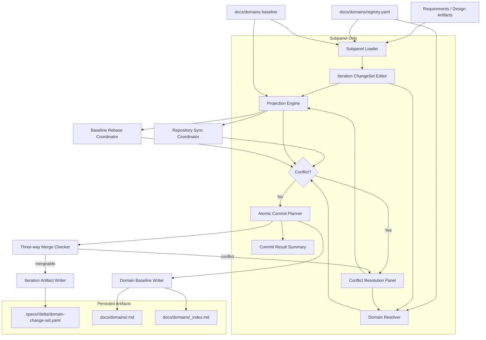
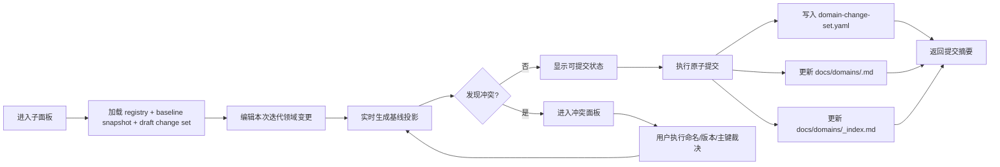
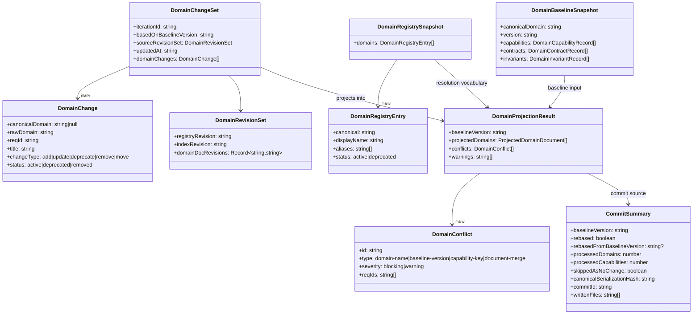
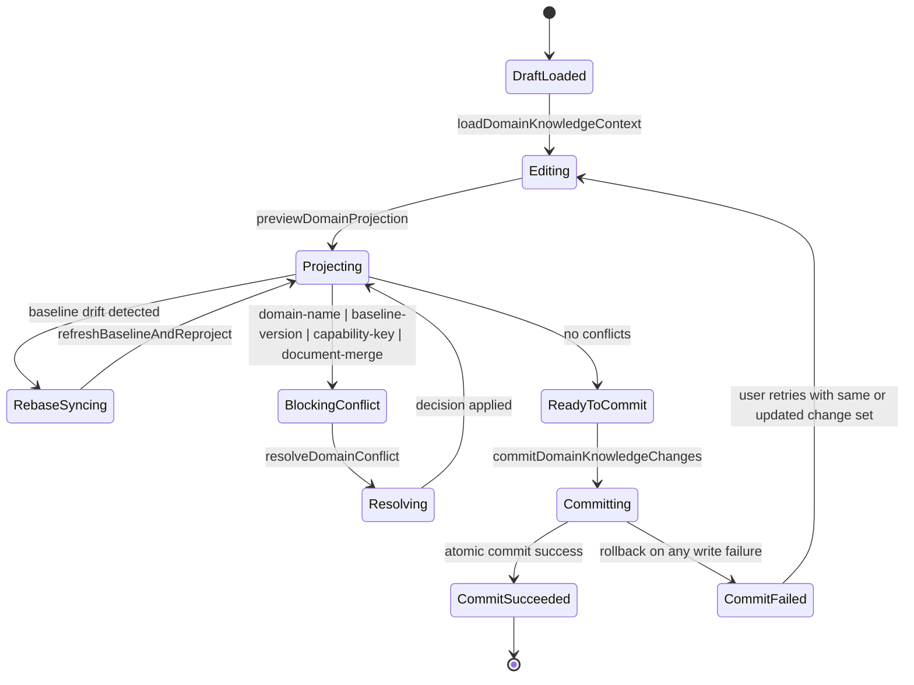

# 设计文档

## 1. 概述

本设计覆盖 [specs/领域聚合优化/requirements.md](c:/Users/cnu07hws/fun-harness/worktrees/领域聚合优化/specs/领域聚合优化/requirements.md) 中的 Req-1 至 Req-8，目标是在 Fun Harness 当前领域聚合能力上重构为“子面板单入口维护”方案：用户仅在子面板内完成领域变更编辑、领域基线投影、冲突裁决和最终提交，原主面板中的领域裁决、领域基线聚合及其相关治理功能全部移除。

本设计不引入新的业务域名，只使用 requirements 阶段已经确定的 canonical domain：`domain-knowledge`。设计范围仅覆盖契约、模型、路由、状态与正确性约束，不包含迁移方案和实现代码。

并发范围约束：

- 本设计默认并发场景为“不同 Git 分支并行修改同一领域，后续在沉淀路径汇合（merge/rebase）”。
- 不将“同一 branch 同一工作区多窗口并发编辑”作为主要场景，但仍通过提交锁与版本校验兜底。
- Git 同步、代码提交属于外层迭代流程能力，不属于子面板领域沉淀能力；子面板只处理领域沉淀数据的编辑、投影、冲突裁决与写入。

核心设计决策：

1. 子面板成为领域维护唯一入口，主面板不再保留领域相关治理能力。绑定 Req-1。
2. 当前迭代编辑态采用“领域变更集 + 基线快照 + 实时投影”三层模型，避免先写中间产物再到其他面板聚合。绑定 Req-2。
3. 提交采用原子化写入，一次完成迭代增量产物和领域基线产物落盘。绑定 Req-3。
4. 冲突在子面板提交前预检查并分类，裁决动作在子面板内完成。绑定 Req-4、Req-5。
5. 所有路径按当前仓库根目录解析，所有领域能力均必须绑定 Req-* 来源并满足幂等。绑定 Req-6、Req-7、Req-8。
6. 提交前允许自动 rebase 到最新基线并强制重投影；重投影后仍有 blocking 冲突时必须人工裁决。绑定 Req-4、Req-5、Req-8。
7. 领域文档允许机器按确定性规范重排（排序、分段重写）；等价内容必须序列化为相同文本。绑定 Req-3、Req-8。

## 2. 架构设计

### 2.1 架构图（Mermaid）



#### 目标流程图



### 2.2 项目目录结构

```text
apps/src/
├── extension.ts                                # 子面板命令注册；移除原主面板领域命令
├── harnessMessageController.ts                 # 子面板消息路由与提交流程编排
├── harnessMessages.ts                          # 子面板消息与事件契约
├── models.ts                                   # 领域变更集、投影结果、冲突与提交摘要模型
├── webviewTemplates.ts                         # 子面板领域维护界面模板
└── services/
    ├── domainRegistryService.ts                # 读取 registry、别名归一化、命名冲突判断
    ├── domainKnowledgeAggregateService.ts      # 重构为子面板内投影与原子提交服务
    ├── capabilityDeltaService.ts               # 读取结构化来源并生成迭代变更集内容
    ├── baselineRebaseService.ts                # 提交前基线刷新、自动 rebase 与重投影
    ├── workspaceRoot.ts                        # 当前仓库根目录解析
    ├── fileOps.ts                              # 原子写入、回滚、提交日志恢复
    └── mergeConflictService.ts                 # 领域文档三方合并与冲突分段检测
docs/
└── domains/
    ├── registry.yaml                           # canonical domain 注册表
    ├── _index.md                               # 领域总览
    └── <domain>.md                             # 领域基线文档
specs/
└── <iteration>/
    └── delta/
        └── domain-change-set.yaml              # 当前迭代子面板提交的结构化领域变更集
specs/领域聚合优化/
    ├── requirements.md                         # 本任务需求文档
    └── design.md                               # 本设计文档
```

目录设计约束：

- `specs/<iteration>/delta/domain-change-set.yaml` 是当前迭代领域沉淀的结构化追溯产物。绑定 Req-3、Req-6。
- `docs/domains/` 由子面板提交直接更新，不再依赖主面板入口。绑定 Req-1、Req-3。
- 与领域聚合相关的主面板命令、按钮和消息入口必须移除，而不是隐藏。绑定 Req-1。
- 所有路径必须通过当前仓库根目录解析，禁止硬编码 workspace 根路径。绑定 Req-7。

### 2.3 路由设计

本能力不新增浏览器 URL 路由，采用“子面板消息路由 + 扩展命令路由”两层设计。

| 路由 ID | 消息/命令 | 来源 | 目标处理器 | 绑定需求 |
| --- | --- | --- | --- | --- |
| ROUTE-1 | `openDomainKnowledgeWorkspace` | 子面板入口 | `Extension.openDomainKnowledgeWorkspace` | Req-1 |
| ROUTE-2 | `loadDomainKnowledgeContext` | 子面板 | `HarnessMessageController.loadDomainKnowledgeContext` | Req-1, Req-2, Req-7 |
| ROUTE-3 | `updateDomainChangeSet` | 子面板 | `HarnessMessageController.updateDomainChangeSet` | Req-2, Req-6 |
| ROUTE-4 | `previewDomainProjection` | 子面板 | `DomainKnowledgeAggregateService.previewProjection` | Req-2, Req-4, Req-8 |
| ROUTE-5 | `resolveDomainConflict` | 子面板 | `HarnessMessageController.resolveDomainConflict` | Req-4, Req-5 |
| ROUTE-6 | `commitDomainKnowledgeChanges` | 子面板 | `DomainKnowledgeAggregateService.commitChangeSet` | Req-3, Req-6, Req-8 |
| ROUTE-7 | `removeLegacyMainPanelDomainActions` | 扩展启动 | `Extension.unregisterLegacyDomainActions` | Req-1 |
| ROUTE-8 | `refreshBaselineAndReproject` | 子面板提交前 | `DomainKnowledgeAggregateService.refreshBaselineAndReproject` | Req-4, Req-5, Req-8 |
| ROUTE-9 | `detectDocumentMergeConflicts` | 子面板提交前 | `DomainKnowledgeAggregateService.detectDocumentMergeConflicts` | Req-4, Req-5, Req-8 |

路由约束：

- 不保留任何主面板领域裁决、领域基线聚合、领域提交或领域预览入口。绑定 Req-1。
- `previewDomainProjection` 只能消费当前子面板内存态的领域变更集、基线快照和 registry，不得依赖主面板状态。绑定 Req-2、Req-8。
- `commitDomainKnowledgeChanges` 提交前必须先执行 `refreshBaselineAndReproject`；若检测到 `baselineVersion` 漂移，允许自动 rebase 并重投影。绑定 Req-4、Req-5、Req-8。
- `commitDomainKnowledgeChanges` 必须在提交前强制经过冲突检测；存在未解决冲突时不得落盘。绑定 Req-3、Req-4、Req-5。
- `detectDocumentMergeConflicts` 必须针对 `docs/domains/<domain>.md` 与 `docs/domains/_index.md` 执行三方比较（base/current/draft）；不可自动合并的分段必须转为 blocking 冲突。绑定 Req-4、Req-5、Req-8。
- 子面板不得暴露任何 Git 同步、branch 切换或代码提交流程入口。绑定 Req-1。
- `removeLegacyMainPanelDomainActions` 必须在扩展启动时执行，以保证旧入口不可显示、不可触发。绑定 Req-1。

## 3. 组件与接口设计

### 3.1 API 契约

> 说明：`method` 字段表示契约类型，取值为 `SERVICE`、`COMMAND` 或 `MESSAGE`。

| API ID | 契约 | method | path | 绑定需求 |
| --- | --- | --- | --- | --- |
| API-1 | 打开子面板领域维护工作区 | COMMAND | `Extension.openDomainKnowledgeWorkspace` | Req-1 |
| API-2 | 加载子面板上下文 | MESSAGE | `HarnessMessageController.loadDomainKnowledgeContext` | Req-1, Req-2, Req-7 |
| API-3 | 更新当前迭代领域变更集 | MESSAGE | `HarnessMessageController.updateDomainChangeSet` | Req-2, Req-6 |
| API-4 | 预览领域基线投影 | SERVICE | `DomainKnowledgeAggregateService.previewProjection` | Req-2, Req-4, Req-8 |
| API-5 | 检测并分类冲突 | SERVICE | `DomainKnowledgeAggregateService.detectConflicts` | Req-4, Req-5, Req-8 |
| API-6 | 应用冲突裁决 | MESSAGE | `HarnessMessageController.resolveDomainConflict` | Req-4, Req-5 |
| API-7 | 原子提交领域变更 | SERVICE | `DomainKnowledgeAggregateService.commitChangeSet` | Req-3, Req-6, Req-8 |
| API-8 | 读取并校验领域注册表 | SERVICE | `DomainRegistryService.loadRegistry` | Req-4, Req-7 |
| API-9 | 归一化领域名 | SERVICE | `DomainRegistryService.normalizeDomain` | Req-4, Req-5, Req-7 |
| API-10 | 移除原主面板领域动作 | COMMAND | `Extension.unregisterLegacyDomainActions` | Req-1 |
| API-11 | 刷新基线并重投影 | SERVICE | `DomainKnowledgeAggregateService.refreshBaselineAndReproject` | Req-4, Req-5, Req-8 |
| API-12 | 检测文档三方合并冲突 | SERVICE | `DomainKnowledgeAggregateService.detectDocumentMergeConflicts` | Req-4, Req-5, Req-8 |

详细契约：

- API-1 `Extension.openDomainKnowledgeWorkspace`
  - request:
    - `taskId: string`
    - `iterationPath: string`
  - response:
    - `opened: boolean`
    - `contextVersion: string`
  - 约束：仅打开子面板入口，不得回退到主面板领域治理流程。绑定 Req-1。

- API-2 `HarnessMessageController.loadDomainKnowledgeContext`
  - request:
    - `repoRoot: string`
    - `iterationId: string`
  - response:
    - `baselineVersion: string`
    - `registry: DomainRegistrySnapshot`
    - `baselineSnapshot: DomainBaselineSnapshot[]`
    - `draftChangeSet: DomainChangeSet`
  - 约束：必须按当前仓库根目录解析所有路径，且返回的数据足以独立驱动子面板编辑与投影。绑定 Req-1、Req-2、Req-7。

- API-3 `HarnessMessageController.updateDomainChangeSet`
  - request:
    - `changeSet: DomainChangeSet`
  - response:
    - `savedDraft: DomainChangeSet`
    - `dirty: boolean`
  - 约束：每条能力项必须绑定唯一 `Req-*`，未通过字段校验的项不得进入变更集。绑定 Req-2、Req-6、Req-7。

- API-4 `DomainKnowledgeAggregateService.previewProjection`
  - request:
    - `changeSet: DomainChangeSet`
    - `baselineVersion: string`
    - `baselineSnapshot: DomainBaselineSnapshot[]`
    - `registry: DomainRegistrySnapshot`
  - response:
    - `projection: DomainProjectionResult`
  - 约束：相同输入必须得到确定性一致输出，不得有写入副作用。绑定 Req-2、Req-4、Req-8。

- API-5 `DomainKnowledgeAggregateService.detectConflicts`
  - request:
    - `changeSet: DomainChangeSet`
    - `projection: DomainProjectionResult`
    - `baselineVersion: string`
  - response:
    - `conflicts: DomainConflict[]`
    - `blocking: boolean`
  - 约束：至少识别命名冲突、基线版本冲突、能力主键冲突三类；只要存在未解决 blocking 冲突即不得提交。绑定 Req-4、Req-5、Req-8。

- API-6 `HarnessMessageController.resolveDomainConflict`
  - request:
    - `conflictId: string`
    - `decision: ConflictDecision`
  - response:
    - `updatedChangeSet: DomainChangeSet`
    - `remainingConflicts: DomainConflict[]`
  - 约束：冲突裁决必须在子面板内完成；命名冲突至少支持合并到已有 canonical、追加别名、创建受控新领域三种结果。绑定 Req-4、Req-5。

- API-7 `DomainKnowledgeAggregateService.commitChangeSet`
  - request:
    - `changeSet: DomainChangeSet`
    - `baselineVersion: string`
    - `expectedRevisions: DomainRevisionSet`
    - `autoRebase: boolean`
    - `formatPolicy: 'deterministic-v1'`
    - `resolvedConflicts: DomainConflictResolution[]`
  - response:
    - `summary: CommitSummary`
  - 约束：提交前必须基于 `expectedRevisions` 做复合并发校验；若漂移且 `autoRebase=true`，先刷新基线并重投影，再执行原子写入。必须原子写入 `domain-change-set.yaml`、`docs/domains/<domain>.md` 与 `docs/domains/_index.md`；任一写入失败时整体回滚。绑定 Req-3、Req-4、Req-6、Req-8。

- API-8 `DomainRegistryService.loadRegistry`
  - request:
    - `repoRoot: string`
  - response:
    - `registry: DomainRegistrySnapshot`
    - `validationErrors: RegistryValidationIssue[]`
  - 约束：重复 canonical、重复 alias、非法 slug 都必须阻断。绑定 Req-4、Req-7。

- API-9 `DomainRegistryService.normalizeDomain`
  - request:
    - `rawDomain: string`
    - `registry: DomainRegistrySnapshot`
  - response:
    - `canonical: string | null`
    - `matchedBy: 'canonical' | 'alias' | 'none'`
  - 约束：只允许使用注册表 vocabulary；无法唯一映射时必须返回 `canonical=null` 以触发命名冲突。绑定 Req-4、Req-5、Req-7。

- API-10 `Extension.unregisterLegacyDomainActions`
  - request:
    - `none`
  - response:
    - `removedActionIds: string[]`
  - 约束：必须移除原主面板中的领域裁决、领域基线聚合、领域预览和领域提交相关入口。绑定 Req-1。

- API-11 `DomainKnowledgeAggregateService.refreshBaselineAndReproject`
  - request:
    - `changeSet: DomainChangeSet`
    - `currentBaselineVersion: string`
    - `expectedRevisions: DomainRevisionSet`
  - response:
    - `rebased: boolean`
    - `latestBaselineVersion: string`
    - `latestRevisions: DomainRevisionSet`
    - `projection: DomainProjectionResult`
  - 约束：若发现基线漂移，必须先刷新最新基线并重投影；重投影输出仍需满足确定性。绑定 Req-2、Req-4、Req-8。

- API-12 `DomainKnowledgeAggregateService.detectDocumentMergeConflicts`
  - request:
    - `baseDocuments: ProjectedDomainDocument[]`
    - `currentDocuments: ProjectedDomainDocument[]`
    - `draftDocuments: ProjectedDomainDocument[]`
  - response:
    - `conflicts: DomainConflict[]`
    - `autoMergedDocuments: ProjectedDomainDocument[]`
  - 约束：必须执行三方比较；不可自动合并分段必须产出 `document-merge` blocking 冲突。绑定 Req-4、Req-5、Req-8。

### 3.2 数据模型

```ts
interface DomainRegistrySnapshot {
  domains: DomainRegistryEntry[];
}

interface DomainRegistryEntry {
  canonical: string;
  displayName: string;
  aliases: string[];
  status: 'active' | 'deprecated';
}

interface DomainChangeSet {
  iterationId: string;
  basedOnBaselineVersion: string;
  sourceRevisionSet: DomainRevisionSet;
  updatedAt: string;
  domainChanges: DomainChange[];
}

interface DomainRevisionSet {
  registryRevision: string;
  indexRevision: string;
  domainDocRevisions: Record<string, string>;
}

interface DomainChange {
  canonicalDomain: string | null;
  rawDomain: string;
  reqId: string;
  title: string;
  userStory: string;
  changeType: 'add' | 'update' | 'deprecate' | 'remove' | 'move';
  status: 'active' | 'deprecated' | 'removed';
  contracts: DomainContractChange[];
  invariants: DomainInvariantChange[];
}

interface DomainBaselineSnapshot {
  canonicalDomain: string;
  version: string;
  capabilities: DomainCapabilityRecord[];
  contracts: DomainContractRecord[];
  invariants: DomainInvariantRecord[];
}

interface DomainProjectionResult {
  baselineVersion: string;
  projectedDomains: ProjectedDomainDocument[];
  conflicts: DomainConflict[];
  warnings: string[];
}

interface DomainConflict {
  id: string;
  type: 'domain-name' | 'baseline-version' | 'capability-key' | 'document-merge';
  severity: 'blocking' | 'warning';
  reqIds: string[];
  message: string;
}

interface CommitSummary {
  baselineVersion: string;
  rebased: boolean;
  rebasedFromBaselineVersion?: string;
  processedDomains: number;
  processedCapabilities: number;
  skippedAsNoChange: boolean;
  canonicalSerializationHash: string;
  commitId: string;
  writtenFiles: string[];
}
```

#### 数据模型关系图



模型约束：

- `DomainChange.reqId` 是能力主键；同一 `DomainChangeSet` 内不得重复。绑定 Req-4、Req-6。
- `DomainChangeSet.basedOnBaselineVersion + sourceRevisionSet` 是提交前复合并发校验锚点；两者任一漂移都必须触发刷新与重投影或冲突阻断。绑定 Req-4、Req-8。
- `DomainProjectionResult.projectedDomains` 必须按 `canonicalDomain` 稳定排序，以保证重复预览结果一致。绑定 Req-2、Req-8。
- `DomainConflict.type='domain-name'` 时，`canonicalDomain` 必须为空或不唯一命中。绑定 Req-4、Req-5。
- `DomainConflict.type='document-merge'` 时，必须附带不可自动合并的文档分段标识，并默认 `severity='blocking'`。绑定 Req-4、Req-5、Req-8。
- `CommitSummary.writtenFiles` 只允许包含当前仓库下的 `specs/<iteration>/delta/` 与 `docs/domains/` 目标路径。绑定 Req-3、Req-7。
- 领域产物序列化必须执行 `deterministic-v1` 规范（canonical 排序、字段顺序固定、空值折叠、换行规范统一），并将结果摘要写入 `canonicalSerializationHash`。绑定 Req-3、Req-8。

### 3.3 组件 Props / Events

本能力仅保留子面板组件，不再设计主面板领域治理组件。

#### 子面板交互草图

```text
+----------------------------------------------------------------------------------+
| DomainWorkspaceShell                                                             |
| Iteration: <iterationId>              Baseline: <baselineVersion>                |
+-----------------------------------+----------------------------------------------+
| DomainChangeEditor                | DomainProjectionPreview                      |
|                                   |                                              |
| Domain: [canonical / alias / ?]   | Projected Domain Document                    |
| Req-ID: [Req-*]                   | - capabilities                               |
| Title:  [text]                    | - contracts                                  |
| Status: [active|deprecated|...]   | - invariants                                 |
| Change: [add|update|move|...]     |                                              |
|                                   | Warnings: ...                                |
| [新增变更] [预览投影]              |                                              |
+-----------------------------------+----------------------------------------------+
| DomainConflictPanel                                                             |
| - conflict type: domain-name / baseline-version / capability-key                |
| - resolution: merge existing / append alias / create canonical / choose value   |
+----------------------------------------------------------------------------------+
| DomainCommitBar: [写入沉淀] [无变更] [最近摘要]                                   |
+----------------------------------------------------------------------------------+
```

交互草图约束：

- `DomainChangeEditor` 和 `DomainProjectionPreview` 必须并排呈现，确保编辑和结果预览处于同一上下文。绑定 Req-1、Req-2。
- `DomainConflictPanel` 只在存在冲突时展开，但 blocking 冲突存在时不得折叠为不可见状态。绑定 Req-4、Req-5。
- `DomainCommitBar` 必须固定在子面板底部或等效稳定位置，以保证提交状态始终可见。绑定 Req-3、Req-8。
- 子面板按钮文案必须显示中文：`新增变更`、`预览投影`、`写入沉淀`、`无变更`、`最近摘要`。绑定 Req-1、Req-2、Req-3。
- 基线同步提示区触发按钮文案必须显示中文：`同步基线并重投影`。绑定 Req-4、Req-8。

| 组件 ID | 组件 | Props | Events | 绑定需求 |
| --- | --- | --- | --- | --- |
| UI-1 | `DomainWorkspaceShell` | `iterationId`, `baselineVersion`, `loading`, `error` | `loadDomainKnowledgeContext` | Req-1, Req-2 |
| UI-2 | `DomainChangeEditor` | `changeSet`, `registryDomains`, `readOnly` | `updateDomainChangeSet`, `previewDomainProjection` | Req-2, Req-6 |
| UI-3 | `DomainProjectionPreview` | `projection`, `conflicts`, `warnings` | `previewDomainProjection` | Req-2, Req-4 |
| UI-4 | `DomainConflictPanel` | `conflicts`, `decisionOptions`, `blocking` | `resolveDomainConflict` | Req-4, Req-5 |
| UI-5 | `DomainCommitBar` | `canCommit`, `loading`, `summary` | `commitDomainKnowledgeChanges` | Req-3, Req-8 |
| UI-6 | `BaselineSyncBanner` | `stale`, `rebaseInProgress`, `rebaseResult` | `refreshBaselineAndReproject` | Req-4, Req-8 |

事件约束：

- `DomainWorkspaceShell` 初始化失败时必须只显示子面板失败态，不提供回退到主面板的替代入口。绑定 Req-1。
- `DomainChangeEditor` 对 `domain`、`Req ID`、`status`、`path` 的编辑必须即时校验格式合法性。绑定 Req-6、Req-7。
- `DomainProjectionPreview` 仅展示只读投影结果，不能隐式写文件。绑定 Req-2。
- `DomainConflictPanel` 在存在 blocking 冲突时必须保持显式可见，直到全部解决。绑定 Req-4、Req-5。
- `DomainConflictPanel` 必须展示 `document-merge` 冲突分段并允许逐段裁决（保留 draft、保留 current、手工合成）。绑定 Req-4、Req-5、Req-8。
- `DomainCommitBar` 在 `blocking=true`、`baselineVersion` 漂移或无有效变更时必须禁用提交。绑定 Req-3、Req-4、Req-8。
- `BaselineSyncBanner` 在检测到基线漂移时必须显式显示“即将自动 rebase 并重投影”状态。绑定 Req-4、Req-8。

### 3.4 Store 设计

| Store | 类型 | 作用 | 绑定需求 |
| --- | --- | --- | --- |
| `domainWorkspaceStore` | `DomainWorkspaceState` | 子面板工作区初始化态、错误态与 loading 状态 | Req-1, Req-2 |
| `domainChangeSetStore` | `DomainChangeSet` | 当前迭代领域变更集草稿与脏状态 | Req-2, Req-6, Req-8 |
| `domainProjectionStore` | `DomainProjectionResult` | 当前变更集对应的实时基线投影结果 | Req-2, Req-4 |
| `domainConflictStore` | `DomainConflict[]` | 冲突清单、裁决结果和 blocking 状态 | Req-4, Req-5 |
| `domainCommitStore` | `CommitSummary | null` | 最近一次提交结果摘要与无变更判定 | Req-3, Req-8 |
| `baselineSyncStore` | `BaselineSyncState` | 基线漂移检测、自动 rebase 状态与结果 | Req-4, Req-8 |

Store 约束：

- 文件系统是最终事实源，store 只缓存本次子面板会话状态。绑定 Req-3、Req-8。
- 每次重新打开子面板都必须基于最新 `baselineVersion` 初始化 store，不得复用过期快照。绑定 Req-4、Req-8。
- `domainProjectionStore` 的刷新必须由 `domainChangeSetStore` 和 `domainWorkspaceStore.baselineVersion` 共同驱动。绑定 Req-2。
- `baselineSyncStore` 若检测到 revision 漂移，必须先完成 rebase+重投影，再刷新 `domainProjectionStore` 与 `domainConflictStore`。绑定 Req-4、Req-8。
- `domainConflictStore` 的 blocking 结果直接控制 `domainCommitStore` 是否允许提交。绑定 Req-4、Req-5。

## 4. 正确性属性（需求不变量）

### 4.1 冲突状态机



状态机约束：

- `BlockingConflict` 是唯一允许进入裁决的状态，且未离开该状态前不得进入 `Committing`。绑定 Req-4、Req-5。
- `RebaseSyncing` 期间不得提交；仅当重投影完成且 blocking 冲突清零时才可回到 `ReadyToCommit`。绑定 Req-4、Req-8。
- `CommitFailed` 必须代表已完成回滚，不能留下半提交状态。绑定 Req-3。
- `ReadyToCommit` 只能由一次成功的投影和零个 blocking 冲突共同产生。绑定 Req-2、Req-4、Req-8。

### 4.2 需求不变量

- INV-1：领域聚合优化启用后，原主面板中的领域裁决、领域基线聚合、领域预览和领域提交入口必须全部移除，且不可被消息或命令触发。绑定 Req-1。
- INV-2：子面板必须能够在单一会话内完成编辑、预览、冲突裁决和提交；任何步骤都不得强制跳转到主面板。绑定 Req-1。
- INV-3：相同 `DomainChangeSet + baselineVersion + registry` 输入下，`previewProjection` 输出必须完全确定。绑定 Req-2、Req-8。
- INV-4：任一提交必须同时写入当前迭代的 `domain-change-set.yaml` 与对应领域基线文件；若任一文件写入失败，全部写入必须回滚。绑定 Req-3。
- INV-5：存在未解决的 blocking 冲突时，`commitChangeSet` 必须失败且不得写入任何产物。绑定 Req-3、Req-4、Req-5。
- INV-6：无法唯一映射到 canonical domain 的原始领域名必须产生 `domain-name` 冲突，不得直接落入正式领域基线。绑定 Req-4、Req-5。
- INV-7：同一 `Req-*` 在同一提交中最多对应一个能力主键；若出现矛盾字段，必须产生 `capability-key` 冲突。绑定 Req-4、Req-6。
- INV-8：每条能力、契约和不变量都必须可追溯到当前迭代领域变更集中的 `Req-*` 来源。绑定 Req-6。
- INV-9：所有外部输入在进入 `DomainChangeSet` 之前必须完成格式校验；不合法值不得进入落盘路径。绑定 Req-7。
- INV-10：所有读写路径必须位于当前仓库根目录内；越界路径必须阻断。绑定 Req-7。
- INV-11：等价的重复提交不得产生重复写入或重复提交摘要，必须返回幂等结果。绑定 Req-8。
- INV-12：若 `sourceRevisionSet` 与当前仓库 revision 不一致，系统必须先执行自动 rebase+重投影或阻断提交，禁止直接写入。绑定 Req-4、Req-8。
- INV-13：`document-merge` 冲突未解决前，任何领域文档目标文件都不得进入写入阶段。绑定 Req-3、Req-4、Req-5。
- INV-14：机器重排必须采用 `deterministic-v1` 规范，等价语义内容必须产出一致文本与一致 `canonicalSerializationHash`。绑定 Req-3、Req-8。

## 5. 错误处理

| 场景 | 处理策略 | 绑定需求 |
| --- | --- | --- |
| 子面板上下文加载失败 | 返回 `DOMAIN_WORKSPACE_LOAD_FAILED`，在子面板展示阻断原因和缺失输入，不回退到主面板 | Req-1, Req-7 |
| registry 缺失或非法 | 返回 `DOMAIN_REGISTRY_INVALID`，阻断加载或提交，并给出 canonical/alias 冲突细节 | Req-4, Req-7 |
| 领域名无法唯一归一化 | 生成 `domain-name` blocking 冲突，要求在子面板内裁决 | Req-4, Req-5 |
| baselineVersion 漂移 | 生成 `baseline-version` blocking 冲突，要求重新拉取基线并重投影 | Req-4, Req-5, Req-8 |
| 自动 rebase 失败（冲突不可解或中断） | 返回 `DOMAIN_REBASE_FAILED`，阻断提交并提供需人工裁决的冲突清单 | Req-4, Req-5, Req-8 |
| 同一 Req 主键字段冲突 | 生成 `capability-key` blocking 冲突，要求人工选择保留值 | Req-4, Req-5, Req-6 |
| 文档三方合并冲突 | 生成 `document-merge` blocking 冲突，要求逐段裁决 | Req-4, Req-5, Req-8 |
| 提交无实际变更 | 返回 `NO_DOMAIN_CHANGE`，不写文件，不报错 | Req-3, Req-8 |
| 原子写入中任一文件失败 | 返回 `DOMAIN_COMMIT_ROLLED_BACK`，恢复已写入目标并报告失败文件 | Req-3 |
| 提交锁被占用 | 返回 `DOMAIN_COMMIT_LOCKED`，提示稍后重试并附带持有者信息 | Req-3, Req-8 |
| 输入字段非法 | 返回 `DOMAIN_INPUT_INVALID`，指出字段、格式要求和拒绝原因 | Req-6, Req-7 |
| 路径越界 | 返回 `DOMAIN_PATH_OUT_OF_SCOPE`，阻断并回显越界路径 | Req-7 |
| 尝试触发遗留主面板动作 | 返回 `LEGACY_DOMAIN_ACTION_REMOVED`，记录旧 actionId 并拒绝执行 | Req-1 |

## 6. 测试策略

- 单元测试
  - 校验 `loadDomainKnowledgeContext` 只返回子面板需要的上下文，且缺少上下文时返回明确失败。绑定 Req-1、Req-7。
  - 校验 `previewProjection` 在相同输入下输出完全一致，且无文件写入副作用。绑定 Req-2、Req-8。
  - 校验 `detectConflicts` 能识别命名冲突、基线版本冲突、能力主键冲突。绑定 Req-4。
  - 校验 `detectDocumentMergeConflicts` 能识别不可自动合并分段并产出 `document-merge` blocking 冲突。绑定 Req-4、Req-5、Req-8。
  - 校验 `resolveDomainConflict` 支持 merge existing、append alias、create canonical 三种命名裁决。绑定 Req-5。
  - 校验 `refreshBaselineAndReproject` 在基线漂移时完成自动 rebase 并保持重投影确定性。绑定 Req-4、Req-8。
  - 校验 `commitChangeSet` 在任一文件失败时整体回滚，在无变更时返回幂等结果。绑定 Req-3、Req-8。
  - 校验所有输入字段在入库前经过格式校验，非法值被拒绝。绑定 Req-6、Req-7。

- 集成测试
  - 模拟子面板完整流程：加载上下文 → 编辑变更集 → 预览投影 → 冲突裁决 → 原子提交。绑定 Req-1 至 Req-5。
  - 模拟提交后生成 `domain-change-set.yaml`、更新 `docs/domains/<domain>.md` 与 `_index.md`，并验证可追溯字段存在。绑定 Req-3、Req-6。
  - 模拟 baselineVersion 漂移场景，验证系统阻断提交并要求重投影。绑定 Req-4、Req-8。
  - 模拟不同 branch 并行修改同一领域后汇合场景，验证自动 rebase、三方合并检测与冲突裁决流程。绑定 Req-4、Req-5、Req-8。
  - 模拟启动后检查旧主面板 action 列表，验证领域相关动作全部移除。绑定 Req-1。
  - 模拟多次等价提交，验证不会产生重复写入或重复提交摘要。绑定 Req-8。

- 门禁测试
  - 设计中的每个 API、Model、UI 组件和不变量都必须能回溯到至少一个 Req-*。绑定 Req-1 至 Req-8。
  - 若仍存在主面板领域命令注册、消息路由或可见按钮，则门禁必须失败。绑定 Req-1。
  - 若 `commitChangeSet` 能在存在 blocking 冲突时继续写入，则门禁必须失败。绑定 Req-3、Req-4、Req-5。
  - 若 revision 漂移后未执行 rebase+重投影即进入写入阶段，则门禁必须失败。绑定 Req-4、Req-8。
  - 若子面板仍暴露 Git 同步、branch 切换或代码提交入口，则门禁必须失败。绑定 Req-1。
  - 若领域变更产物中出现无 `Req-*` 来源的能力、契约或不变量，则门禁必须失败。绑定 Req-6。

## 7. 机器可读区

```yaml
artifactType: design
taskName: 领域聚合优化
apiContracts:
  - id: API-1
    domain: domain-knowledge
    requirementIds: [Req-1]
    method: COMMAND
    path: Extension.openDomainKnowledgeWorkspace
    request:
      taskId: string
      iterationPath: string
    response:
      opened: boolean
      contextVersion: string
  - id: API-2
    domain: domain-knowledge
    requirementIds: [Req-1, Req-2, Req-7]
    method: MESSAGE
    path: HarnessMessageController.loadDomainKnowledgeContext
    request:
      repoRoot: string
      iterationId: string
    response:
      baselineVersion: string
      registry: DomainRegistrySnapshot
      baselineSnapshot: DomainBaselineSnapshot[]
      draftChangeSet: DomainChangeSet
  - id: API-3
    domain: domain-knowledge
    requirementIds: [Req-2, Req-6]
    method: MESSAGE
    path: HarnessMessageController.updateDomainChangeSet
    request:
      changeSet: DomainChangeSet
    response:
      savedDraft: DomainChangeSet
      dirty: boolean
  - id: API-4
    domain: domain-knowledge
    requirementIds: [Req-2, Req-4, Req-8]
    method: SERVICE
    path: DomainKnowledgeAggregateService.previewProjection
    request:
      changeSet: DomainChangeSet
      baselineVersion: string
      baselineSnapshot: DomainBaselineSnapshot[]
      registry: DomainRegistrySnapshot
    response:
      projection: DomainProjectionResult
  - id: API-5
    domain: domain-knowledge
    requirementIds: [Req-4, Req-5, Req-8]
    method: SERVICE
    path: DomainKnowledgeAggregateService.detectConflicts
    request:
      changeSet: DomainChangeSet
      projection: DomainProjectionResult
      baselineVersion: string
    response:
      conflicts: DomainConflict[]
      blocking: boolean
  - id: API-6
    domain: domain-knowledge
    requirementIds: [Req-4, Req-5]
    method: MESSAGE
    path: HarnessMessageController.resolveDomainConflict
    request:
      conflictId: string
      decision: ConflictDecision
    response:
      updatedChangeSet: DomainChangeSet
      remainingConflicts: DomainConflict[]
  - id: API-7
    domain: domain-knowledge
    requirementIds: [Req-3, Req-4, Req-6, Req-8]
    method: SERVICE
    path: DomainKnowledgeAggregateService.commitChangeSet
    request:
      changeSet: DomainChangeSet
      baselineVersion: string
      expectedRevisions: DomainRevisionSet
      autoRebase: boolean
      formatPolicy: deterministic-v1
      resolvedConflicts: DomainConflictResolution[]
    response:
      summary: CommitSummary
  - id: API-8
    domain: domain-knowledge
    requirementIds: [Req-4, Req-7]
    method: SERVICE
    path: DomainRegistryService.loadRegistry
    request:
      repoRoot: string
    response:
      registry: DomainRegistrySnapshot
      validationErrors: RegistryValidationIssue[]
  - id: API-9
    domain: domain-knowledge
    requirementIds: [Req-4, Req-5, Req-7]
    method: SERVICE
    path: DomainRegistryService.normalizeDomain
    request:
      rawDomain: string
      registry: DomainRegistrySnapshot
    response:
      canonical: string|null
      matchedBy: canonical|alias|none
  - id: API-10
    domain: domain-knowledge
    requirementIds: [Req-1]
    method: COMMAND
    path: Extension.unregisterLegacyDomainActions
    request: {}
    response:
      removedActionIds: string[]
  - id: API-11
    domain: domain-knowledge
    requirementIds: [Req-4, Req-5, Req-8]
    method: SERVICE
    path: DomainKnowledgeAggregateService.refreshBaselineAndReproject
    request:
      changeSet: DomainChangeSet
      currentBaselineVersion: string
      expectedRevisions: DomainRevisionSet
    response:
      rebased: boolean
      latestBaselineVersion: string
      latestRevisions: DomainRevisionSet
      projection: DomainProjectionResult
  - id: API-12
    domain: domain-knowledge
    requirementIds: [Req-4, Req-5, Req-8]
    method: SERVICE
    path: DomainKnowledgeAggregateService.detectDocumentMergeConflicts
    request:
      baseDocuments: ProjectedDomainDocument[]
      currentDocuments: ProjectedDomainDocument[]
      draftDocuments: ProjectedDomainDocument[]
    response:
      conflicts: DomainConflict[]
      autoMergedDocuments: ProjectedDomainDocument[]
models:
  - id: Model-1
    domain: domain-knowledge
    requirementIds: [Req-4, Req-7]
    name: DomainRegistrySnapshot
    fields: [domains]
  - id: Model-2
    domain: domain-knowledge
    requirementIds: [Req-2, Req-4, Req-6, Req-8]
    name: DomainChangeSet
    fields: [iterationId, basedOnBaselineVersion, sourceRevisionSet, updatedAt, domainChanges]
  - id: Model-2A
    domain: domain-knowledge
    requirementIds: [Req-4, Req-8]
    name: DomainRevisionSet
    fields: [registryRevision, indexRevision, domainDocRevisions]
  - id: Model-3
    domain: domain-knowledge
    requirementIds: [Req-2, Req-6]
    name: DomainChange
    fields: [canonicalDomain, rawDomain, reqId, title, userStory, changeType, status, contracts, invariants]
  - id: Model-4
    domain: domain-knowledge
    requirementIds: [Req-2, Req-4, Req-8]
    name: DomainProjectionResult
    fields: [baselineVersion, projectedDomains, conflicts, warnings]
  - id: Model-5
    domain: domain-knowledge
    requirementIds: [Req-4, Req-5]
    name: DomainConflict
    fields: [id, type, severity, reqIds, message]
  - id: Model-6
    domain: domain-knowledge
    requirementIds: [Req-3, Req-6, Req-8]
    name: CommitSummary
    fields: [baselineVersion, rebased, rebasedFromBaselineVersion, processedDomains, processedCapabilities, skippedAsNoChange, canonicalSerializationHash, commitId, writtenFiles]
components:
  - id: UI-1
    domain: domain-knowledge
    requirementIds: [Req-1, Req-2]
    name: DomainWorkspaceShell
    events: [loadDomainKnowledgeContext]
  - id: UI-2
    domain: domain-knowledge
    requirementIds: [Req-2, Req-6]
    name: DomainChangeEditor
    events: [updateDomainChangeSet, previewDomainProjection]
  - id: UI-3
    domain: domain-knowledge
    requirementIds: [Req-2, Req-4]
    name: DomainProjectionPreview
    events: [previewDomainProjection]
  - id: UI-4
    domain: domain-knowledge
    requirementIds: [Req-4, Req-5]
    name: DomainConflictPanel
    events: [resolveDomainConflict]
  - id: UI-5
    domain: domain-knowledge
    requirementIds: [Req-3, Req-8]
    name: DomainCommitBar
    events: [commitDomainKnowledgeChanges]
  - id: UI-6
    domain: domain-knowledge
    requirementIds: [Req-4, Req-8]
    name: BaselineSyncBanner
    events: [refreshBaselineAndReproject]
invariants:
  - id: INV-1
    domain: domain-knowledge
    requirementId: Req-1
    rule: 原主面板中的领域裁决领域基线聚合领域预览和领域提交入口必须全部移除且不可触发
  - id: INV-2
    domain: domain-knowledge
    requirementId: Req-1
    rule: 子面板必须独立完成编辑预览裁决和提交不得要求用户回到主面板
  - id: INV-3
    domain: domain-knowledge
    requirementId: Req-2
    rule: 相同 DomainChangeSet baselineVersion registry 输入下的投影结果必须完全确定
  - id: INV-4
    domain: domain-knowledge
    requirementId: Req-3
    rule: 提交必须同时写入迭代领域变更产物和领域基线产物任一失败则整体回滚
  - id: INV-5
    domain: domain-knowledge
    requirementId: Req-4
    rule: 存在未解决 blocking 冲突时 commitChangeSet 必须失败且不得写入任何产物
  - id: INV-6
    domain: domain-knowledge
    requirementId: Req-5
    rule: 无法唯一映射到 canonical domain 的原始领域名必须产生 domain-name 冲突而不是直接入库
  - id: INV-7
    domain: domain-knowledge
    requirementId: Req-6
    rule: 同一 Req-* 在同一提交中最多对应一个能力主键若出现矛盾字段必须产生 capability-key 冲突
  - id: INV-8
    domain: domain-knowledge
    requirementId: Req-6
    rule: 每条能力契约和不变量都必须绑定可追溯的 Req-* 来源
  - id: INV-9
    domain: domain-knowledge
    requirementId: Req-7
    rule: 所有外部输入在进入 DomainChangeSet 之前必须完成格式校验不合法值不得进入落盘路径
  - id: INV-10
    domain: domain-knowledge
    requirementId: Req-7
    rule: 所有读写路径必须位于当前仓库根目录内越界路径必须阻断
  - id: INV-11
    domain: domain-knowledge
    requirementId: Req-8
    rule: 等价重复提交不得产生重复写入或重复提交摘要
  - id: INV-12
    domain: domain-knowledge
    requirementId: Req-8
    rule: 若 sourceRevisionSet 与当前仓库 revision 不一致系统必须先执行自动 rebase 和重投影或阻断提交
  - id: INV-13
    domain: domain-knowledge
    requirementId: Req-5
    rule: document-merge 冲突未解决前任何领域文档目标文件都不得进入写入阶段
  - id: INV-14
    domain: domain-knowledge
    requirementId: Req-8
    rule: 机器重排必须采用 deterministic-v1 规范且等价语义内容必须产出一致 canonicalSerializationHash
```